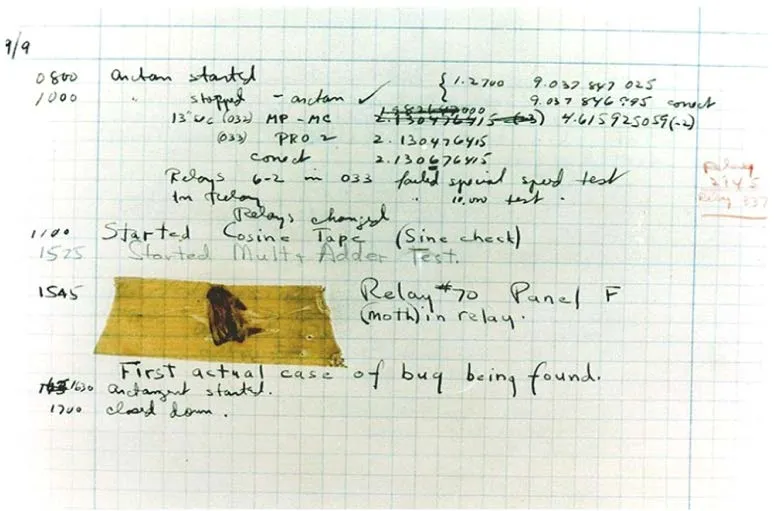

# 1.2  软件调试——本质、溯源与迷思

如果上一节是在搭建实验室的物理空间，那么这一节，我们需要先对齐一个认知：在这个空间里，我们要对付的到底是什么？

作为软件从业者，我们口中的 "Bug（缺陷/错误）"，指的就是代码里那些瑕疵、错误或缺陷——任何会导致软件偏离预期运行轨道的东西。

而作为开发者，我们工作中那个庞大且核心的部分，正是为了把这种东西揪出来并修好它。我们要追求的目标很单纯：尽人力之所及，让软件做到“无瑕疵”，像设计图纸那样精准运行。

### 先有鸡还是先有蛋？

这听起来天经地义——但为了修好它，你得先找到它。这就是第一个反直觉的地方：

**对于非平凡的系统级 Bug，你往往根本不知道它的存在，直到某次事件把它“炸”出来。**

这就像守着一颗不知何时会爆的地雷。这种不确定性让人极其不安。所以，作为一个理性的行业，我们难道不应该有一套纪律严明的办法，在产品发布前就把它们都找出来吗？

当然应该，而且我们确实有。这就是 **质量保证**，俗称**测试**。

虽然有时候我们会轻视测试工作（觉得它不如写核心代码有“技术含量”），但它依然是软件生命周期中——甚至可以说就是**那个**最重要的环节。试想一下，你愿意坐一架从未经过测试的新型飞机吗？除非你就是那个赌上性命的试飞员，否则答案肯定是“绝不”。

测试是最后一道防线，它是为了在 Bug 走向世界之前把它截住。

### 当防线失守时

好了，回到我们的场景。

假设防线失守了——QA 把漏网之鱼放到了生产环境，或者你正在开发的内核模块在某个极端场景下突然挂了。

现在，Bug 被识别出来了（甚至有人给你提了一个工单）。这时候，你的核心任务就变了：从“发现它”变成“解剖它”。你需要精准定位**根本原因**——不仅仅是“它崩溃了”，而是“为什么它会在这一行、这一个条件下崩溃”。

这并不容易。本书的大部分篇幅，其实都在讲一件事：**如何利用工具、技巧，以及正确的思维模式，去定位这个根本原因。**

一旦你找到了根因，并且真正理解了底层的机制，修复它往往只是顺手的事——改几行代码而已。真正让人头秃的，是找到那个改几行代码的位置。

这个过程——从识别 Bug，利用工具和深度思考定位根因，最后修复它——就被统称为**调试**。

> **Debugging**: 识别缺陷并确定其根本原因，进而修复的过程。

### 名字的由来：那只飞蛾

既然讲到“调试”这个词，咱们不得不提那个广为流传的故事。

这有一个很著名的说法：1947 年 9 月 9 日，星期二，哈佛大学的 Grace Hopper 将军（那时她还只是上校）和她的团队们在 Mark II 计算机的继电器面板里发现了一只飞蛾。

因为这只虫子卡住了继电器，导致系统故障。他们把它夹在了工作日志里，并标注为“First actual case of bug being found”（发现的第一个真正的 Bug）。他们把飞蛾取出来，系统就恢复正常了——于是，他们“De-bug”（除虫）了系统！

这个故事很棒，很有画面感，以至于它成了计算机科学界的传说。

*图 1.1——那只著名的飞蛾（由 Naval Surface Warfare Center, Dahlgren, VA 提供，1988 年。U.S. Naval Historical Center Online Library Photograph NH 96566-KN. Public Domain）*

但作为一名严谨的工程师，我得泼一盆冷水：

第一，Hopper 将军自己后来澄清过，她并不是发明“debug”这个词的人；
第二，从词源上考证，这个词似乎最早源于航空领域（指航空引擎里的机械故障）。

虽然那只飞蛾确实是真实存在的，也是第一只被物理“记录在案”的计算机 Bug，但“调试”这个概念在它出现之前就有了。不过，鉴于这个故事太传神了，这个词就这样牢牢地嵌入了我们的行话里。

### 现实的代价

理解了什么是 Bug 和调试之后，我们要把视线拉高一点。

这不仅仅是代码写得烂不烂的问题。在接下来的内容里，我们将通过几个真实的惨痛案例来看一看：当一个微小的软件 Bug 出现在错误的地点、错误的时间时，它不仅会让服务器宕机，还可能导致生命财产的巨大损失。

这些案例提醒我们：**调试不是在玩拼图游戏，而是在排查系统的隐患。**