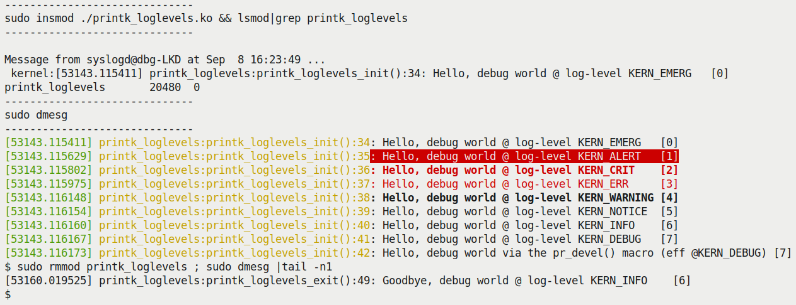
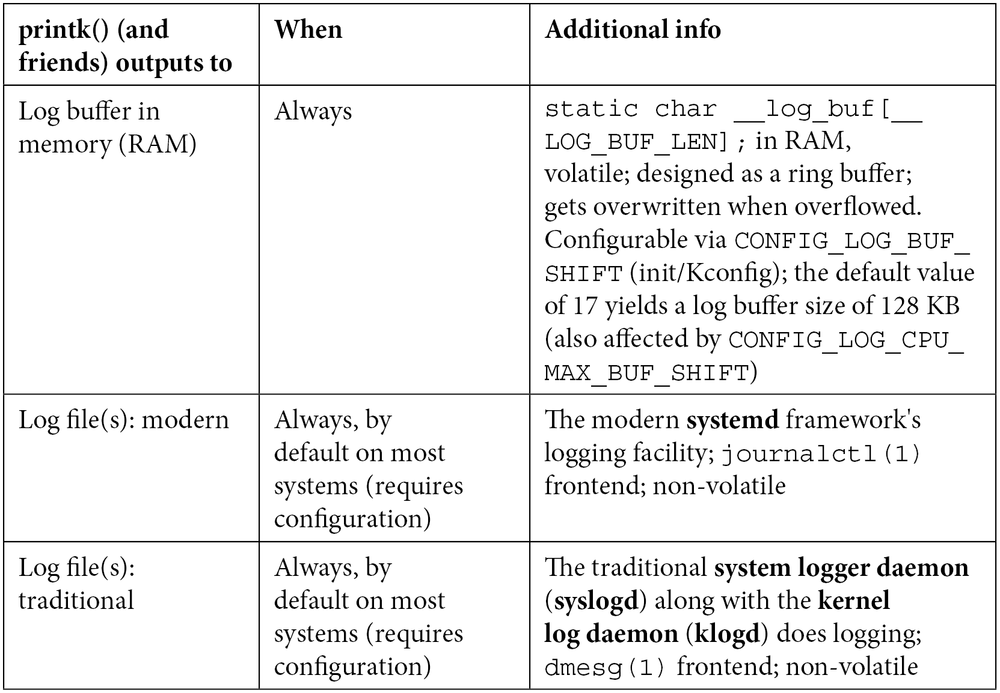

# 3.1 无处不在的内核 printk

K&R 那本著名的《C 程序设计语言》里，第一个示例程序为什么总是 `Hello, world`？

这不是巧合。对于任何一门语言或环境来说，只要能让字符出现在屏幕上，就意味着你掌握了与它交互的最基本渠道。在用户空间，这个渠道是 `printf()`——我们依赖它来证明程序活着，还在按预期的逻辑跑。

但你肯定记得，写第一个 C 程序时，你并没有亲手实现 `printf`。它住在哪？住在那个庞大、臃肿，但又不可或缺的标准 C 库里。在 Linux 上，这通常是 glibc。只要是在 Linux 上跑的二进制程序，几乎都会自动链接上这个库。不信？你在终端里敲一句 `ldd $(which ps)`，就能看到 `ps` 这个指令身后的依赖关系链里，正儿八经地挂着 `libc.so.*`。

这里有一个微妙但关键的转折。

到了内核里，这套规则突然失效了。

**内核里没有 `printf`**，更没有 libc。

Why? 这是一个很好的问题。答案触及了内核设计的底层逻辑：**Linux 内核不以用户空间那种方式链接库——无论是动态还是静态**。

当然，内核源码树的 `lib/` 目录下确实堆积了大量有用的 API，但它们是被直接编译进内核镜像本身的。至于内核模块（LKM）机制，虽然某种程度上模拟了“库”的行为——比如模块堆叠、多源文件链接——但它终究不是 `dlopen()` 那一套。

（顺便说一句，关于内核模块编写的那些细节，比如 LKM、模块堆叠，我在前一本《Linux Kernel Programming》里花了整整几章来讲，这里就不展开赘述了。）

现在问题来了：作为内核开发者，当我们想要看一眼变量状态，或者确认一下代码走到哪儿了，我们该怎么办？

答案就藏在那句老掉牙的调试信条里：**插桩**。

而在内核里干这件事的瑞士军刀，就是 `printk()`。

之所以称它“无处不在”，是因为它几乎可以在内核的任何上下文里安然无恙地工作——无论是硬中断处理程序、软中断、tasklet，还是普通的进程上下文，甚至在自旋锁临界区里。它是 SMP 安全的。

这一节，我假设你已经不是第一次见 `printk` 了，所以那些最基础的语法我会略过。我们要做的，是把这件武器从“能用”磨砺到“好用”。

---

### printk 的面孔：签名与位置

先看一眼它的签名，和用户空间的 `printf` 长得几乎一模一样：

```c
// include/linux/printk.h
int printk(const char *fmt, ...);
```

如果你好奇它骨子里是怎么实现的，源码就躺在 `kernel/printk/printk.c` 的 `printk()` 函数里。

> **💡 代码库浏览小贴士**
>
> 逛内核源码是项硬技能——现在的内核代码量早就突破了 2000 万行大关。用 `find | xargs grep` 这种原始方式虽然能行，但效率太低。
>
> 听我一句劝，把 `ctags` 和 `cscope` 用起来。这些工具在第一章里你应该已经装好了。内核的 Makefile 甚至贴心地内置了索引构建目标：
>
> ```bash
> cd <kernel-src-tree>
> make -j8 tags
> make -j8 cscope
> ```
>
> 如果是针对特定架构（比如 ARM64），记得带上 `ARCH` 参数：
>
> ```bash
> make ARCH=arm64 cscope
> ```
>
> 想深入了解这两个工具？去翻翻本章末尾的“延伸阅读”。

---

### 给消息定级：不仅是字面上的意思

在语法上，`printk` 和 `printf` 只有一个显眼的区别：`printk` 要求你在格式字符串的开头加上一个**日志级别** 前缀。

看看这个例子：

```c
printk(KERN_INFO "Hello, kernel debug world\n");
```

请注意，`KERN_INFO` **不是** `printk` 的第二个参数。C 语言的字符串拼接机制会把相邻的两个字符串字面量合并成一个，所以它本质上还是那个 `fmt` 参数的一部分。

这不是优先级，只是个标记。`dmesg`、`journalctl` 这些查看日志的工具，或者像 `gnome-logs` 这种 GUI 工具，会根据这个标记来过滤消息——决定哪些该给你看，哪些该被忽略。

内核一共有 8 个日志级别（0 到 7）。让我们直接把源码里的定义搬过来看，右边的注释已经把适用场景说得清清楚楚：

```c
// include/linux/kern_levels.h
#define KERN_EMERG   KERN_SOH "0"           /* system is unusable */
#define KERN_ALERT   KERN_SOH "1"           /* action must be taken immediately */
#define KERN_CRIT    KERN_SOH "2"           /* critical conditions */
#define KERN_ERR     KERN_SOH "3"           /* error conditions */
#define KERN_WARNING KERN_SOH "4"           /* warning conditions */
#define KERN_NOTICE  KERN_SOH "5"           /* normal but significant condition */
#define KERN_INFO    KERN_SOH "6"           /* informational */
#define KERN_DEBUG   KERN_SOH "7"           /* debug-level messages */
#define KERN_DEFAULT ""                    /* the default kernel log level */
```

你会发现，`KERN_<FOO>` 说白了就是字符串 `"0"` 到 `"7"`，外加一个 `KERN_SOH`。这个 `SOH` 代表 **Start Of Header**，值为 `\001`。这是 ASCII 码表里的一个控制字符，内核用它来做标记，仅此而已。

**如果不指定级别呢？**

如果不显式指定，`printk` 会默认使用 **4**，也就是 `KERN_WARNING`。但这并不是个好习惯。你应该明确地指定级别，或者——更好的办法——用我们接下来要讲的封装宏。

顺便提一句，`kern_levels.h` 里还把这些字符串级别定义成了对应的整型宏 `LOGLEVEL_<FOO>`，我们在后面的例子里会用到它们。

---

### 偷懒的艺术：pr_<foo> 封装宏

为了让我们少敲那几个字符，更重要的是为了让代码更整洁，内核提供了一系列基于 `printk` 的封装宏：`pr_<foo>`。

与其这么写：

```c
printk(KERN_INFO "Hello, kernel debug world\n");
```

不如——而且强烈建议——这么写：

```c
pr_info("Hello, kernel debug world\n");
```

内核头文件 `include/linux/printk.h` 定义了全套的“快捷方式”。你应该在代码里优先使用它们，而不是原始的 `printk`：

*   `pr_emerg()`：对应 `KERN_EMERG`
*   `pr_alert()`：对应 `KERN_ALERT`
*   `pr_crit()`：对应 `KERN_CRIT`
*   `pr_err()`：对应 `KERN_ERR`
*   `pr_warn()`：对应 `KERN_WARNING`
*   `pr_notice()`：对应 `KERN_NOTICE`
*   `pr_info()`：对应 `KERN_INFO`
*   `pr_debug()` / `pr_devel()`：对应 `KERN_DEBUG`

看一个稍微夸张点的真实案例，来自 x86 架构的 CPU 机器检查代码：

```c
// arch/x86/kernel/cpu/mce/p5.c
/* Machine check handler for Pentium class Intel CPUs: */
static noinstr void pentium_machine_check(struct pt_regs *regs)
{
    [...]
    if (lotype & (1<<5)) {
       pr_emerg("CPU#%d: Possible thermal failure (CPU on fire ?).\n", 
                smp_processor_id());
    }
    [...]
}
```

“CPU 着火了”？虽然听起来有点惊悚，但这正是 `KERN_EMERG` 级别该干的事——系统可能已经不可用了，赶紧发警报。

#### ⚠️ 连续打印：pr_cont()

还有个特殊的变种叫 `pr_cont()`。它的作用是把内容**追加**到上一次 `printk` 的消息末尾，而不是另起一行。这在构建多段式的日志时很有用。

比如内核模块加载的代码里就有这种用法：

```c
// kernel/module.c
if (last_unloaded_module[0])
    pr_cont(" [last unloaded: %s]", last_unloaded_module);
pr_cont("\n");
```

通常我们只在最后一个 `pr_cont()` 里加上换行符。

---

### 统一制服：pr_fmt() 宏

现在的代码里，`pr_info` 已经够短了，但有时候我们还想要更个性化一点——比如给每一条日志都自动加上模块名、函数名和行号。

这时候就要祭出 `pr_fmt()` 这个宏了。

它是一个“元宏”。只要你在源文件的第一行（非注释行）重新定义它，它就会像模版一样，自动套用到后续所有的 `pr_*()` 宏和 `printk()` 调用上。

看个例子就明白了。我们准备了一个名为 `printk_loglevels` 的内核模块，它演示了两件事：

1.  利用 `pr_fmt()` 自动给每条打印加上前缀。
2.  演示了各个日志级别的效果。

> **📦 代码位置**
>
> 本书中所有示例代码的 GitHub 仓库地址：
> https://github.com/PacktPublishing/Linux-Kernel-Debugging
>
> 本节演示模块路径：`ch3/printk_loglevels/`
>
> ⚠️ **注意**：试跑这些模块时，请确保你启动的是**自定义调试内核**（或者至少是发行版的默认内核）。如果你在上一章里编译了那个“加固版”的生产内核，这里可能会出问题——因为安全配置太严，加载未签名的模块会被拒绝。

我们把代码拆开来看。首先是头部的“魔咒”：

```c
#define pr_fmt(fmt) "%s:%s():%d: " fmt, KBUILD_MODNAME, __func__, __LINE__
#include <linux/init.h>
#include <linux/module.h>
#include <linux/kernel.h>
```

这行 `#define` 的意思是：所有的格式字符串 `fmt`，前面都要自动加上 `模块名:函数名:行号: `。

这是初始化函数的主体：

```c
static int __init printk_loglevels_init(void)
{
    pr_emerg("Hello, debug world @ log-level KERN_EMERG [%d]\n", LOGLEVEL_EMERG);
    pr_alert("Hello, debug world @ log-level KERN_ALERT [%d]\n", LOGLEVEL_ALERT);
    pr_crit("Hello, debug world @ log-level KERN_CRIT [%d]\n", LOGLEVEL_CRIT);
    pr_err("Hello, debug world @ log-level KERN_ERR [%d]\n", LOGLEVEL_ERR);
    pr_warn("Hello, debug world @ log-level KERN_WARNING [%d]\n", LOGLEVEL_WARNING);
    pr_notice("Hello, debug world @ log-level KERN_NOTICE [%d]\n", LOGLEVEL_NOTICE);
    pr_info("Hello, debug world @ log-level KERN_INFO [%d]\n", LOGLEVEL_INFO);
    
    /* Debug levels might not show up unless console_loglevel is adjusted */
    pr_debug("Hello, debug world @ log-level KERN_DEBUG [%d]\n", LOGLEVEL_DEBUG);
    pr_devel("Hello, debug world via the pr_devel() macro (eff @KERN_DEBUG) [%d]\n", 
             LOGLEVEL_DEBUG);
    
    return 0;
}
```

以及清理函数：

```c
static void __exit printk_loglevels_exit(void)
{
    pr_info("Goodbye, debug world @ log-level KERN_INFO [%d]\n", LOGLEVEL_DEBUG);
}

module_init(printk_loglevels_init);
module_exit(printk_loglevels_exit);
```

当我们把它插进内核，你会看到类似这样的输出（截图 3.1）：


*(图 3.1 – printk_loglevels 模块的运行输出截图)*

这里有几个细节值得你停下来看一看：

1.  **前缀生效了**：注意看每一条日志的开头，`printk_loglevels:init_module:XX:`。这就是我们那个 `pr_fmt()` 宏的功劳。这在调试时简直是救命稻草，尤其是当多个模块都在疯狂打日志时，你能立刻分清是谁在说话。
2.  **级别对应上了**：右边的方括号里显示了对应的数字级别（`[0]` 到 `[7]`）。
3.  **紧急事件会弹窗**：`KERN_EMERG` (0级) 的消息不仅进了日志缓冲区，还会直接弹到所有打开的控制台终端上。你能在截图的上半部分看到那条 `Message from syslogd@...` 的弹窗。
4.  **颜色辅助**：`dmesg` 和 `journalctl` 都支持颜色高亮，这对人眼筛选重要信息非常有帮助。
5.  **权限墙**：如果你看到 `dmesg` 读不出东西，别慌。现在的发行版为了防止信息泄露，默认开启了 `CONFIG_SECURITY_DMESG_RESTRICT`。你需要 `sudo` 一下，或者让用户拥有相应的权限位。

---

### 消息去哪儿了？

好了，我们会发日志了。但发出的这些字符，最终到底流落到了哪里？

这是一个比看起来要深的问题。与用户空间 `printf` 直接到 `stdout` 不同，内核的“下水道系统”要复杂得多。

我们可以用一张表来概括它的流向（表 3.1）：


*(图 3.1 – printk 输出流向示意图)*

| 输出位置 | 描述 | 查看方式 |
| :--- | :--- | :--- |
| **内核环形缓冲区** | 内存中固定大小的循环队列，所有 printk 的第一站。 | `dmesg`, `/proc/kmsg` |
| **系统日志文件** | 由系统守护进程（如 systemd/journald）从缓冲区读取并落盘。 | `/var/log/syslog` (Debian/Ubuntu)<br>`/var/log/messages` (RHEL/CentOS) |
| **控制台终端** | 如果日志级别足够低（足够严重），会直接刷到当前终端。 | 屏幕直接输出 |

#### 📊 环形缓冲区与控制台级别

首先明确一点：**`printk` 不写 `stdout`**。它的第一站是内存里的**内核环形缓冲区**。

这意味着日志是暂存在内存里的，一旦重启（除非 `kexec` 或者做了 pstore 持久化），旧日志就没了。

而能否**同时**显示在你的控制台屏幕上，取决于**控制台日志级别**。内核有一个变量来控制这个阈值。

你可以这样查看当前阈值：

```bash
$ cat /proc/sys/kernel/printk
4     4     1     7
```

这四个数字分别是：
1.  **当前控制台日志级别**（Console Loglevel）：4。只有比 4 **小**（更紧急）的消息才会显示在控制台上。也就是 `KERN_EMERG`, `KERN_ALERT`, `KERN_CRIT`, `KERN_ERR`。
2.  **默认控制台日志级别**：4。
3.  **最小控制台日志级别**：1。
4.  **最大控制台日志级别**：7。

如果你想把所有的调试信息（包括 `KERN_DEBUG`）都怼到屏幕上，你可以（作为 root）修改这个值：

```bash
sudo echo 8 > /proc/sys/kernel/printk
```

这会把它临时调到最高（高于 7，意味着全开）。但这通常是个坏主意，内核里的 DEBUG 级日志浩如烟海，你的屏幕瞬间就会被刷屏，甚至可能影响系统性能。

#### 📂 现代系统的日志文件

在现代 Linux 发行版（尤其是 systemd 的地盘，比如 Ubuntu 20.04）上，日志流转稍微复杂一点。

Systemd 是个“霸道”的初始化系统，它接管了日志职责。它不仅把日志写到传统的文件里，还维护了自己的二进制日志系统。

具体来说，传统的文本日志文件依然存在，取决于你的发行版流派：
*   **Debian / Ubuntu 系**：看 `/var/log/syslog`
*   **Red Hat / Fedora / CentOS 系**：看 `/var/log/messages`

你可以用常规命令去翻阅，但更现代的方式是 `journalctl`。

---

### 格式化 specifier：那些你可能不知道的 %

写代码的时候，选对格式化符很重要。这里列几个容易踩坑的：

*   **大小敏感**：对于 `size_t`（无符号）和 `ssize_t`（有符号），请分别使用 `%zu` 和 `%zd`。
*   **指针打印**：
    *   **安全第一**：用 `%pK`。它会打印哈希后的指针值，防止敏感的内核地址泄露给普通用户。这是现代内核的安全要求。
    *   **真实地址**：用 `%px`。这会打印真实的地址值。**千万不要在发布的产品代码里用这个**，除非你确切知道自己在干什么。
    *   **物理地址**：用 `%pa`。注意要传地址的引用。
*   **Buffer 转储**：想把内存里的 raw buffer 打印成一串 hex？用 `%*ph`（`*` 替代长度，适用于小于 64 字节的 buffer）。如果是更大的块，别硬拼字符串，用专门的 `print_hex_dump_bytes()` 辅助函数。
*   **IP 地址**：打印 IPv4 用 `%pI4`，IPv6 用 `%pI6`。

如果你想看一份完整的“字典”，内核官方文档有一份详尽的清单：

`Documentation/printk-formats.txt`

去扫一眼吧，总有一天你会用到。

---

掌握了 `printk` 的这些门道，我们就算把“插桩”这把武器握在手里了。但在实战中，光知道怎么打印还不够——还得知道在哪儿打印、怎么高效地打印，以及怎么别让打印把系统搞挂了。

这正是我们接下来要深入的话题。