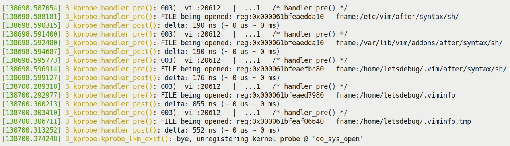
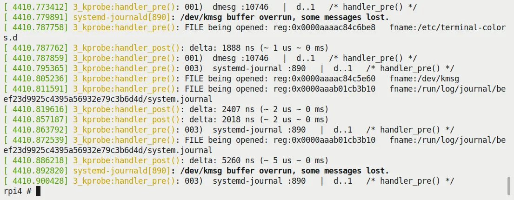
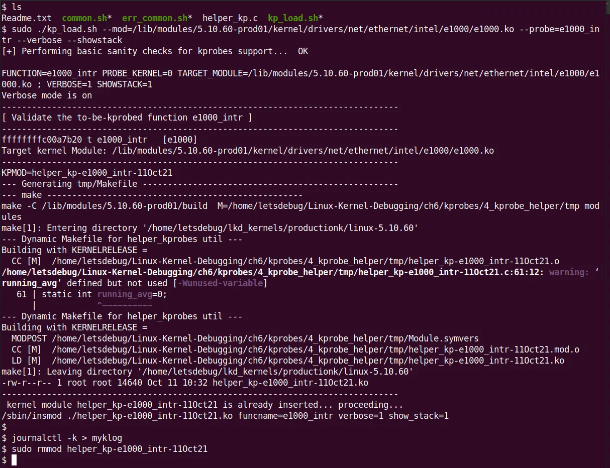
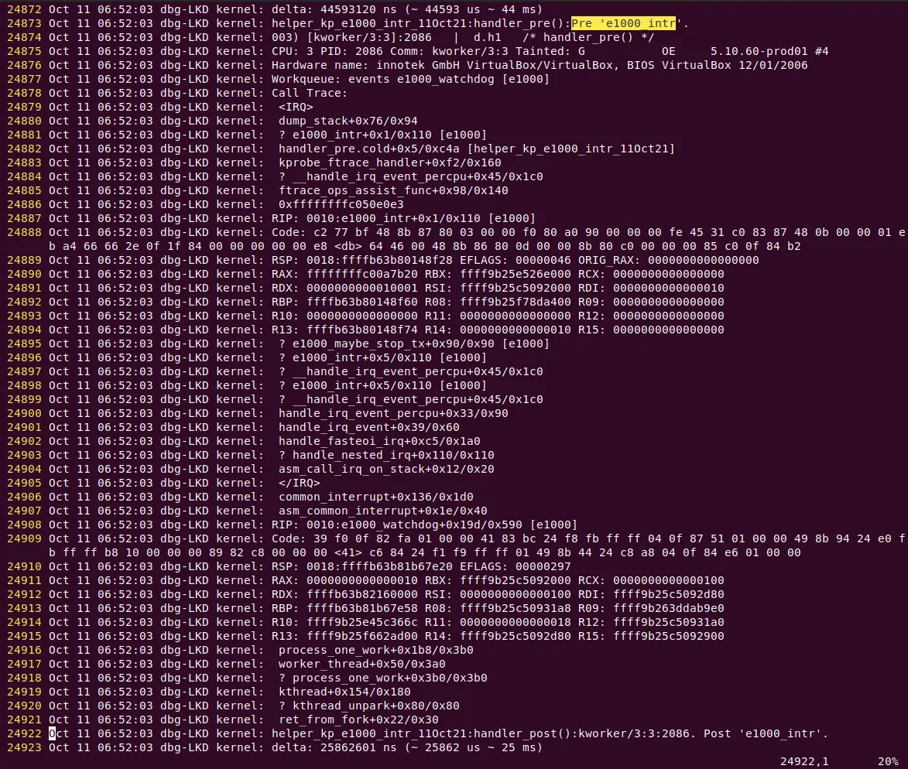

### 4.3 使用静态 kprobes —— 演示 3 与演示 4

在上一节里，我们通过手动查阅处理器寄存器，弄清楚了参数是如何在内核深处悄无声息地传递的。这就像是你学会了一门方言的语法——现在，你终于能听懂他们在说什么了。

如果我们只是盯着函数看，那只能算是「看戏」；真正的调试高手是要「上台」的——不仅要看到函数被调用，还要**抓住它传递的参数**。

接下来的两个演示（Demo 3 和 Demo 4），我们将继续沿用传统的静态 kprobe 方式（还记得吧，「静态」意味着任何修改都要重新编译模块）。我们要做一件非常实用的事情：**截获被探测函数的参数**。这在实际排错中往往是救命稻草——很多时候，bug 的根源就是某个参数传错了，或者传进去的指针已经坏掉了。

Demo 3 会手把手教你如何从寄存器里把这些参数抠出来；Demo 4 则会玩得更大一点——我们会写一个半自动化的脚本来生成这些代码。

#### Demo 3 —— 静态 kprobe：截获文件打开系统调用并获取文件名参数

你应该已经感觉到，Demo 2 比 Demo 1 要聪明不少——它允许通过模块参数传入任何想要探测的函数名。但这就够了吗？远远不够。在实际的调试场景中，你不仅要知道 `do_sys_open` 被调用了，你更得知道它**试图打开哪个文件**。这往往就是区分「能搞定 bug」和「两眼一抹黑」的关键。

> 💡 **小贴士**：很多 bug 的罪魁祸首都是参数传递错误（通常是一个无效或损坏的指针）。
> 千万小心——反复检查你的假设，别太相信直觉。

按照我们的演示主线，被探测函数 `do_sys_open` 的长这样：

```c
long do_sys_open(int dfd, const char __user *filename, int flags, umode_t mode);
```

如果在 pre-handler 里能拿到它的参数，特别是第二个参数 `filename`，那调试效率简直能起飞。上一节关于 ABI 的铺垫就是为了这一刻。

##### 被遗忘的 Jprobes

在正式动手前，提一下内核历史上一个叫 **Jumper probes (jprobes)** 的接口。它原本是用来专门偷取函数参数的——能让你直接跳到函数里去访问参数。听起来很完美对吧？

但它在内核 4.15 版本被无情废弃了。官方的逻辑是：既然有更简单的方法（利用内核的 tracing 基础设施），何必还要维护这套复杂的接口？

如果你不幸还要维护 4.15 以前的古董内核，jprobes 确实是个好帮手。但对于我们来说，还是得学会「手动挡」——直接利用 ABI 知识从 `pt_regs` 里拿数据。至于更简单的方法（比如动态 kprobes），我们会在后面的章节里讲。

好了，让我们把这些 ABI 知识变成代码。

##### 获取文件名参数

来看 Demo 3 的核心代码片段（完整代码请去 GitHub 找）。我们直接切到关键戏肉：pre-handler 的部分。

```c
// ch4/kprobes/3_kprobe/3_kprobe.c
static int handler_pre(struct kprobe *p, struct pt_regs *regs)
{
    char *param_fname_reg;
```

注意 pre-handler 的这两个参数：
1. 指向 `kprobe` 结构体的指针。
2. 指向 `pt_regs` 结构体的指针——这是我们的宝箱。

`struct pt_regs` 这个结构体封装了 CPU 的寄存器状态，显然是架构相关的。它的定义藏在特定架构的头文件里。

假设你在 ARM-32 (AArch32) 系统上跑这个模块（比如树莓派 Zero W 或 BeagleBone Black）。ARM-32 的 `pt_regs` 定义在 `arch/arm/include/asm/ptrace.h`。CPU 寄存器被放在一个叫 `uregs` 的数组里。头文件里有个宏：

```c
#define ARM_r1      uregs[1]
```

回顾一下上一节的 ABI 表格：ARM-32 的前四个参数是通过寄存器 **r0, r1, r2, r3** 传递的。第二个参数 `filename` 正好在 **r1** 里。所以，我们的代码是这样把它拿出来的：

```c
#ifdef CONFIG_ARM
/* ARM-32 ABI:
 * 前四个参数通过以下通用寄存器传递: r0, r1, r2, r3
 * 参考 kernel 的 pt_regs 结构体 - 这里是 CPU 寄存器的副本:
 * https://elixir.bootlin.com/linux/v5.10.60/source/arch/arm/include/asm/ptrace.h#L135
 */
param_fname_reg = (char __user *)regs->ARM_r1;
#endif
```

同样的逻辑，对于 x86 和 AArch64，我们也是根据架构来条件编译，从对应的寄存器里把第二个参数抓到 `param_fname_reg` 变量里：

```c
#ifdef CONFIG_X86
    param_fname_reg = (char __user *)regs->si;
#endif
[...]
#ifdef CONFIG_ARM64
/* AArch64 ABI:
 * 前八个参数(以及返回值)通过以下通用寄存器传递: x0 到 x7 (64-bit GPRs)
 * 参考 kernel 的 pt_regs 结构体:
 * https://elixir.bootlin.com/linux/v5.10.60/source/arch/arm64/include/asm/ptrace.h#L173
 */
    param_fname_reg = (char __user *)regs->regs[1];
#endif
```

正如上一节表格所示：在 x86_64 上，第二个参数在 **[R]SI** 寄存器；在 ARM64 上，则在 **X1** 寄存器。代码完全符合 ABI 规则。

现在参数指针拿到了，直接 `printk` 打出来就行了吗？

**别急，这里有个坑。**

内核编程的复杂性就在这里：你不能直接去解引用 `param_fname_reg` 这个指针。为什么？因为这玩意儿指向的是**用户空间内存**，而我们现在的代码运行在**内核空间**。贸然访问用户空间指针，轻则报错，重则 panic。

我们必须用 `strncpy_from_user()` 这个内核 API，把它安全地拷贝到我们在内核空间预先分配好的缓冲区 `fname` 里（这块内存是我们在 `init` 时用 `kzalloc()` 申请的）：

```c
if (!strncpy_from_user(fname, param_fname_reg, PATH_MAX))
    return -EFAULT;
pr_info("FILE being opened: reg:0x%px   fname:%s\n",
        (void *)param_fname_reg, fname);
```

顺带提一句有意思的事：只有在我们开了调试选项的内核上跑这个模块时，`strncpy_from_user()` 才会扔出一个警告：

```
BUG: sleeping function called from invalid context at lib/strncpy_from_user.c:117
```

罪魁祸首是 `lib/strncpy_from_user.c:117` 那一行的 `might_fault()` 函数。简单来说，它检查到内核开启了 `CONFIG_PROVE_LOCKING` 或 `CONFIG_DEBUG_ATOMIC_SLEEP`，就会调用 `might_sleep()`。

这个函数的注释写得很清楚：

> /**
>  * might_sleep - annotation for functions that can sleep
>  * this macro will print a stack trace if it is executed in an atomic context (spinlock, irq-handler, ...).
>  * ...
>  */

我们用的是调试内核，这两个选项恰好都开了，所以你会看到这个警告。这就像有人在你耳边大声念叨「嘿，这里可能会睡觉哦」。在这个场景下我们暂时没办法，只能先受着，把它当作一个待办事项（TODO）记下来。

除了这点小插曲，代码其他部分和 Demo 2 基本一样。让我们跑一下。

为了控制日志量，我们依然只在进程上下文是 `vi` 的时候才打印。图 4.5 展示了 `dmesg` 的输出尾部：



**图 4.5** – x86_64 VM 上 3_kprobe 演示的 dmesg 输出尾部（过滤仅显示 vi 进程上下文）

看图，`do_sys_open` 的第二个参数——那个被打开文件的完整路径——清清楚楚地显示在那儿！

##### 换个口味：在树莓派 4 (AArch64) 上试试

为了证明这玩意儿不是只能在 x86 上跑，我也把这个模块扔到了树莓派 4 上（64位 Ubuntu 系统，完整的 AArch64 架构）。编译并插入模块：

```bash
rpi4 # sudo dmesg –C; insmod ./3_kprobe.ko kprobe_func=do_sys_open ; sleep 1 ; dmesg|tail -n5
[ 3893.514219] 3_kprobe:kprobe_lkm_init(): FYI, skip_if_not_vi is on, verbose=0
[ 3893.525200] 3_kprobe:kprobe_lkm_init(): registering kernel probe @ 'do_sys_open'
```

从输出看，新的模块参数 `skip_if_not_vi` 默认是开的（值为 1），意味着只有 `vi` 打文件时才会被捕获。

来做个实验：我们在运行时动态修改这个参数。

首先，别忘了把调试打印开关全部打开：

```bash
rpi4 # echo -n "module 3_kprobe +p" > /sys/kernel/debug/dynamic_debug/control
rpi4 # grep 3_kprobe /sys/kernel/debug/dynamic_debug/control
<...>/3_kprobe.c:98 [3_kprobe]handler_pre =p "%03d) %c%s%c:%d   |  %c%c%c%u   /* %s() */\012"
<...>/3_kprobe.c:158 [3_kprobe]handler_post =p "%03d) %c%s%c:%d   |  %c%c%c%u   /* %s() */\012"
```

现在查询并修改 `skip_if_not_vi` 参数为 0：

```bash
rpi4 # cat /sys/module/3_kprobe/parameters/skip_if_not_vi
1
rpi4 # echo –n 0 > /sys/module/3_kprobe/parameters/skip_if_not_vi
```

好了，现在所有的文件打开系统调用都会被捕获。图 4.6 可以看到效果（你可以清楚地看到 `dmesg` 和 `systemd-journal` 进程正在打开各种文件）：



**图 4.6** – 树莓派 4 (AArch64) 上运行 3_kprobe 的截图，显示所有正在被打开的文件

完美运行！这多亏了我们在代码里正确处理了 AArch64 架构的逻辑（还记得那些 `#ifdef CONFIG_ARM64 ...` 吗？）。

这一招你一定要亲自试一试，那种上帝视角看文件打开的感觉真的很爽。

#### Demo 4 —— 通过辅助脚本实现半自动化静态 kprobe

手动写代码虽然爽，但每次都要改 C 代码、编译、插模块，确实有点累。能不能自动化一点？

当然可以。这次我们用一个 Shell (bash) 脚本 (`kp_load.sh`) 来代劳。你只要告诉它你想探测哪个函数，它在哪个模块里（可选），剩下的脏活累活——生成 C 代码模板、生成 Makefile、编译、插入内核——统统交给脚本。

篇幅原因，我不展示脚本和内核模块（`helper_kp.c`）的所有代码了，重点展示怎么用。当然，强烈建议你去读一下源码（`ch4/kprobes/4_kprobe_helper`）。

脚本运行前会先做些健康检查，比如确认内核真的支持 kprobes。直接不带参数跑会显示帮助信息：

```bash
$ cd ch4/kprobes/4_kprobe_helper
$ sudo ./kp_load.sh
[sudo] password for letsdebug: xxxxxxxxxxxx
[+] Performing basic sanity checks for kprobes support...  OK
kp_load.sh: minimally, a function to be kprobe'd has to be specified (via the --probe=func option)
Usage: kp_load.sh [--verbose] [--help] [--mod=module-pathname] --probe=function-to-probe
       --probe=probe-this-function  : if module-pathname is not passed, then we assume the function to be kprobed is in the kernel itself.
       [--mod=module-pathname]       : pathname of kernel module that has the function-to-probe
       [--verbose]                   : run in verbose mode; shows PRINT_CTX() o/p, etc
       [--showstack]                 : display kernel-mode stack, see how we got here!
       [--help]                      : show this help screen
$
```

让我们干点刺激的——**探测网卡驱动的硬件中断处理函数**。

接下来的步骤基于这个场景：平台是 Ubuntu 20.04 LTS，跑着自定制的生产内核 (5.10.60-prod01)，架构是 x86_64 虚拟机。

**第一步：找出网卡驱动**

在我的系统上，网卡是 `enp0s8`。用 `ethtool` 这个神器查一下底细：

```bash
# ethtool -i enp0s8 |grep -w driver
driver: e1000
```

`-i` 参数指定网络接口。再用 `lsmod` 确认一下 `e1000` 驱动确实在内存里（并且是以模块形式加载的）：

```bash
# lsmod |grep -w e1000
e1000                 135168  0
```

**第二步：定位中断处理函数**

大多数网卡驱动的代码都在 `drivers/net/ethernet` 目录下。`e1000` 也不例外：`drivers/net/ethernet/intel/e1000/`。

这是设置网卡硬件中断的代码：

```c
// drivers/net/ethernet/intel/e1000/e1000_main.c
static int e1000_request_irq(struct e1000_adapter *adapter)
{
    struct net_device *netdev = adapter->netdev;
    irq_handler_t handler = e1000_intr;
    […]
    err = request_irq(adapter->pdev->irq, handler,
                  irq_flags, netdev->name, netdev);
    […]
```

（顺便给个在线代码查看的捷径：[Bootlin's LXR](https://elixir.bootlin.com/linux/v5.10.60/source/drivers/net/ethernet/intel/e1000/e1000_main.c#L253)，这种工具在查源码时简直是救命稻草。）

可以看到，硬件中断处理函数名叫 `e1000_intr()`。签名如下：

```c
static irqreturn_t e1000_intr(int irq, void *data);
```

代码地址在这里：[e1000_intr source](https://elixir.bootlin.com/linux/v5.10.60/source/drivers/net/ethernet/intel/e1000/e1000_main.c#L3745)。

**第三步：开搞**

用我们的辅助脚本直接怼：

```bash
# ./kp_load.sh --mod=/lib/modules/5.10.60-prod01/kernel/drivers/net/ethernet/intel/e1000/e1000.ko --probe=e1000_intr --verbose --showstack
```

仔细看我们传给脚本的参数。图 4.7 展示了脚本的执行过程：



**图 4.7** – kp_load.sh 辅助脚本执行并加载自定义 kprobe LKM 的截图

脚本在后台默默干了这些事：做健康检查、验证函数（甚至通过 `/proc/kallsyms` 显示了它的内核虚拟地址）、创建临时文件夹 (`tmp/`)、把 C 模板文件 (`helper_kp.c`) 拷进去并改名、用 HERE document 技术生成 Makefile、切换进去编译模块、最后 `insmod` 插入内核。一气呵成。

**第四步：看结果**

我把内核日志保存到文件 (`journalctl –k > myklog`)，然后卸载模块，用 `vi` 打开日志。输出量很大，图 4.8 是部分截图。你能看到我们自定义 kprobe 的 pre-handler printk、`PRINT_CTX()` 宏的输出，以及最劲爆的 `dump_stack()` 的输出！最后两行是 post handler 的输出：



**图 4.8** – 内核日志部分截图，显示 helper script 生成的 kprobe 在 pre-handler 里的输出；最后两行是 post handler 的

有点意思！我们自动生成的 kprobe 居然真的做到了。

别被这一大坨栈回溯吓到了，怎么解读内核栈我们后面章节会细讲。现在先关注图 4.8 里的几个关键点（忽略行号和左边的前五列）：

*   **第 24873 行**：这是自定义 kprobe 的输出。因为开了 verbose 标志，debug printk 把调用点显示了出来 —— `helper_kp_e1000_intr_11Oct21:handler_pre():Pre 'e1000_intr'`。
*   **第 24874 行**：这是 `PRINT_CTX()` 宏的输出 —— `003) [kworker/3:3]:2086   |  d.h1   /* handler_pre() */`。那串 `d.h1` 字符符可以对照图 4.4 解读：硬件中断关闭了，我们正处在硬中断上下文里，而且当前持有自旋锁。
*   **第 24875 到 24921 行**：这是 `dump_stack()` 的输出，信息量巨大。现在你只要倒着读，忽略那些以 `?` 开头的行。这里有个很有趣的点：**你注意到这里其实显示了两段内核栈吗？**

    *   上半部分被 `<IRQ>` 和 `</IRQ>` 标签包着。这告诉咱们这是 **IRQ 栈**——这是专门用来处理硬件中断的特殊栈区域（这是架构相关的优化特性，叫中断栈，大部分现代处理器都用这个）。
    
    *   下半部分，也就是 `</IRQ>` 之后的那段，是常规的内核栈。它通常属于那个被打断的倒霉进程上下文（在这里恰好是一个叫 `kworker/3:3` 的内核线程）。

> 🧠 **顺便学一招：怎么解读 kthread 名字**
> 内核线程的名字（比如这里看到的 `kworker/3:3`）是有格式的：`kworker/%u\:%d[%s]` （即 kworker/cpu\:id[priority]）。
> 细节可以参考内核文档：[Documentation/kernel-per-CPU-kthreads.txt](https://www.kernel.org/doc/Documentation/kernel-per-CPU-kthreads.txt)。

用这个辅助脚本确实省事多了。当然，代价也是有的——天下没有免费的午餐。我们的 `helper_kp.c` C 语言代码模板是写死的，也就是说，不管你探测什么函数，生成的模块代码结构都是一样的。这就叫 trade-off（权衡）。

现在，你已经学会了怎么写静态 kprobes；更重要的是，你知道了怎么利用这项技术去精细地「插桩」你的内核/模块代码，哪怕是在生产环境上！

硬币的另一面是 **kretprobe**（返回探针）。让我们去见识一下它的威力。