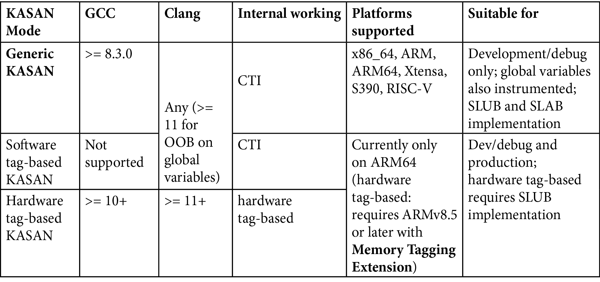

# 5.3  理解 KASAN 的基本原理

上一节我们列了一张长长的「愿望清单」，把内核里可能出现的各种内存错误都扒拉出来晒了一遍。现在的问题是：KASAN 到底是怎么把这张清单上的坏蛋一个个抓出来的？

在回答这个问题之前，我们要先建立几个关键认知。这几个认知如果不搞清楚，后面看日志就像看天书。

### 编译时插桩：它是怎么做到的？

首先，KASAN 是一个**动态分析工具**。这意味着什么？

意味着它不是靠静态扫描代码找 Bug 的，它是**跑起来**才能干活。如果你的代码路径从来没有被执行过，或者你的测试用例写得不够烂（没有覆盖到边界情况），KASAN 也就是个摆设。这也是为什么我一直强调「好的测试用例」和「Fuzzing（模糊测试）」的重要性——你不去撞墙，KASAN 就不会报警。

这就引出了它的核心技术：**Compile-Time Instrumentation（编译时插桩）**。

这名字听着高大上，其实原理很暴力。当我们使用 GCC 或 Clang 编译内核时，只要带上 `-fsanitize=kernel-address` 这个选项，编译器就会在你的每一条内存访问指令前后，偷偷塞进一些「检查代码」。

这些检查代码干了什么事？

它维护了一块额外的内存区域，叫 **Shadow Memory（影子内存）**。

你可以把影子内存理解为真实内存的「账本**——或者更形象一点，是放在屋外的监控摄像头**。

但摄像头这个比喻有一点不对：摄像头是被动录像的，而 KASAN 的影子内存是主动拦截的。它是这样工作的：真实内存每 8 个字节，会在影子内存里对应 1 个字节。

*   如果影子字节是 `0`，说明这 8 个字节都可以访问。
*   如果影子字节是 `1`，说明只有第一个字节可访问。
*   如果影子字节是负数（比如 `0xFF`），说明这块内存根本就是非法的。

**但真实情况比这更暴力**：每次你读写内存时，编译器插入的检查代码会先去查这个「账本」，发现账本上写着「红区」或者「已释放」，直接当场触发 panic。它不是在记录问题，它是在执行私刑。

---

### 代价是什么？什么时候能用？

这种暴力检查是有代价的。主要来自两个方面：

1.  **时间（CPU）**：每次内存访问都要先查影子内存，指令多了，分支预测也可能被打乱。
2.  **空间（RAM）**：影子内存本身要占地方。

**这里有个反直觉的事实**：KASAN 的 CPU 开销其实非常感人——通常只有 2 倍到 4 倍。如果你用过 Valgrind 这种动态插桩工具（它的开销通常是 20 倍甚至 50 倍），你会觉得 KASAN 简直快得飞起。

真正的痛点在 **RAM**。

还记得刚才那个比例吗？1:8。也就是每 8 字节真实内存就要消耗 1 字节影子内存。这对于 x86_64 这种动辄拥有 128 TB 内核虚拟地址空间（VAS）的架构来说，意味着 KASAN 要划拉走 **16 TB** 的虚拟地址空间用于影子内存（虽然物理内存未必真的用掉那么多，但地址空间资源是被占用了）。

对于企业级服务器，这都不是事儿。但对于资源受限的嵌入式系统——比如你的 Android 手机、电视盒子、或者低端路由器——这点开销可能就是不可承受之重。

这就是为什么现代 Linux 内核支持三种不同「档次」的 KASAN 模式。我们在表 5.2 里总结了一下它们的行为：

*(表 5.2：KASAN 的三种模式及其开销对比)*

| 模式 | 昵称 | 内存/CPU 开销 | 适用场景 | 架构限制 |
|---|---|---|---|---|
| Generic KASAN | **通用版** | 高 / 中 | 主动调试、抓 Bug | x86_64, ARM, ARM64, RISC-V 等 |
| Software tag-based | 软件标签版 | 中 / 低 | 真实负载压力测试 | **仅 ARM64** |
| Hardware tag-based | 硬件标签版 | 低 / 极低 | 甚至可用于生产环境 | **仅 ARM64 (MTE)** |

**回到那个「监控摄像头」的类比**：

*   **Generic KASAN** 就像是给房子里的每件物品都配了一个 24 小时盯着的保镖。安全是安全，但太贵了，你只能在关键时候（调试阶段）用，平时根本雇不起。
*   **Tag-based modes** 就像是给物品贴了RFID 标签。只有当你试图拿走它的时候，门禁系统才会响。这要轻量得多。

看到这里你可能会问：为什么这么好的东西（Tag-based），只在 ARM64 上有？

答案在市场里。Android 阵营几乎全是 ARM64 的天下。Google 极其需要在生产环境（用户的手机上）也能检测到内存错误，因为他们没办法让几亿用户都开着 Generic KASAN 跑手机。所以，基于硬件特性的 **MTE（Memory Tagging Extension）** 被推了出来，让低开销的内存检查成为可能。

---

### 使用门槛：编译器和硬件

既然是编译器技术，编译器的版本就很关键。你总不能让十几年前的 GCC 去生成现代的插桩代码。

目前的硬性要求如下：

*   **GCC**：必须是 **8.3.0** 或更高版本。
*   **Clang**：理论上任意版本都行，但如果你想要检测全局变量的越界访问，你需要 **Clang 11 或更高**。

硬件方面，KASAN 传统上是个「64位俱乐部」的特权功能。

> **为什么是 64 位？**
>
> 回想一下那个 1:8 的影子内存比例。在 32 位系统上，地址空间只有 4GB，划出去 1/8 给影子内存，剩下的也就捉襟见肘了。更别提内核地址空间通常只有 1GB 或者 3GB（取决于配置），这会让内核直接窒息。

**但事情正在起变化**。

如果你仔细看内核文档，你会发现 **Generic KASAN 已经支持 32 位的 ARM 架构了**——这是从 Linux 5.11 内核开始的新特性。这意味着，即使是算力较弱的老式 ARM 开发板，也能享受到这一福利（当然，你会更痛切地感受到内存压力）。

至于那两个看起来更高级的 Tag-based 模式，目前依然固执地只支持 **ARM64**。

**为什么还是 ARM64？**

因为 Android。几乎所有现代智能手机、智能穿戴设备、智能电视的核心都是 ARM64。对于移动生态来说，能够「在线上环境（生产环境）」以极低的代价捕捉内存错误，价值千金。这不仅是技术选择，更是商业驱动。

---

**接下来的路**

在本章的后续内容中，为了演示方便，我们默认使用的是 **Generic KASAN**。这不仅是因为它支持最广泛的架构（包括你可能手头有的 x86_64 PC 或 32-bit ARM 板子），更因为它是调试模式下最狠、最有效的那个。

如果你手头正好有一块 ARM64 的板子，可以尝试切换到 Tag-based 模式，体验一下那种「甚至敢在生产环境开启」的丝滑感。但无论如何，原理是相通的——只要你理解了 Generic 模式下的影子内存机制，剩下的也就是实现细节的不同罢了。