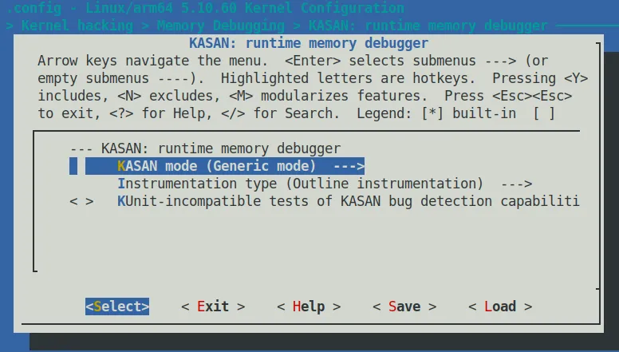

# 5.4  配置 Generic KASAN 模式

既然决定了先拿 Generic KASAN 开刀，那我们就得先把内核「武装」起来。

配置过程本身并不复杂，但就像是给赛车换引擎——虽然只是拧几个螺丝，但你知道这几个螺丝拧下去之后，这台机器的运行逻辑就全变了。

### 启用 Generic KASAN

第一步是常规操作：打开内核配置菜单。

如果你是在为 ARM64 配置（这也是我们演示的默认架构），命令如下：

```bash
make ARCH=arm64 menuconfig
```

在菜单里，你需要按以下路径导航，找到 KASAN 的开关：
`Kernel hacking` → `Memory Debugging` → `KASAN: runtime memory debugger`

进入这个子菜单后，你会看到模式选择的选项。这里我们保持默认，也就是 **Generic KASAN** 模式。


*图 5.1 – 启用 KASAN 的内核配置截图*

当你把光标停在 `Config KASAN as generic mode` 这一项上时，按下 `< Help >` 键，屏幕上会弹出一段值得你花 10 秒钟读完的提示。这不仅是说明，这是它在向你索要「代价」：

> This mode consumes about 1/8th of available memory at kernel start and introduces an overhead of ~x1.5 for the rest of the allocations. The performance slowdown is ~x3.

翻译成人话就是：
1.  **内存**：内核启动时，它会直接吃掉你 **1/8** 的物理内存。如果你的板子只有 512MB 内存，这刀下去是很痛的。
2.  **分配开销**：所有的内存分配开销都会增加约 **1.5 倍**。
3.  **整体性能**：系统运行速度会慢上 **3 倍**左右。

这就是你为了捕捉那些幽灵般的 Bug 所支付的首付。

保存配置并退出后，我们可以看看 `.config` 文件里到底发生了什么变化。

对于 ARM64 架构，`.config` 里会出现一组特定的宏（注意 `SHADOW_OFFSET` 和 `SW_TAGS` 的出现）：

```bash
$ grep KASAN .config
CONFIG_KASAN_SHADOW_OFFSET=0xdfffffd000000000
CONFIG_HAVE_ARCH_KASAN=y
CONFIG_HAVE_ARCH_KASAN_SW_TAGS=y
CONFIG_CC_HAS_KASAN_GENERIC=y
CONFIG_KASAN=y
CONFIG_KASAN_GENERIC=y
[...]
```

这里面有一个关键信息：`CONFIG_KASAN_SHADOW_OFFSET`。
这就是我们之前说的「影子内存」的基地址（Kernel Virtual Address）。内核会依靠这个值，把你的实际内存地址映射到这片专门的影子区域上，以此记录每一段内存的状态（是否可读、是否已释放等）。

---

### KASAN 对编译过程的影响

启用 `CONFIG_KASAN=y` 后，仅仅配置是不够的，编译器的行为也会发生根本性的变化。

如果你带着 `V=1` 参数重新编译内核（`make V=1`），你会看到满屏飞舞的 GCC 参数。如果我们截取其中一段，你会看到类似这样的编译命令：

```bash
make V=1

gcc -Wp,-MMD,[...] -fsanitize=kernel-address \
-fasan-shadow-offset=0xdffffc0000000000 --param \
asan-globals=1 --param asan-instrumentation-with-call-threshold=0 \
--param asan-stack=1 --param asan-instrument-allocas=1 [...]
```

请注意这几个关键参数：
*   **`-fsanitize=kernel-address`**：这就是编译器插桩的总开关。它告诉 GCC：「在这个编译单元里，我要对所有的内存访问进行检查」。
*   **`-fasan-shadow-offset=...`**：告诉编译器，影子内存的起始偏移量是多少，这样它生成的检查代码才能算出正确的影子地址。

**KASAN 的工作原理本质上就是：每当你读写内存时，它都要插手管一管。**

这里用到了一种叫 **Compile-Time Instrumentation (编译时插桩)** 的技术。简单来说，编译器会在编译阶段，在你的代码里偷偷塞入一些「检查代码」。

每当你有一行代码试图读取 1、2、4、8 或 16 字节的内存时，编译器实际上会生成类似这样的逻辑：

1.  调用 `__asan_load*()` 函数（Outline 模式）
2.  或者直接插入一段检查逻辑（Inline 模式）

通过检查对应的「影子内存」里的值，运行时就能判断：这次访问是合法的，还是我们在「越界读写」。

#### Outline vs. Inline：插桩的两种流派

既然提到了插桩，这里有一个重要的配置选项值得你关注，它决定了编译器插手的「深度」。

在配置菜单里，你会看到 **`Instrumentation type`** 选项。
它对应两个内核配置宏：

*   **`CONFIG_KASAN_OUTLINE`**（默认）：**轮廓化插桩**。
    *   编译器插入的是真正的**函数调用**（比如 `__asan_load1`）。
    *   **优点**：生成的内核镜像体积**更小**（检查代码只有一份）。
    *   **缺点**：每次访问都要走一遍函数调用流程，性能损耗相对较高。
*   **`CONFIG_KASAN_INLINE`**：**内联插桩**。
    *   编译器直接把检查的**逻辑代码**硬拷贝到每一次内存访问的地方。
    *   **优点**：**速度更快**（省去了函数调用的开销），通常比 Outline 快 1.1 到 2 倍。
    *   **缺点**：内核镜像体积会**显著膨胀**（因为检查代码被复制了无数遍）。

这是典型的工程 trade-off（权衡）。对于调试内核来说，通常默认的 Outline 模式就够用了；但如果你觉得 KASAN 太慢影响了某些时序相关的 Bug 复现，尝试切换到 Inline 模式可能会带来惊喜。

---

### 辅助配置：让报告更易读

KASAN 捕捉到 Bug 时会抛出一份报告。为了让这份报告更有含金量，不仅仅是告诉你「崩了」，而是告诉你「是谁干的」，建议你顺手开启以下两个选项。

#### 1. 开启堆栈跟踪

务必开启 `CONFIG_STACKTRACE`。

这会让 KASAN 在报告错误时，不仅打印出当前的访问栈，还会打印出「这块内存是什么时候被分配的」以及「是什么时候被释放的」。这对于定位 `Use-After-Free`（释放后重用）问题至关重要。

#### 2. 追踪页面所有者 (Page Owner)

在 `Kernel hacking` → `Memory Debugging` 菜单下，找到并开启 `Track page owner`（对应 `CONFIG_PAGE_OWNER`）。

这不仅用于 KASAN，它是一个通用的内核内存调试功能，能记录每一个物理页面的分配和释放历史栈。

⚠️ **注意**
`page_owner` 默认是关闭的，即使你编译进去了，也需要在内核启动参数里加上 `page_owner=on` 才能真正生效。

---

### x86_64 上的特别选项：vmalloc 空间

如果你是在 x86_64 架构上配置，你会发现一个 ARM64 上通常没有的额外选项：

```
[*] Back mappings in vmalloc space with real shadow memory
```

这个选项的作用是：用真实的影子内存来**映射 vmalloc 空间**。

开启它，KASAN 就能检测到 vmalloc 相关的内存破坏问题（比如越界写入了 vmalloc 分配的区域）。代价自然是运行时内存占用的进一步增加。如果你在调试驱动模块（它们经常加载在 vmalloc 空间），这个选项非常有用。

---

### 准备点火

理论就先到这里。

现在的任务是：按照上面的步骤，配置并重新构建你的「调试版内核」。

把它编译出来，烧录进去，然后重启。当系统成功启动并看到那个熟悉的 login 提示符时——虽然它可能比平时慢了那么几拍——你就拥有了一双透视眼，准备好去抓那些隐藏在阴暗角落里的内存 Bug 了。