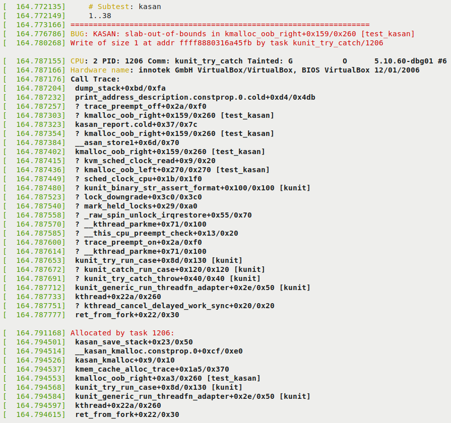
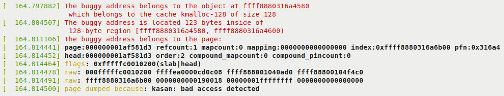
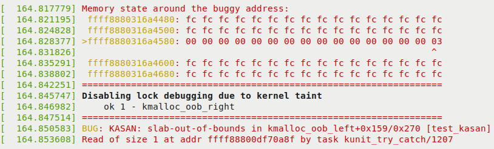
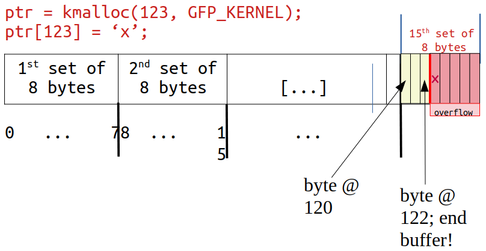
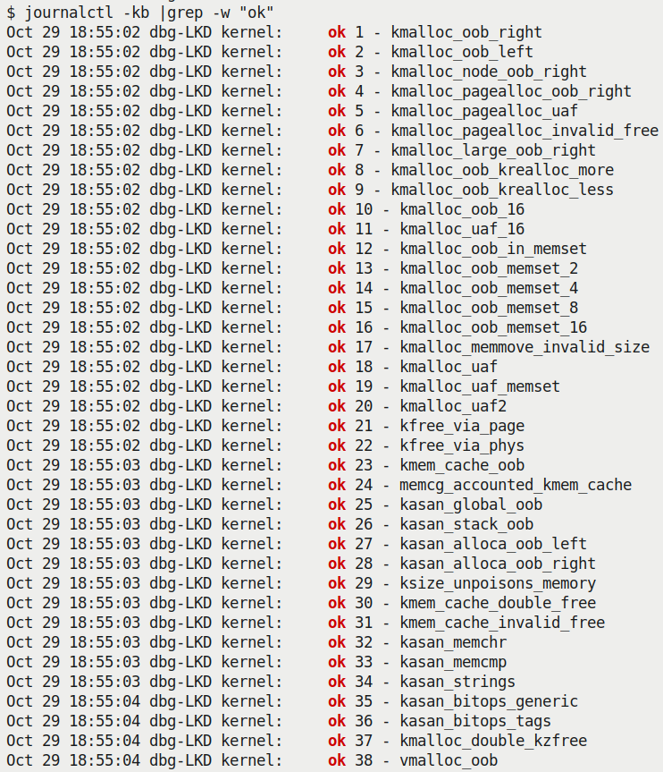
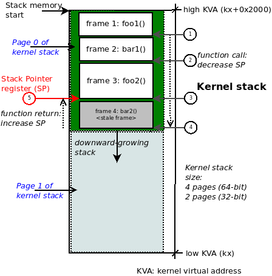
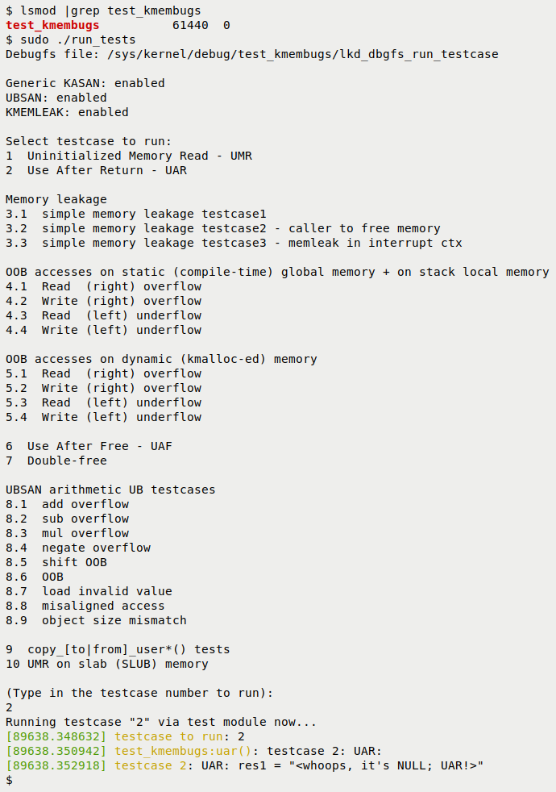
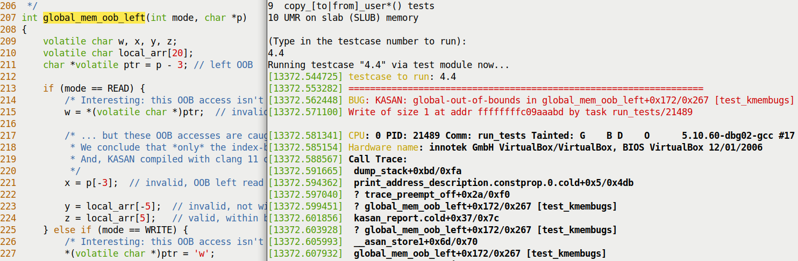
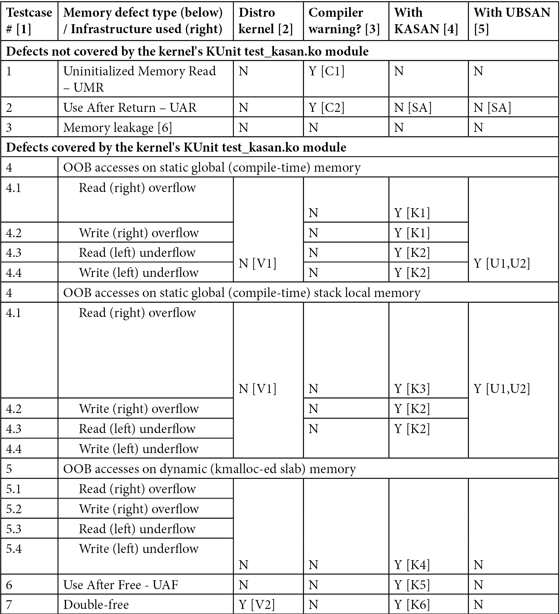

# 5.5  Bug hunting with KASAN

假设你现在已经按照上一节的详细步骤，把开启了 KASAN 的调试内核配置好、编译好，并成功启动进去了。在我的环境里——一台 x86_64 的 Ubuntu 20.04 LTS 虚拟机——这一切已经就绪。

现在这双眼睛已经装好了，我们需要找点东西给它看。

为了验证 KASAN 是否真的在工作，我们需要执行一些包含内存 Bug 的代码（我仿佛听到有些老手在台下冷笑：「呵，这还不简单？随便找段代码就是了」）。确实，我们完全可以手写几个测试用例，但既然轮子都已经造好了，为什么还要重复劳动呢？这正好是一个熟悉内核测试基础设施的好机会。接下来的部分，我们就来看看如何利用内核的 KUnit 单元测试框架来跑 KASAN 的测试用例。

---

### 利用内核的 KUnit 基础设施运行 KASAN 测试

既然社区已经帮我们把测试用例写好了，何必费那劲自己去写？这就是开源的美妙之处。

如今的 Linux 内核已经进化得相当完备，内置了各种测试基础设施，包括成熟的测试套件。想要测试内核的某个方面，现在通常只需要正确配置内核选项，然后跑测试就行了。

在内核众多的内置测试框架中，主要有两个：KUnit 框架和 kselftest 框架。顺便提一下，官方内核文档当然有所有细节。作为起点，你可以看看这个「内核测试指南」：

`https://www.kernel.org/doc/html/latest/dev-tools/testing-overview.html`

它提供了一个关于内核中可用测试框架和工具（包括动态分析工具）的粗略概览。

另外，还有一些相关且有用的框架：内核故障注入、通知器错误注入、Linux Kernel Dump Test Module (LKDTM) 等等。你可以在内核配置的 `Kernel hacking | Kernel Testing and Coverage` 菜单下找到它们。

我们这里不打算深入探究 KUnit 的工作原理，现在的目标仅仅是把它作为一个实用的例子来测试 KASAN。关于如何使用这些测试框架的细节（这证明非常有用！），你可以参考章节末尾的「延伸阅读」部分的链接。

言归正传，为了开始上手并熟悉它，让我们利用内核的 KUnit（Linux 内核单元测试）框架来执行 KASAN 测试用例。

这其实非常简单。首先，确保你的调试内核已经配置启用了 KUnit：
`CONFIG_KUNIT=y`（或者 `CONFIG_KUNIT=m`）。

我们要跑的是 KASAN 的测试用例，所以必须也把 KASAN 测试模块选上：

`CONFIG_KASAN_KUNIT_TEST=m`

我们即将运行的 KASAN 测试模块的内核代码位于 `lib/test_kasan.c`。稍微瞄一眼代码，你会看到里面定义了各种各样的测试用例（很多——在我写这段代码时，有 38 个之多）：

```c
// lib/test_kasan.c
static struct kunit_suite kasan_kunit_test_suite = {
    .name = "kasan",
    .init = kasan_test_init,
    .test_cases = kasan_kunit_test_cases,
    .exit = kasan_test_exit,
};
kunit_test_suite(kasan_kunit_test_suite);
```

这段代码设置了一组待执行的测试套件。实际的测试用例放在 `kunit_suite` 结构体的 `test_cases` 成员里。它是一个指向 `kunit_case` 结构体数组的指针：

```c
static struct kunit_case kasan_kunit_test_cases[] = {
    KUNIT_CASE(kmalloc_oob_right),
    KUNIT_CASE(kmalloc_oob_left),
    [...]
    KUNIT_CASE(kmalloc_double_kzfree),
    KUNIT_CASE(vmalloc_oob),
    {}
};
```

`KUNIT_CASE()` 宏负责设置单个测试用例。为了帮你理解它是怎么工作的，我们来看看第一个测试用例的代码：

```c
// lib/test_kasan.c
static void kmalloc_oob_right(struct kunit *test)
{
    char *ptr;
    size_t size = 123;

    ptr = kmalloc(size, GFP_KERNEL);
    KUNIT_ASSERT_NOT_ERR_OR_NULL(test, ptr);
    KUNIT_EXPECT_KASAN_FAIL(test, ptr[size + OOB_TAG_OFF] = 'x');
    kfree(ptr);
}
```

很直观，实际的检查发生在这里看到的 `KUNIT_ASSERT|EXPECT_*()` 宏里。
第一个宏断言 `kmalloc()` API 的返回值没有报错且不为空。
第二个宏，`KUNIT_EXPECT_KASAN_FAIL()`，让 KUnit 代码预期失败——这是一个负面测试用例（Negative Test Case）。这正是我们要做的：我们期望向缓冲区右侧越界写入（一个写溢出缺陷）会触发 KASAN 并报告失败！如果你感兴趣，可以去研究一下这些宏的实现细节。

此外，非常有趣的一点是，`kunit_suite` 结构体中的 `name` 和 `exit` 成员指定了在每个测试用例运行前后需要执行的函数。这个模块利用这个机制来确保内核 sysctl `kasan_multi_shot` 被临时启用，并将 `panic_on_warn` 设为 0（否则，只有第一次非法内存访问会触发报告并可能导致内核崩溃！）。

最后，让我们试一试：

```bash
$ uname -r
5.10.60-dbg01
$ sudo modprobe test_kasan
```

这会导致 KASAN 测试模块里的所有测试用例全部执行！查看内核日志（通过 `journalctl -k` 或 `dmesg`），你会看到每个测试用例详细的 KASAN 报告。因为输出内容非常庞大，我只截取一部分。第一个测试用例——`KUNIT_CASE(kmalloc_oob_right)`——导致 KASAN 生成了如下报告（输出被截断了——后面会有更多）：



**Figure 5.2 – KUnit KASAN 抓虫示例的第一部分**

请注意上图中的几个关键点：

*   在前两行，KUnit 显示了测试标题（即 `# Subtest: kasan`），并表示将要运行测试用例 1..38。
*   KASAN 如我们所料，成功检测到了内存缺陷（写溢出），并生成了报告。报告以 `BUG: KASAN: [...]` 开头，后面跟着详细内容。
*   接下来的几行揭示了根本原因。KASAN 显示违规函数的格式是 `func()+0xoff_from_func/0xsize_of_func`。这表示在名为 `func()` 的函数中，错误发生在该函数起始位置偏移 `0xoff_from_func` 字节处，并且内核估算该函数长度为 `0xsize_of_func` 字节。所以在这里，内核模块 `test_kasan`（在最右边的方括号中显示）中的 `kmalloc_oob_right()` 函数代码，在距离起始位置 `0x159` 字节的偏移处（后面跟一个该函数长度为 `0x260` 字节的 educated guess），试图非法写入指定地址。这个缺陷，也就是 Bug，是对 slab 内存缓冲区的 OOB 写入，正如我们看到的 `slab-out-of-bounds` 标记所示：

    ```
    BUG: KASAN: slab-out-of-bounds in kmalloc_oob_right+0x159/0x260 [test_kasan]
    Write of size 1 at addr ffff8880316a45fb by task kunit_try_catch/1206
    ```

*   下面一行显示了发生这件事的进程上下文（我们会在下一章涵盖 tainted 标记的含义）：

    ```
    CPU: 2 PID: 1206  Comm: kunit_try_catch Tainted: G    O      5.10.60-dbg01 #6
    ```

*   再下一行显示了硬件细节（你可以看出来这是一个 VM，VirtualBox）。
*   输出的绝大部分是调用栈（标记为 `Call Trace:`）。如果你从下往上读（并忽略前缀带 `?` 的行），你可以清晰地看到控制流是如何到达这个 Bug 代码的！
*   `Allocated by task 1206:` 这一行以及随后的输出显示了内存分配代码路径的调用跟踪。这非常有帮助，因为它展示了这块内存缓冲区最初是由谁、在哪里分配的。

输出的剩余部分可以在下图中看到：



**Figure 5.3 – KUnit KASAN 抓虫示例的第二部分**

由于我们之前建议在配置 Generic KASAN 模式时开启了 `CONFIG_PAGE_OWNER=y`（参见 Configuring the kernel for Generic KASAN mode 一节），下面的输出也会出现。它让你深入了解到发生非法访问的页面位于何处以及它的所有权信息：



**Figure 5.4 – KUnit KASAN 抓虫示例的第三（也是最后）部分**

在上图中，你可以看到 KASAN 正在自证清白。它显示了发生缺陷的实际内存区域，甚至精确指出了导致问题的那个字节（通过行首的 `>` 和列上的 `^` 符号！）。作为这个 Bug 的副作用，内核现在禁用了所有锁调试。此外，KUnit 表示运行第一个测试用例进展顺利：`ok 1 - kmalloc_oob_right`。

理解这些信息非常重要。它能帮你抽丝剥茧，找到真正触发 Bug 的元凶。我们将在下一节详细解读这行输出！

---

### 解读 KASAN 影子内存输出

在 Figure 5.4 中，你可以看到 KASAN 的影子内存揭示了缺陷的成因。我们把关键的那一行打印出来——就是带右箭头 `>` 前缀的那行：

```
>ffff8880318ad980: 00 00 00 00 00 00 00 00 00 00 00 00 00 00 00 03
                  ^
```

这些是 KASAN 的影子内存字节，每一个字节代表 8 字节的实际内存。那个被指向的（`^` 符号）字节 `03` 告诉我们问题出在哪里。那么 `00`、`03` 这些字节到底是什么意思？细节如下：

*   **Generic KASAN** 分配一个影子字节来跟踪 8 字节的内核内存（你可以把这块 8 字节区域看作一个**内存粒度**，Memory Granule）。
*   一个粒度（8 字节区域）被编码为：可访问、部分可访问、红区的一部分或已释放。
*   通过影子字节跟踪来编码内存粒度（8 字节区域）的规则如下：

    *   **Shadow memory = 00**：所有 8 字节都可访问（没问题）。
    *   **Shadow memory = N**（其中 N 可以是 1 到 7 之间的值）：**前 N 个字节**是可访问的（合法）；剩下的 `8 - N` 个字节在法律上是不可访问的。
    *   **Shadow memory < 0**：负值意味着整个粒度（8 字节）都不可访问。具体的（负）值及其含义（已释放的内存、红区等）编码在头文件 `mm/kasan/kasan.h` 中。

现在你应该明白了，影子字节 `03` 意味着这块内存是**部分可访问**的。前 3 个字节（这里 N = 3）是合法可访问的；剩下的 5 个（8 - 3 = 5）字节则不是。让我们费点心思详细验证一下。当然，触发 Bug 的代码行就在这里（位于内核代码库中）：

```c
// lib/test_kasan.c
static void kmalloc_oob_right(struct kunit *test)
    [...]
    size_t size = 123;
    ptr = kmalloc(size, GFP_KERNEL);
    [...]
    KUNIT_EXPECT_KASAN_FAIL(test, ptr[size + OOB_TAG_OFF] = 'x');
```

现在，变量 `size` 被设为值 `123`，而当 `CONFIG_KASAN_GENERIC` 开启时 `OOB_TAG_OFF` 是 0。所以，实际上，这段（有 Bug 的）代码等同于：

```c
ptr[123] = 'x';
```

Generic KASAN 的内存粒度大小是 8 字节。所以在分配的 123 字节中，第 15 个内存粒度（`8 * 15 = 120`）正是我们要写入的目标。下面的示意图清晰地展示了内存缓冲区以及它是如何被溢出的：



**Figure 5.5 – 被 kmalloc 分配的内存（slab）缓冲区发生了溢出**

仔细看：在右端，字节位置 120、121 和 122 是合法且可以读/写的，但我们的 KUnit KASAN 测试用例故意写入了字节位置 123——这是超出 slab 缓冲区末尾 1 个字节的地方，这是一个明显的 OOB 写溢出违规，KASAN 抓住了它！

不仅如此，正如 Figure 5.4 和 Figure 5.5 清楚展示的那样，内核足够聪明，显示这里的影子值是 `03`，这意味着前 3 个字节是有效的，但剩下的 5 个不是——事实正是如此！

此外，周围的字节被设为值 `0xfc`（参见 Figure 5.4）。这是什么意思？从头文件里一看便知——它是内核 SLUB 对象内部的**红区**：

```c
// mm/kasan/kasan.h
#ifdef CONFIG_KASAN_GENERIC
#define KASAN_FREE_PAGE         0xFF  /* page was freed */
#define KASAN_PAGE_REDZONE      0xFE  /* redzone for kmalloc_large allocations */
#define KASAN_KMALLOC_REDZONE   0xFC  /* redzone inside slub object */
#define KASAN_KMALLOC_FREE      0xFB  /* object was freed (kmem_cache_free/kfree) */
#define KASAN_KMALLOC_FREETRACK 0xFA  /* object was freed and has free track set */
```

回到我们对 Figure 5.4 的解读：下一行（`BUG: KASAN: [...]`）只是想告诉你它继续运行下一个测试用例了…… KASAN 现在抓住了第二个测试用例的 Bug（`KUNIT_CASE(kmalloc_oob_left)`）。内核日志包含的信息和第一个缺陷一样：KASAN 的 Bug 摘要、`dump_stack()` 的输出（调用栈帧）、谁执行的分配、页面所有权信息以及 Bug 访问地址周围的内存状态。这一直持续到第三十八个测试用例——完美！

快速检查一下内核日志，会发现如我们所料——内核的 KUnit KASAN 测试用例模块抓住了所有 38 个有内存缺陷的测试用例：



**Figure 5.6 – 截图显示内核的 KUnit KASAN 测试模块抓住了全部 38 个有内存缺陷的测试用例**

正如从上面的截图中可以清楚看到的那样，全部 38 个测试用例都报告为 `ok`（通过）。

**练习**
务必在你的机器上执行我们刚刚做的步骤——运行内核的 KUnit KASAN 测试用例。注意从内核日志中观察各种 KASAN 测试用例，并验证它们是否都正确运行了。

顺便说一句，注意看这个：

```bash
$ lsmod |egrep "kunit|kasan"
test_kasan             81920  0
kunit                  49152  1 test_kasan
```

在我的特定环境下，你可以从 `lsmod` 的输出中看到 KUnit 被配置为了内核模块。

你可以学习如何编写自己的 KUnit 测试套件。更多关于使用 KUnit 的内容，请务必参考「延伸阅读」部分！

---

### 使用我们自定义的有 Bug 内核模块进行剩余测试

你有没有注意到，尽管运行了所有的 KASAN KUnit 测试用例，似乎仍有几种常见的内存缺陷（我们在第 4 章以及本章的 What's the problem with memory anyway? 一节中都有提到）没有被 KUnit 测试用例覆盖到？

*   未初始化内存读取（UMR，Uninitialized Memory Read）Bug
*   返回后重用（UAR，Use-After-Return）Bug
*   简单的内存泄漏 Bug（我们稍后在本章会更详细地讨论内存泄漏）

所以，我编写了一个内核模块来执行这些测试用例（当然是在开启了 Generic KASAN 的调试内核上运行的），以及一些更有趣的用例。要针对 KASAN 进行测试，记得通过你的自定义调试内核启动，那个内核显然要包含 `CONFIG_KASAN=y`。

由于篇幅限制，我不会在这里展示整个测试模块的代码（请参考本书的 GitHub 仓库并阅读其中的注释——你可以在 `ch5/kmembugs_test` 文件夹下找到）。为了让你尝尝鲜，让我们来看看其中一个测试用例以及它是如何被调用的。下面是 UAR 测试用例的代码：

```c
// ch5/kmembugs_test/kmembugs_test.c
/* The UAR - Use After Return - testcase */
static void *uar(void)
{
    volatile char name[NUM_ALLOC];
    volatile int i;
    pr_info("testcase 2: UAR:\n");
    for (i=0; i<NUM_ALLOC-1; i++)
        name[i] = 'x';
    name[i] = '\0';
    return name;
}
```

这个模块设计为通过一个名为 `load_testmod` 的 bash 脚本加载，测试用例则是交互式运行的（通过一个名为 `run_tests` 的 bash 包装脚本）。`run_tests` 脚本（你必须以 root 身份运行）会显示一个可用测试菜单，并要求你输入对应的数字来选择其中一个。你可以在 Figure 5.8（下一节）中看到菜单的截图——因此你也能看到所有可以尝试的测试用例。

然后，脚本会将这个数字写入我们的 debugfs 伪文件：`/sys/kernel/debug/test_kmembugs/lkd_dbgfs_run_testcase`。debugfs 的写钩子函数随后会从用户空间接收这个数据，验证它，并调用相应的测试用例例程（通过一长串 if-else 梯级结构）。这种设计允许你交互式测试，并可以根据意愿多次执行任何测试用例。

下面这段代码片段展示了我们的 debugfs 模块代码是如何调用前面的 `uar()` 测试用例的：

```c
// ch5/kmembugs_test/debugfs_kmembugs.c
static ssize_t dbgfs_run_testcase(struct file *filp, const char __user *ubuf,
                                  size_t count, loff_t *fpos)
{
    char udata[MAXUPASS];
    volatile char *res1 = NULL, *res2 = NULL;
    [...]

    if (copy_from_user(udata, ubuf, count))
        return -EIO;
    udata[count-1]='\0';
    pr_debug("testcase to run: %s\n", udata);
    /* Now udata contains the data passed from userspace - the testcase # to run (as a string) */
    if (!strncmp(udata, "1", 2))
       umr();
    else if (!strncmp(udata, "2", 2)) {
       res1 = uar();
       pr_info("testcase 2: UAR: res1 = \"%s\"\n",
res1 == NULL ? "<whoops, it's NULL; UAR!>" : (char *)res1);
    } else if (!strncmp(udata, "3.1", 4))
...
```

很显然，这——测试用例 #2——是一个缺陷，一个 Bug。你知道局部变量只在它们的生命周期内有效——也就是在函数执行期间。这是因为局部（或自动）变量是在正在执行的进程上下文的（内核模式）栈帧上分配的。因此，一旦超出包含它的函数的作用域，你就必须停止引用该局部变量。我们（故意）没有这么做！我们尝试把它作为返回值取回。问题是，到了那个时候，它已经没了……

不过，在深入运行这些测试用例之前（虽然没理由不现在就跑），我们先绕个弯，谈谈一个有趣的困境：一个已知的 Bug（比如我们的 UAR）有时怎么会看起来运行得完全正常。

---

### 过时栈帧——天堂里的麻烦

像 UAR 这种 Bug 最神奇（或者说最疯狂）的地方在于：代码有时看起来竟然能正常运行！怎么会这样？

事情是这样的：保存局部（自动）变量内容的内存位于栈上。虽然我们通俗地说栈帧是在函数进入时分配、在函数返回时销毁的（所谓的函数序言 Prologue 和尾声 Epilogue），但现实并没有这么戏剧化。

现实是，内存通常是以页面级别为粒度分配的。这也包括栈页面的内存。因此，一旦为栈分配了一页内存，通常足够容纳好几个帧（当然，这取决于具体情况）。然后，当需要更多栈内存时，栈就会增长（通过分配更多页面，向下增长，因为栈是向下长的）。系统通过让栈指针（Stack Pointer, SP）寄存器跟踪这个内存位置来知晓栈顶在哪里。此外，你要意识到所谓的「栈顶」通常是最低的合法地址。因此，当帧被分配和/或函数被调用时，SP 寄存器的值会减少。当函数返回时，栈通过向 SP 寄存器加值来收缩（记住，这是一个向下增长的栈！）。下面的示意图展示了一个典型的 Linux 系统上（32 位）内核模式栈的样子：



**Figure 5.7 – 32 位 Linux 上典型的内核模式栈示意图；函数调用链：foo1() -> bar1() -> foo2() -> bar2()**

所以，完全有可能发生这种情况：**过时**的栈帧（以及其中的相应数据）存在于有效帧的下面，并且可能被成功引用——甚至是在稍后——而系统不会抛出内存错误！

仔细研究 Figure 5.7。举个例子，我们展示了 32 位 Linux 系统上的内核模式栈，因此内核栈的大小将是 2 页，通常是 8 KB。现在，假设正在执行的进程上下文（在内核中）按以下顺序调用了这些函数（这就是调用链，图中的圆圈步骤 1 到 4）：

`foo1() --> bar1() --> foo2() --> bar2()`

想象我们现在处于叶子节点，在这个例子中是函数 `bar2()`。它返回了（上图中的圆圈步骤 5）。这导致 SP 寄存器增加回代表函数 `foo2()` 的调用帧地址。所以，虽然函数 `bar2()` 的调用栈内存仍然完整地保留在栈上，但实际上已经**无效**了。但是，对它的错误（也就是有 Bug 的）访问可能仍然会成功。

这在理想情况下不应该发生，但嘿，这本来就不是个完美的世界，对吧？！这里的教训是：我们需要工具——以及清晰的思考，这是最好的工具——来捕捉像 UAR 这样棘手的 Bug！

好了，回到我们的测试用例！要运行测试，请按照以下步骤操作：

1.  运行以下命令：

    ```bash
    cd <book_src>/ch5/kmembugs_test
    ```

2.  加载模块：

    ```bash
    ./load_testmod
    [...]
    ```

    这应该会构建内核模块并将其加载到内存中，`dmesg` 会显示 debugfs 伪文件——`<debugfs_mountpt>/test_kmembugs/lkd_dbgfs_run_testcase`——已经被创建。

3.  运行我们的 bash 脚本进行测试：

    ```bash
    sudo ./run_tests
    ```

下面的截图显示我们的 `test_kmembugs` 模块确实被加载进去了（这是通过我们的 `load_testmod` 脚本完成的），通过 `run_tests` 脚本显示了菜单，以及我们正在运行测试用例 #2——那个 UAR Bug：



**Figure 5.8 – 部分截图，显示了我们的 kmembugs_test LKM 的构建和输出**

下面是我们的测试用例框架通过 KASAN 抓住左 OOB 写 Bug 访问的示例截图：



**Figure 5.9 – 部分截图，显示了 KASAN 抓住了向全局内存写入时的左 OOB Bug**

有几点需要意识到：

*   首先，编译器，无论是 GCC 还是 Clang，都足够聪明，会针对这些（这里相当明显的）Bug 发出警告。UAR 和 UMR 缺陷确实都会被它们捕获（就在代码中发生的精确位置），虽然是作为警告！下面是 GCC 针对我们的 UAR Bug 发出的警告之一：

    ```
    <...>/ch5/kmembugs_test/kmembugs_test.c:115:9: warning: function returns address of local variable [-Wreturn-local-addr]
      115 |  return (void *)name;
          |         ^~~~~~~~~~~~
    ```

    **⚠️ 这一点很重要**
    作为程序员，你的任务是仔细留意所有的编译器警告，并——尽人力所能——修复它们。

*   脚本会查询内核配置文件，看看你当前的内核是否配置了 KASAN、UBSAN 和 KMEMLEAK，并显示它找到的内容。它还显示了 debugfs 伪文件的路径，测试用例编号将被写入该文件（以调用该测试）。

下面是 UAR 测试用例的一次示例运行：

```bash
$ sudo ./run_tests
[...]
(Type in the testcase number to run):
2
Running testcase "2" via test module now...
[  144.313592] testcase to run: 2
[  144.313597] test_kmembugs:uar(): testcase 2: UAR:
[  144.313600] testcase 2: UAR: res1 = "<whoops, it's NULL; UAR!>"
$
```

*   内核日志中的输出（通过上面的 `dmesg` 看到）清楚地说明了情况：我们执行了 UAR 测试用例，内核和 KASAN 都没有抓住它（如果抓住了，日志里会有一堆抱怨！）。我们自己的代码检查变量 `res1` 是否为 NULL，并得出结论发生了 UAR Bug。我们可以这样做，因为我们专门将其初始化为 NULL，并在它被设为由函数 `uar()` 返回的字符串之后进行检查；否则，我们可能就没抓到它。

好了，现在我们已经用 KASAN 做了几个测试。KASAN 的成绩单怎么样呢？下一节就会告诉你。

---

### KASAN——结果汇总表格

KASAN 到底能抓到哪些内存破坏 Bug（缺陷），又抓不到哪些？根据我们的测试运行，我们把结果汇总在下面的表格里。请仔细研究它，以及随后的注释：




**Table 5.3 – KASAN 捕获（或未捕获）的内存缺陷和算术 UB 测试用例汇总**

你会找到表格中看到的脚注符号（比如 `[C1]`, `[U1]` 等）的解释，见下文。

**测试环境**

*   **[1] 测试用例编号**：请参考测试内核模块的源代码——`ch5/kmembugs_test/kmembugs_test.c`，debugfs 条目创建和用法在 `debugfs_kmembugs.c` 中，以及 bash 脚本 `load_testmod` 和 `run_tests`，都在同一个文件夹下。
*   **[2] 这里使用的编译器**是 x86_64 Ubuntu Linux 上的 GCC 版本 9.3.0。后面的章节 - 使用 Clang 13 on Ubuntu 21.10 - 会涵盖使用 Clang 13 编译器的内容。
*   **[3]** 为了测试 KASAN，我必须通过我们的自定义调试内核（5.10.60-dbg01）启动，其中包含 `CONFIG_KASAN=y` 和 `CONFIG_KASAN_GENERIC=y`。我们假设使用的是 Generic KASAN 变体。
*   **测试用例 4.1 到 4.4** 作用于静态（编译时分配的全局）内存以及栈局部内存。这就是为什么测试用例编号在两者中都是 4.x。

**编译器警告**

*   **版本**：这是针对 x86_64 Ubuntu 上的 GCC 版本 9.3.0：

    *   **[C1]** GCC 编译器将 UMR 报告为警告：

        ```
        warning: '<var>' is used uninitialized in this function [-Wuninitialized]
        ```

    *   **[C2]** GCC 报告潜在的 UAF 缺陷为警告：

        ```
        warning: function returns address of local variable [-Wreturn-local-addr]
        ```

    *   **[C3]** GCC（相当聪明！）在这里捕获了非法的 `copy_[to|from]_user()`。它算出目标大小太小了：

        ```
        * In function 'check_copy_size',
            inlined from 'copy_from_user' at ./include/linux/uaccess.h:191:6,
            inlined from 'copy_user_test' at <...>/ch5/kmembugs_test/kmembugs_test.c:482:14:
        ./include/linux/thread_info.h:160:4: error: call to '__bad_copy_to' declared with attribute error: copy destination size is too small
          160 |    __bad_copy_to();
              |    ^~~~~~~~~~~~~~~
        ```

*   **使用 Clang 13 编译器**时（我们在使用 Clang 构建内核和模块一节中会涉及），警告与 GCC 几乎完全一致。此外，它还会发出 `variable 'xxx' set but not used [-Wunused-but-set-variable]`。

下面的部分会深入探讨细节——千万别错过！

---

### KASAN——关于表格结果的详细说明

这里详细解释一下 KASAN 的脚注符号（`[K1]`, `[K2]` 等）。通读所有注释非常重要，因为我们提到了一些注意事项和极端情况：

*   **[K1]** KASAN 捕获并报告**全局静态内存**上的 OOB 访问，格式如下：

    ```
    global-out-of-bounds in <func>+0xstart/0xlen [modname]
    Read/Write of size <n> at addr <addr> by task <taskname/PID>
    ```

    报告中会包含 `Read` 或 `Write`，取决于发生了读取还是写入的 Bug 访问。

*   **[K2]** 这里有不少注意事项要提：

    *   在**全局内存**测试用例上的 Out-Of-Bounds (OOB) 读/写**左下溢**，只有在使用 Clang 版本 11 或更高版本编译时才会被捕获。GCC 10 或 11 甚至抓不到它，这是由于其红区的工作方式导致的。

    *   KASAN 只有在使用 **Clang 11 及更高版本**编译时才会捕获全局内存的 OOB 访问！因此，在我使用 GCC 9.3 和 Clang 10 的测试运行中，我看到它未能捕获全局缓冲区上的读/写下溢（左 OOB）访问（测试用例 4.3 和 4.4）！不过，对于全局内存的溢出缺陷，它似乎倒是能捕获，尽管你不应想当然……（顺便说一句，Clang 读作 "clang" 而不是 "see-lang"）。此外，虽然文档声称从版本 8.3.0 开始支持 GCC，但在我的测试中，它未能捕获（仅）全局内存上的读/写下溢 Bug 测试用例。请务必阅读即将到来的使用 Clang 编译内核和模块一节！

    *   然而，即使使用 GCC 9.3，根据其内部红区和填充的工作方式，**第一个声明的全局变量**（具体是哪个变量取决于链接器如何设置）可能没有左侧红区，导致左 OOB Bug 访问被漏掉……这就是为什么——作为一个愚蠢的变通方法，直到 GCC 修复这个问题——我们使用了三个全局数组。在测试用例中，我们将中间的那个作为测试缓冲区（除了第一个以外的任何都可以）。希望 GCC 能被修复——拥有正确的红区——这样所有的 OOB 访问都能被捕获。在我们的特定测试运行中，即使使用 GCC 9.3 编译，全局内存上的 Bug 左 OOB 访问确实被捕获了！

    *   这些观察结果、注意事项等等，本质上有时有点玄学。它们可能在一个系统上以一种方式工作，而在另一个不同配置的系统或架构上又截然不同。因此，我们衷心建议你使用适当配置的调试内核，结合你手头的所有工具（包括使用较新的编译器技术，如 Clang）以及本书涵盖的各种工具和技术来测试你的工作负载。是的，这工作量很大，是的，这很值得！

*   **[K3]** KASAN 捕获并报告**栈局部内存**上的 OOB 访问，格式如下：

    ```
    stack-out-of-bounds in <func>+0xstart/0xlen [modname]
    Read/Write of size <n> at addr <addr> by task <taskname/PID>
    ```

*   **[K4]** KASAN 捕获并报告**动态 slab 内存**上的 OOB 访问，格式如下：

    ```
    BUG: KASAN: slab-out-of-bounds in <func>+0xstart/0xlen [modname]
    Read/Write of size <n> at addr <addr> by task <taskname/PID>
    ```

*   **[K5]** KASAN 捕获并报告 **UAF** 缺陷，格式如下：

    ```
    BUG: KASAN: use-after-free in <func>+0xstart/0xlen [modname]
    Read/Write of size <n> at addr <addr> by task <taskname/PID>
    ```

*   **[K6]** KASAN 捕获并报告**双重释放**，格式如下：

    ```
    BUG: KASAN: double-free or invalid-free in <func>+0xstart/0xlen [modname]
    ```

*   在上述所有情况下，KASAN 的报告还会详细显示实际的违规情况，包括进程上下文、（内核模式栈）调用跟踪，以及影子内存映射，显示 OOB 内存访问属于哪个变量（如果适用）以及 Bug 地址周围的内存状态。

**提示——把所有结果汇总在一张表里**
为了方便你查阅，在这个关键主题的第二部分（下一章），在 *Catching memory defects in the kernel – comparisons and notes (Part 2)* 一节中，表 6.4 汇总了我们在本章中使用的所有工具技术——vanilla/distro 内核、编译器警告、KASAN、UBSAN 以及 SLUB debug——的测试用例结果。实际上，它是所有发现的一个汇编，让你能够快速（且希望是有帮助地）进行比较。

你有没有注意到，关于内核内置的基于 KUnit 的 KASAN 测试用例，`test_kasan` 内核模块**没有**针对这三种内存缺陷——UMR、UAR 和内存泄漏——的测试用例。为什么？很简单：**KASAN 抓不住这些 Bug**。好了，那我们能得出什么结论？KUnit（以及其他）测试套件通常是以自动化方式运行的，其预期的最终结果是所有可行的测试用例都通过；事实上，它们必须通过。如果测试套件包含了这三个缺陷，这就不可能实现了，所以它们没包含。现在，别误会——这只是测试套件的设计方式而已。当然除了 KASAN 之外，肯定还有其他手段可以捕获这些缺陷。别急——我们会到的，也会抓住它们的。

在这里，我们只是展示了 KASAN 本身并不捕获这些特定的棘手 Bug。在本书的后面，我们会看到哪些工具能做到。

顺便提一下，KASAN 是通过模糊测试方法捕获难以寻找的 Bug 的关键组件。Syzkaller（也就是 syzbot）——事实上的强大 Linux 内核模糊器——要求内核必须配置 KASAN！我们将在第 12 章 *A few More Kernel Debug Approaches* 的 *What is fuzzing?* 一节中简要介绍模糊测试。务必去看看。

干得漂亮——你现在知道如何利用 KASAN 的力量来帮助捕捉那些棘手的内存 Bug 了！接下来让我们进入使用 UBSAN 的环节。