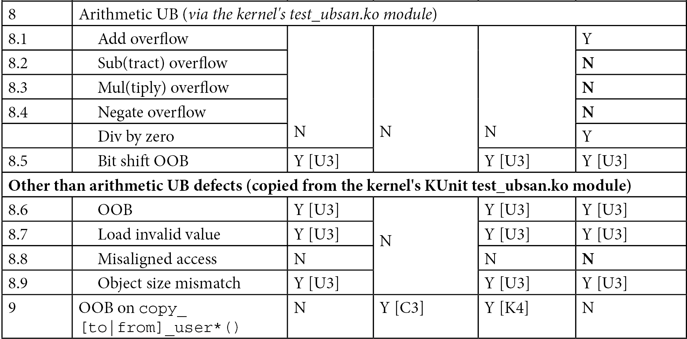

# 5.8  捕获内核中的内存缺陷——对比与笔记（Part 1）

现在到了做复盘的时候了。

前面的几节就像是在兵器库里试刀：一会儿拿 KASAN 砍一砍，一会儿拿 UBSAN 刺一刺，最后还换上了 Clang 这把新剑。这种零散的尝试能让你感觉到「这东西挺锋利」，但真要上了战场——面对一个诡异崩溃的生产环境内核——你需要清楚地知道手里每把武器的射程和盲区。

为了不让你在真家伙面前手忙脚乱，我们花点时间把这些测试结果摊开来看。

这也是为什么会有下面这张大表。

**表 5.5 —— 各种常见内存缺陷与不同技术捕获能力的总结**

表里的各种脚注（比如 `[C1]`、`[K1]`、`[U1]` 之类），我们在前面的章节里其实都已经详细解释过了。现在，让我们透过这些密密麻麻的「Yes」和「No」，试着提炼出几条核心规律：

*   **KASAN 几乎是一个「全能捕手」**：对于全局（静态）内存、栈内存和动态内存上的越界（OOB）访问，KASAN 几乎照单全收。相比之下，UBSAN 对动态堆内存的越界访问就显得力不从心了——你看表里的 4.x 和 5.x 测试用例，它在那儿是失明的。

*   **KASAN 有它的盲区**：它看不见那些纯粹的「未定义行为」（UB，即 8.x 测试用例）。但这正好是 UBSAN 的主场，它能捕获绝大多数这类隐患。

*   **有些 Bug 谁都抓不到**：前三个测试用例——未初始化内存读取（UMR）、返回后重用（UAR）和内存泄漏——KASAN 和 UBSAN 都束手无策。对于 UMR，你得靠编译器的警告（把 Wall 开满）或者静态分析器（比如 cppcheck）来救场。至于那个棘手的 UAR Bug，我们留到第 12 章《几种额外的内核调试方法》里，专门用一节《使用 cppcheck、checkpatch.pl 进行静态分析》来演示怎么捕获它。

*   **内存泄漏得靠专家**：`kmemleak` 内核基础设施是专门干这个的，它能追踪由 `k{m|z}alloc()`、`vmalloc()` 或 `kmem_cache_alloc()`（以及相关接口）分配的内存泄漏。

---

### 关于这张表的几点补充

看着这张表，还有几个细节值得停下来琢磨一下：

*   **`[V1]` 的含义**：表里写的是「Various」（各种可能）。这其实是最吓人的情况——系统可能只是 Oops 一下，或者直接死机挂起，甚至表面看起来毫发无损。
    **不要被表象骗了。**
    一旦内核逻辑有了 Bug，这个系统就是不可信的，哪怕它现在还能跑。这种「看起来没事」的状态往往是定时炸弹。

*   **`[V2]` 的含义**：这一点在表里没展开，但我必须提个醒。关于这个细节的完整解释，我们留给下一章的《在关闭 slub_debug 的内核上运行 SLUB 测试用例》那一节。那里会有一个反转，值得你期待。

---

### KASAN 的替代品——KFENCE（内核电网）

说到内存检测，你可能会在心里嘀咕：KASAN 虽好，但它那个性能开销……我是真不敢在跑生产环境的机器上开它。有没有一种办法，既能享受检测的快乐，又不用担心把机器拖垮？

这就是 **KFENCE (Kernel Electric-Fence)** 登场的时候了。

这是 Linux 内核里非常新的工具（从 5.12 版本开始引入，截至本书写作时，它算是相当新潮的技术）。

KFENCE 的定位很明确：**低开销、基于采样的内存安全错误检测器**。它专门盯着堆内存的释放后重用、无效释放和越界访问这三种臭名昭著的错误。目前它已经支持 x86 和 ARM64 架构，并且能挂接到内核的 SLAB 和 SLUB 分配器上。

你可能会问：**既然有了 KASAN，为什么还要搞个 KFENCE？**

这个问题问到了点子上。虽然它们功能上有重叠，但设计的哲学完全不同：

1.  **使用场景**：KASAN 性能损耗太大，注定只能在开发/调试环境里当宠物养；而 KFENCE 是为生产环境设计的，它的性能开销极低——低到接近于零。
2.  **工作原理**：KASAN 想要抓全，就要监控所有内存；KFENCE 选择了「采样」策略。它不盯着所有内存，而是随机抽查。这就牺牲了一定的精确度，换取了极低的性能损耗。
3.  **时间换概率**：KASAN 是「立刻抓所有」，KFENCE 是「早晚抓到你」。只要系统运行的时间足够长（或者你有足够多的机器在跑），KFENCE 几乎肯定能撞上那个 Bug。

**结论很简单**：在开发和调试机上，无脑上 KASAN（当然也可以顺便开 KFENCE）；但在生产环境的机器上，KFENCE 是你唯一的选择。

要启用 KFENCE，你需要把 `CONFIG_KFENCE` 设为 `y`。
*（⚠️ 注意：因为这项技术太新了，我们在本书中使用的 5.10 内核系列里还没有这个选项，你需要稍微升级一下你的内核源码才能玩到它。）*

更多关于 KFENCE 的细节——包括如何微调、如何解读它的错误报告、它的内部实现原理等等——你可以去啃官方文档：`Documentation/dev-tools/kfence.rst`。

---

### 最后一发补充——`CONFIG_FORTIFY_SOURCE`

在结束这一章之前，还有个重磅武器要介绍一下。

如果你把内核升级到 5.18（截至写作时的最新稳定版），你会遇到一个新的、更严格的 `memcpy()` API 家族（涵盖了 `memcpy()`、`memmove()` 和 `memset()`）。这背后是一个叫做**编译时边界检查**的内核特性，它内部利用了编译器的加固功能。

这个功能的内核配置选项叫 `CONFIG_FORTIFY_SOURCE`。

把它打开之后，它能在编译和运行时帮您捕获一大类典型的缓冲区溢出缺陷。这就像是给内存操作函数加了一层隐形的防护网。如果你想深入了解这个机制有多硬核，强烈推荐去读一下 LWN 的这篇文章：《Strict memcpy() bounds checking for the kernel》。

---

### 本章回响

写到这里，本章的旅程其实已经覆盖了内核内存调试最核心的路径。

还记得我们在这一章开头提出的那几个问题吗？
*   为什么内存 Bug 这么难找？
*   在不重启机器、不破坏现场的前提下，我们到底能做多少事情？

现在你手里有了答案。

虽然 C 语言给了我们操控一切的权力，但这权力的代价就是我们必须亲自管理内存，且稍微一滑，就会跌入未定义行为的深渊。在本章中，我们不仅认识了你可能遇到的各种敌人——从简单的越界到诡异的未定义行为——更重要的是，我们装备了一整柜武器来对付它们。

这不仅仅是 KASAN 和 UBSAN 的简单罗列。**我们建立的是一种分层防御的思维**：用 KUnit 做自动化回归，用 Debugfs 脚本做手动探针，用 UBSAN 补足逻辑漏洞，最后换上 Clang 编译器来利用其更敏锐的诊断能力。

那张大表（Table 5.5）不是终点，它只是一个中间检查站——在下一章里，我们还会往上面填更多工具的数据，继续完善这张作战地图。而像 KFENCE 和 `FORTIFY_SOURCE` 这样的工具，则展示了未来的方向：即使是在生产环境的严苛限制下，我们也依然有办法捕获那些隐蔽的缺陷。

走到这一步，恭喜你，你已经完成了这漫长且至关重要的第一部分——捕获内核空间内存 Bug 的基础训练。**别急着翻页，先花点时间消化一下。** 当你觉得手里的剑已经足够顺手时，下一章在等着你，我们将完成对内核内存缺陷捕获的剩余拼图。