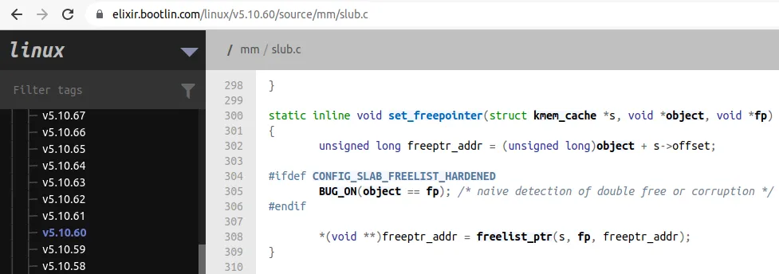
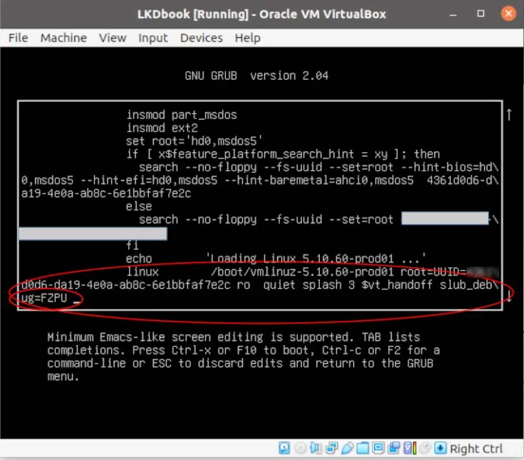

现在我们到了验收环节——把那些有问题的测试模块扔进内核里，看看刚才配置的那套安检机制能不能把漏洞抓出来。

---

## 运行并统计 SLUB 测试案例

所有的测试代码都堆在同一个模块里：`ch5/kmembugs_test/kmembugs_test.c`（别忘了还有它的搭档 `debugfs_kmembugs.c`）。这一节既然是测 SLUB，我们就只挑跟 slab 内存有关的案例跑。

为了看清差距，我们这次要在两个极端环境下做对比：

1.  **完全关闭调试**：`slub_debug=-`
2.  **全开 SLUB 调试**：`slub_debug=FZPU`

你可能会问，为什么要跑两种？直接开调试不就完了？

原因很简单：现实中的发行版内核（比如这里用的 Ubuntu 20.04 LTS）虽然默认开启了 `CONFIG_SLUB_DEBUG=y`，但并不意味着所有调试特性都在跑。你需要理解「有调试框架」和「开着调试干活」的区别。

而且还有一个现实原因：如果我们用之前那个编译了 KASAN 和 UBSAN 的调试内核来测，这两个家伙会抢先一步报错——我们就看不到 SLUB 自己的报错了。所以这里我们用纯净的生产内核（`5.10.60-prod01`）来跑，好让 SLUB 自己唱主角。

---

### 场景一：SLUB 调试关闭时（`slub_debug=-`）

先把安全网撤掉，看看裸奔是什么情况。这对应 Table 6.2 里的第三列，以及标记为 `[V1]`、`[V2]`、`[V3]` 的行。

跑起来的结果正如你预料的那样惨淡：

*   **毫无反应**：当 `slub_debug=-` 时，没有任何内存 bug 被捕获——包括我们的前三项测试（UMR 未初始化内存读、UAR 释放后重用、内存泄漏）全部漏网。
*   **`[V1]` 行为不可预测**：系统可能直接 Oops，可能卡死，也可能看起来什么事都没发生——但这才是最可怕的。内核一旦坏了，它就是坏了，只是还没倒下而已。
*   **`[V2]` Double-free 的下场**：对于重复释放（double-free）这个缺陷，普通的 vanilla 内核或者生产内核会有反应。它可能会触发段错误，然后给你抛出这样一个报错：

    ```
    kernel BUG at mm/slub.c:305!
    ```

    这里的指令指针寄存器（x86_64 上的 RIP）正指着 `kfree()` API。

    这行报错很有意思。我特意去查了主线内核 5.10.60 版本的源码（在 Bootlin 的那个源码浏览器上，非常顺滑）：[`mm/slub.c:305`](https://elixir.bootlin.com/linux/v5.10.60/source/mm/slub.c)。

    看图：

    

    真是不偏不倚。触发 bug 的正是第 305 行。这说明即使是普通的 vanilla 内核，也保留了最后一丝理智——它能检测出这种「原始」的 double-free，知道这是一种内存破坏。

*   **`[V3]` UMR 依然隐形**：至于 slab 内存上的未初始化内存读取（UMR），在生产内核且 `slub_debug=-` 的状态下，它依然逍遥法外。kmalloc 出来的区域看起来像是被初始化成了 `0x0`，但这只是假象，你读到了脏数据，而系统没警告你。

---

### 场景二：SLUB 调试开启时（`slub_debug=FZPU`）

好，现在把安全网拉起来。我们需要重启系统，在 GRUB 里把内核参数改成 `slub_debug=FZPU`。

这对应 Table 6.2 里的第四列。

如果你是通过 VirtualBox 或者直接在真机上操作，编辑 GRUB 启动项大概是这样：



改完重启进系统，第一步永远是确认内核真的收到了你的指令。别懒，这一定要看：

```bash
$ dmesg |grep "Kernel command line"
[    0.094445] Kernel command line: BOOT_IMAGE=/boot/vmlinuz-5.11.0-40-generic root=UUID=<...> ro quiet splash 3 slub_debug=FZPU
```

看到了末尾的 `slub_debug=FZPU` 吗？
（当然，跑 `cat /proc/cmdline` 也能看到同样的结果。）

行，现在一切就位，把测试模块重新扔进去。

这一次，局势完全变了。回到 Table 6.2 看看那些标记为 `[V4]` 的行：

SLUB 调试机制成功捕获了**越界写**（OOB），无论是向上溢出还是向下溢出，都无所遁形。

但这里有个微妙的地方值得注意——如果你仔细看测试结果，你会发现 SLUB 的行为和 UBSAN 有点像：它似乎只对「错误的索引越界」敏感，当越界访问是通过指针算术发生的时候，它可能就会漏掉。另外，对于**越界读**（OOB Read），SLUB 在这个配置下似乎也无能为力。

这很正常。没有哪一种工具是上帝视角，它们各有各的盲区。

现在，SLUB 已经抓到了坏人，并吐出了一堆错误日志。接下来我们要学的是一项核心技能：如何像侦探一样解读这份 SLUB 调错报告。