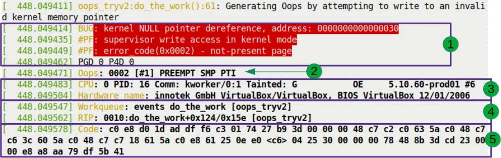
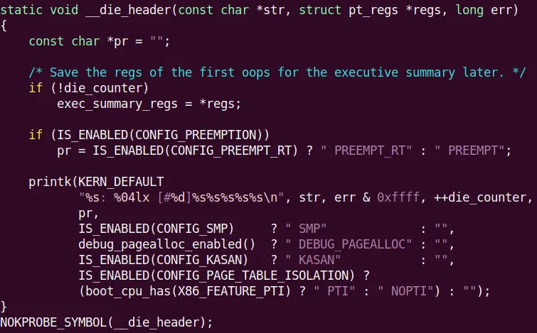
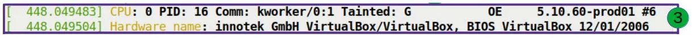
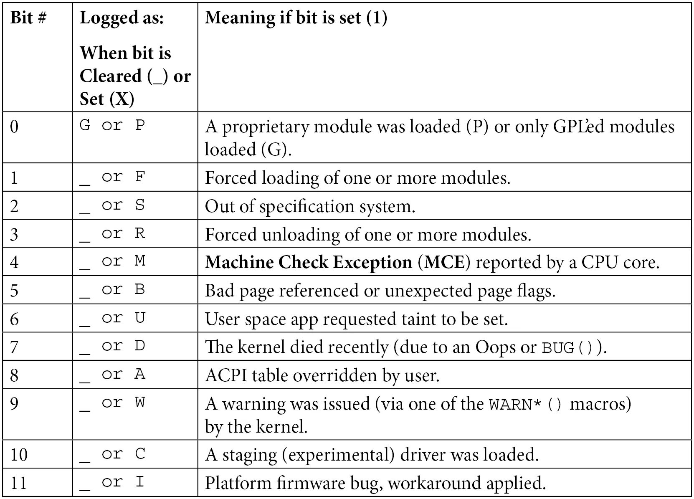
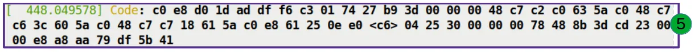
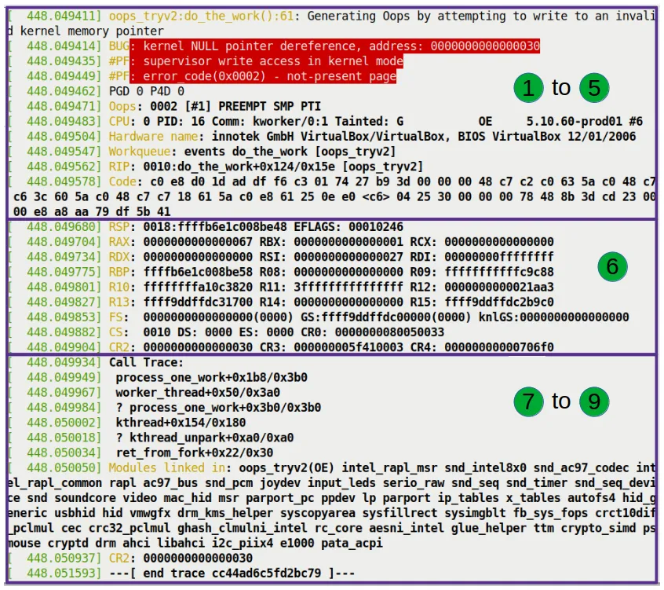
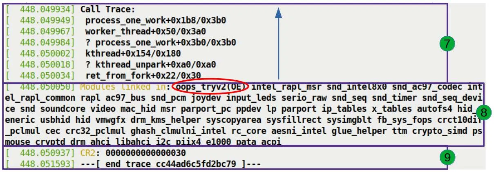

# 7.3  细节里的魔鬼——解剖现场

上一节我们亲手制造了一起内核惨案，看着 Oops 日志刷屏确实挺爽，但痛快完之后，问题来了：**这些满屏的十六进制代码到底在说什么？**

如果你只是像看天气预报一样扫一眼，那它就是一堆乱码。但如果你想当一名内核工程师，你必须学会像法医一样阅读这些信息。每一个字段、每一个数字，甚至每一个标点符号，都是 CPU 留下的证词。

为了不让这变成一场抽象的理论课，我们还是用刚才那个亲手埋下的「雷」来解剖——**Case 3：通过 NULL 指针写结构体成员引发的 Oops**。

如果你手头的模块已经卸载了，没关系，再炸一次：

```bash
cd ch7/oops_tryv2
make
sudo insmod ./oops_tryv2.ko bug_in_workq=yes
```

不出意外，屏幕上会再次喷出一大段红色的报错。别急着清屏，那是我们要解剖的尸体。

**一点必要的说明**：接下来的内容是**架构强相关**的。我们以 x86_64 平台为例进行讲解——因为不同架构的 Oops 输出格式是有差异的。至于 ARM 平台上的样子，我们后面会专门遇到。

---

## 逐行拆解尸检报告

为了让你看得更清楚，我们把刚才那张长长的 Oops 截图切成几块，一块一块地看。这就好比解剖时先把内脏分门别类放好，再逐一检查。

让我们把目光集中在图 7.7 标注为 **1** 的区域。



这是 Oops 的第一部分，也是定性的部分。**背景里的红色**并不是为了吓唬你，那是 `dmesg` 对 `pr_alert()` 日志级别的默认配色——内核在用颜色大喊：「出大事了！」

让我们把这些红字一行行拆开。

### 第 1 行：定罪

```text
BUG: kernel NULL pointer dereference, address: 0000000000000030
```

这行字不是写出来的，是内核的故障处理代码**喊**出来的。

这个逻辑藏在 `arch/x86/mm/fault.c` 的 `show_fault_oops()` 函数里。当 CPU 触发缺页异常（Page Fault）时，内核会跳到这里来诊断。我们可以看一下它的源代码逻辑：

```c
// arch/x86/mm/fault.c
static void
show_fault_oops(struct pt_regs *regs, 
                unsigned long error_code, 
                unsigned long address)
{
    [...]
    if (address < PAGE_SIZE && !user_mode(regs))
        pr_alert("BUG: kernel NULL pointer dereference, address: %px\n", 
                 (void *)address);
    else 
        pr_alert("BUG: unable to handle page fault for address: %px\n", 
                 (void *)address);
```

看到了吗？那个 `if` 条件就是判决书。
- **第一关**：出错的地址是不是在第一页（`PAGE_SIZE`，通常是 4096 字节）以内？
- **第二关**：是不是在内核模式下跑的？

如果两者都满足，内核就会判定：「这是个内核态的空指针解引用」。这就是我们看到的 `BUG: kernel NULL pointer dereference`。

### 为什么是 0x30 而不是 0x00？

这里有一个非常关键的细节，很多新手会卡在这里。

注意看报错的地址：`0000000000000030`。
如果是纯粹的 NULL 指针，地址应该是 0x00 才对。为什么会多出 `0x30`？

回到我们写的恶意代码：

```c
oopsie->data = 'x';
```

`oopsie` 是个结构体指针，我们把它设成了 NULL，没分配内存。但是 `data` 并不是结构体的开头，它是其中的一个成员。
当我们写 `oopsie->data` 时，编译器算出 `data` 在结构体里的偏移量是 `0x30`（十进制 48 字节）。

所以，**CPU 实际访问的地址是：`NULL (0x0) + 偏移量 (0x30) = 0x30`**。

这就是为什么报错地址往往是奇怪的小整数。当你看到一个小于 4096 的地址出现在 Oops 里，条件反射应该立马建立起来：**这几乎肯定就是一个 NULL 指针在访问结构体成员或数组元素**。那个数字，就是它试图跨过的距离。

### 第 2 行：现场还原

```text
#PF: supervisor write access in kernel mode
```

这行同样来自 `show_fault_oops()` 函数，它在打印完 BUG 类型后，继续解码硬件错误码：

```c
pr_alert("#PF: %s %s in %s mode\n",
         (error_code & X86_PF_USER)  ? "user" : "supervisor",
         (error_code & X86_PF_INSTR) ? "instruction fetch" :
         (error_code & X86_PF_WRITE) ? "write access" : "read access",
         user_mode(regs) ? "user" : "kernel");
```

这行信息告诉我们三件事：
1.  **Supervisor**：处于超级用户模式（即内核态），不是用户程序惹的祸。
2.  **Write access**：是**写**操作触发的，不是读。
3.  **Kernel mode**：确认是在内核模式下发生的。

### 第 3 行：错误码解码

```text
#PF: error_code(0x0002) - not-present page
```

这里是 MMU（内存管理单元）给出的最终判决。错误码 `0x0002` 是硬件塞进寄存器的，内核只是把它翻译成了人话。

内核的翻译逻辑如下（依然是 `show_fault_oops` 的后续部分）：

```c
pr_alert("#PF: error_code(0x%04lx) – %s\n", error_code,
         !(error_code & X86_PF_PROT) ? "not-present page" :
         (error_code & X86_PF_RSVD)  ? "reserved bit violation" : 
         (error_code & X86_PF_PK)    ? "protection keys violation" : 
                                       "permissions violation");
```

`not-present page` 意味着：页面不存在。这在情理之中，因为 0x30 地址所在的页根本就没有映射物理内存。

---

## 读取架构指纹：Oops 位掩码

继续往下看，这是第 2 行关键信息（对应图 7.8）：

```text
Oops: 0002 [#1] PREEMPT SMP PTI
```


这里的 `0002` 可不是刚才那个 `error_code`，它是 **Oops 位掩码**。虽然数值碰巧一样，但含义不同。这是内核架构特定的错误代码，由 `arch/x86/kernel/dumpstack.c` 里的 `__die()` 函数打印出来的。

我们可以从内核源码里看到它的生成逻辑：



这串数字就像是 CPU 的指纹。在 x86 架构上，MMU 在发生缺页时，会通过位掩码的形式告诉内核具体发生了什么。这不仅仅是给内核看的，也是给你的。

我们要学会自己读这个掩码。在 x86 上，这 5 个最低有效位（LSB）的含义如下：

| 位 (Bit) | 值 (Value) | 含义 |
| :--- | :--- | :--- |
| **0** | 0 | 页面不存在 (No page found) |
| | 1 | 保护违例 |
| **1** | 0 | 读访问 (Read access) |
| | 1 | **写访问** |
| **2** | 0 | **内核模式** |
| | 1 | 用户模式 |
| **3** | 1 | 检测到保留位违规 |
| **4** | 1 | 故障是指令获取 |

*表 7.1 – x86 平台缺页错误码位含义*

现在拿我们的 `0002`（二进制 `00010`）去对号入座：
- **Bit 2 = 0**：内核模式。
- **Bit 1 = 1**：写访问。
- **Bit 0 = 0**：页面不存在。

完全吻合！
这就是为什么刚才报错信息里写着 `supervisor write access` 和 `not-present page`。**所有的真相都早已编码在这个掩码里了**。

关于这行的剩余部分：
- **[#1]**：这是本次开机以来的**第 1 次** Oops。重启后计数器清零。
- **PREEMPT**：内核开启了可抢占模式（`CONFIG_PREEMPT=y`）。
- **SMP**：对称多处理支持，也就是多核 CPU 开着。
- **PTI**：页表隔离。这是为了防御 Meltdown/Spectre 漏洞引入的安全机制。

---

## 锁定嫌疑人：进程上下文与污染标记

接下来的两行（对应图 7.10）帮我们锁定「是谁干的」。



```text
CPU: 0 PID: 16 Comm: kworker/0:1 Tainted: G           OE     5.10.60-prod01 #6
Hardware name: QEMU Standard PC (i440FX + PIIX, 1996), BIOS 1.14.0-2 04/01/2014
```

### 进程身份
- **CPU: 0**：灾难发生在 0 号核心上。
- **PID: 16**：进程（或线程）ID 是 16。
- **Comm: kworker/0:1**：进程名字是 `kworker/0:1`。
    - 等等，这很重要！这不是我们敲命令的 `bash`，也不是 `insmod` 进程。**这是一个内核线程**。
    - `kworker` 是内核专门用来处理异步任务的「打工人」。我们的代码是扔进工作队列里执行的，所以真正执行它的是这个内核线程。
    - *提示*：如果 Oops 发生在**中断上下文**（Interrupt Context）里，这里的某些信息（比如 PID 和 Comm）可能会变得不可靠，因为中断并不归属于某个特定的进程。

### Tainted（脏污）标志：内核的「不再纯洁」声明

注意看 `Tainted:` 后面的那串字符：`G OE`。

Linux 内核开发社区非常在意「纯净」二字。一个「被污染」的内核意味着它不再处于官方支持的标准状态。这通常是因为加载了非官方、非 GPL 或者未签名的模块。

这个状态由一个 18 位的位掩码记录。你可以对照下面的表来破译这些字母：



*表 7.2 – 内核污染标志位含义速查*

在我们的例子里：
- **G (Bit 0)**：加载了 GPL 模块。
- **O (Bit 12)**：加载了**外部构建**的模块（Out-of-tree，也就是不在主线内核源码树里的）。
- **E (Bit 14)**：加载了**未签名**的模块。

表里的下划线 `_` 表示该位是空的。注意 Oops 输出里，字母之间是有空格的，这精确地对应了哪些位是置 1 的，哪些是 0。

我们的 `oops_tryv2` 模块完美符合这三个特征：它声明了 GPL 许可，是我们在内核源码树外自己写的，而且没签名。

**为什么要看这个？**
当你向内核开发者提交 Bug 报告时，他们首先会看这个。如果是 `Tainted` 状态，尤其是 `P`（私有模块）或 `F`（强制加载），他们很可能会回一句：「别用那个闭源垃圾，复现不了再见」。但如果是 `OE`，至少说明模块还是遵守 GPL 的，大家还有得聊。

不想手动查表？内核源码树里有个脚本帮你做：`scripts/debugging/kernel-chktaint`。

---

## 精确定位：RIP 与案发现场

接下来的这几行（对应图 7.11）是整个尸检报告中最核心的部分——**案发现场的确切坐标**。


我们重点看这行：

```text
RIP: 0010:do_the_work+0x124/0x15e [oops_tryv2]
```

这是 CPU 的指令指针寄存器，也就是 CPU 死死盯着的那行代码。

让我们像拆弹专家一样拆解这行字：

1.  **RIP**：x86_64 上的指令指针寄存器，64 位的。它存的是下一条要执行指令的虚拟地址。
2.  **0010**：这是段选择子。x86 还保留着段式遗存，代码段的值通常是 0x0010。
3.  **do_the_work+0x124/0x15e [oops_tryv2]**：
    - `do_the_work`：出错的函数名。
    - `+0x124`：偏移量。说明指令位于该函数起始地址之后 `0x124`（十进制 292）个字节处。
    - `/0x15e`：函数大小估算。内核认为这个函数大约 `0x15e`（十进制 350）字节大。
    - `[oops_tryv2]`：方括号说明这函数属于一个**内核模块**。如果是内核自身的函数，这里就不会有方括号。

### 还原真实位置

这行告诉我们：CPU 正在执行 `oops_tryv2` 模块里的 `do_the_work` 函数，执行到第 292 个字节的时候，炸了。

这就给了我们寻找罪魁祸首的精确坐标。但有一个坑必须提醒你：

**这里的 RIP 一定是根源吗？**
不一定。
这就是调试最难的地方。RIP 指向的地方是**症状**爆发的地方，真正的**病因**（内存早被踩坏、指针被改写）可能发生在几千行代码之前。

但在我们的例子里，它就是根源。那个臭名昭著的代码行就在这里：

```c
oopsie->data = 'x'; // 这里就是 RIP 停下的地方
```

还记得上一节提到的 `Workqueue: events do_the_work [oops_tryv2]` 吗？这行日志（在 RIP 的上一行）再次确认了上下文：我们的函数是挂载在内核默认的 `events` 工作队列上执行的。

---

## 机器码与寄存器：现场的最后拼图

最后，我们看一眼剩下的两块拼图：机器码（图 7.12）和寄存器状态（图 7.13）。



```text
Code: 48 c7 43 30 78 00 00 00 e8 1f e5 ff ff 48 89 ef 5d 41 5c 5d c3 0f 1f 44 00 00 48 8b 7b 30 48 85 ff 74 04 48 89 df e8 0b 50 00 00 <48> 89 43 30 e8 15 e5 ff ff 48 89 ef 5d 41 5c 5d c3
```

这就是导致崩溃的**原始机器指令**。
这是一个十六进制字节流。对于普通人类来说，这和天书没区别。但内核有专门的脚本（`scripts/decodecode`）可以把这串字节反汇编成可读的汇编指令，并精准标记出哪一条指令挂了。

> **小工具预告**
> 后面我们会专门讲如何使用 `decodecode` 和 `decode_stacktrace.sh` 脚本来自动化分析这些内容。别急，工具就在手边。



这堆寄存器 dump 出来的是 CPU 那个瞬间的**内心世界**。
- **RSP**：栈指针。`0xffffb6e1c008be48`。内核栈向下增长，这就是栈顶。
- **RAX, RBX, RCX...**：通用寄存器当前的值。
- **CR2**：注意这个控制寄存器！
    - 在 x86_64 上，**CR2 专门用来存放触发缺页异常的那个线性地址**。
    - 在我们的例子里，CR2 的值正是 `0x30`。
    - 这就是「呈堂证供」。CPU 用 CR2 指着你的鼻子说：「就是你，访问了 0x30，才搞出来的乱子！」

### 关于更深的证据

这里列出的寄存器只是**栈顶**那一帧的。
如果你想看历史上所有调用栈帧里的寄存器值，那就得动用重型武器了——比如 `kdump` 和 `crash` 工具。它们能帮你把整个内存 dump 下来，让你像穿越时空一样回去复盘每一个函数调用的现场。我们会在第 12 章讲这个。

---

## 呼叫栈：追溯灾难的起源

最后一部分，也是对调试最有帮助的部分（图 7.14）：**Call Trace（调用栈）**。



```text
Call Trace:
 do_the_work+0x124/0x15e [oops_tryv2]
 process_one_work+0x1a7/0x360
 worker_thread+0x4d/0x3f0
 kthread+0x12b/0x150
 ret_from_fork+0x22/0x30
```

这就是内核的「黑匣子」。它完整记录了 CPU 是怎么一步步走到绝境的。

### 阅读规则

1.  **从下往上看**：
    因为栈是向下增长的，最下面的是最早调用的函数。
    
2.  **忽略问号**：
    如果一行开头有 `?`，说明栈回溯算法觉得这部分不太可靠，可能是旧的数据残留。内核的栈展开算法虽然聪明，但也不是万能的。

### 破译我们的 Call Trace

让我们还原一下事情经过：

1.  **ret_from_fork**：这是内核线程创建后的通用入口点。
2.  **kthread**：内核创建线程的标准机制。
3.  **worker_thread**：这是工作队列的消费者线程，它的任务是不停地处理工作队列里的任务。
4.  **process_one_work**：`worker_thread` 的内部实现，它调用这个函数来处理具体的一个工作项。
5.  **do_the_work**：**我们编写的函数**！`process_one_work` 调用了它。
    - 就是在这里，我们试图向 `NULL + 0x30` 写入 'x'，触发了缺页异常。

整个链条非常清晰：内核线程从 fork 出来，进入工作循环，取出我们的任务，执行我们的函数，然后挂了。

### 还有谁在场？

调用栈下面还有一行：
```text
Modules linked in: oops_tryv2 ...
```
这列出了当时系统里加载的所有模块。不出所料，我们的 `oops_tryv2` 位列榜首，因为它刚刚才加载进去。而且这里的 `OE` 污染标志再次确认了它的「法外之徒」身份。

最后，我们再次看到了 **CR2** 的值：
```text
CR2: 0000000000000030
```
内核把这个最重要的证据放在了最后，作为整个尸检报告的总结陈词：**这就是你要找的地址**。

到这里，整个现场的解剖就结束了。
你是不是发现，这堆看似乱七八糟的日志，其实每一句都在给你讲故事？内核虽然沉默寡言，但它从不撒谎。