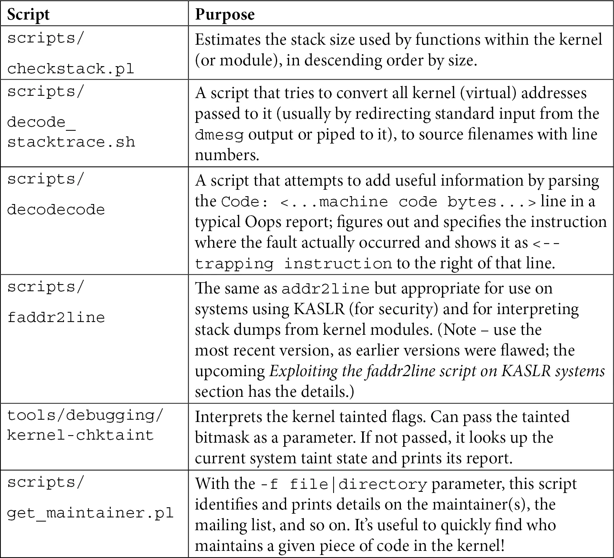
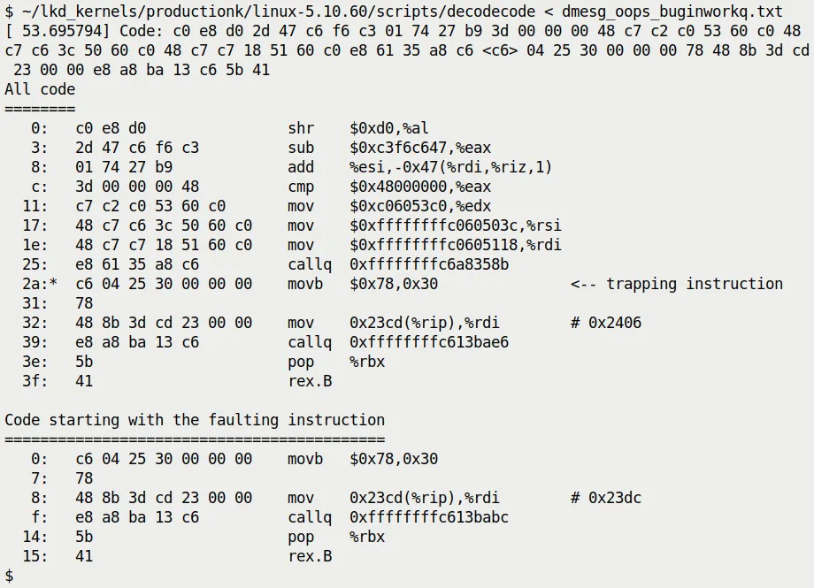
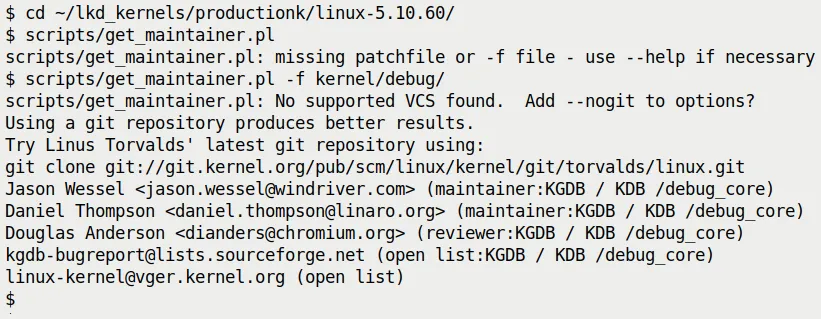

# 第 7 章   Oops! Interpreting the Kernel Bug Diagnostic（下）

## 7.5   善用内核脚本 —— 别重复造轮子

上一节我们像是在手搓汇编代码一样，用 `objdump`、`addr2line` 和 `gdb` 这「三板斧」去硬核定位 Bug。这很极客，也很有必要，因为它帮你建立了底层的认知——知道了那些十六进制地址是怎么变回文件名和行号的。

但在工程实战中，效率同样重要。如果你每天都在和内核打交道，你会希望有一个更「自动化」的助手，能帮你把这堆枯燥的转换工作包圆了。

现代 Linux 内核源码树里其实藏着不少这种「管家脚本」。它们就像是内核开发者留给后人的工具箱，打开来，你会发现很多人其实早就把坑踩过了，并且还顺手写了个脚本防止你再踩。

这一节，我们就来把这些工具摊开来讲，看看它们能怎么帮我们从 Oops 的泥潭里拉出来。

---

### 工具总览

在看细节之前，先有一张地图总是好的。表 7.3 列出了本节会重点讨论的几个脚本，以及它们各自解决什么问题。这不是完整的列表（源码树里还有更多），但这些都是你调试路上的「救命稻草」。



**表 7.3 —— 常用内核辅助脚本速查表**

先别急着背，下面我们会一个个拿起来试试手，看看它们到底好使在哪里。

---

### 1. 预防胜于治疗：使用 checkstack.pl

在内核里玩转指针是很刺激，但也是高危的。你有没有想过一个问题：内核栈有多大？

在用户空间，线程的栈可以很大（默认通常能达到 8 MB），你可以放心大胆地分配局部数组、搞深层递归。但**内核栈完全不是这么回事**。

每个用户态线程都有两个栈：一个大的用户栈，和一个小的内核栈。当系统调用发生、CPU 切换到内核态时，用的就是那个小内核栈。这个小栈有多小？

在 32 位系统上通常是 **2 页**（8 KB），在 64 位系统上是 **4 页**（16 KB）。

（注：别假设页大小总是 4KB，虽然大多数情况是，但内核里要用 `PAGE_SIZE` 宏来判断）。

#### 这意味着什么？

意味着你在内核里写个稍微大一点的局部数组，或者搞个没底的递归，**「栈溢出」** 这件事就会轻而易举地发生。

而且，内核栈溢出和用户栈溢出的下场不一样。用户栈溢出顶多让当前进程崩溃，内核给你发个 SIGSEGV；但内核栈溢出往往会直接把系统搞死——因为它可能破坏了临接的关键数据结构，导致系统无声无息地锁死。那种时候，连 Oops 都不一定能打印出来，调试更是无从谈起。

所以，内核维护者们搞了一个 Perl 脚本：`scripts/checkstack.pl`。它能扫描你的代码，算出每个函数最大会消耗多少栈空间。

这就好比在盖楼前先做个预算，告诉你这面墙是不是承重超标了。

#### 怎么用？

它通常配合 `objdump` 使用，通过管道把反汇编结果喂给它：

```bash
$ objdump -d <...>/linux-5.10.60/vmlinux | <...>/linux-5.10.60/scripts/checkstack.pl
0xffffffff81000210 sev_verify_cbit [vmlinux]:        4096
0xffffffff81a55430 od_set_powersave_bias [vmlinux]:  2064
0xffffffff817b2410 update_balloon_stats [vmlinux]:   1776
[...]
```

输出结果按栈大小降序排列。看到 `sev_verify_cbit` 吃掉了 4096 字节（整整一页！）了吗？这种函数就是重点监控对象。

当然，它也能用来检查你写的内核模块：

```bash
$ objdump -d /lib/modules/5.10.60-dbg02-gcc/kernel/drivers/net/netconsole.ko \
  | <...>/scripts/checkstack.pl
0x0000000000001380 enabled_store [netconsole]:        224
0x0000000000000000 init_module [netconsole]:          224
0x0000000000000c30 remote_ip_store [netconsole]:      208
[...]
```

⚠️ **注意：别太自信**
看着模块里的几百字节可能觉得还好，但要记住，内核调用链是很深的。你的函数被调用时，栈上可能已经压了好几层了。几百字节加上几百字节，很快就会摸到 16 KB 的天花板。

#### CONFIG_VMAP_STACK：内核的最后一道防线

既然内核栈溢出这么危险，内核社区当然也想了办法。从 4.9 版本（x86_64）和 4.14 版本（ARM64）开始，内核引入了一个关键配置：**`CONFIG_VMAP_STACK`**。

以前内核栈是连续物理内存分配的，溢出了就踩到别人的地盘，后果不可控。开启这个选项后，内核栈改用 `vmalloc` 机制分配。

这意味着什么？意味着每个内核栈周围都会被「守卫页」包起来。一旦你的栈溢出了，哪怕只是多访问了一个字节，都会触犯到守卫页，MMU 会立刻抛出一个缺页异常。

虽然这还是会导致内核崩溃，但它至少能**保证崩溃是可控的**——你会看到一个 Oops，而不是一个死机的黑屏。这给了你调试的机会。

---

### 2. 还原现场：利用 decode_stacktrace.sh

假设你拿到了一段原始的 Oops 日志，里面有 `Call Trace`，列了一堆函数名。但这还不够直观——你很想知道这些函数调用具体对应源码的哪一行。

上一节我们用 `addr2line` 手工查过地址。但这对于整个调用栈来说太慢了。这时候，`scripts/decode_stacktrace.sh` 就派上用场了。

你可以把它理解成一个**「批量版的 addr2line」**。它能把整个调用栈里的地址一次性转换成文件名和行号。它本质上就是一个 `addr2line` 的包装脚本，省去了你敲命令的麻烦。

#### 准备工作

要让这个脚本干活，你得先喂给它好吃的：

1.  **带调试符号的 `vmlinux` 文件**：必须是未压缩的 ELF 格式文件。
2.  **源码路径**：脚本需要知道去哪里找源码文件（用来显示行号）。
3.  **模块路径**：如果是模块引起的 Oops，还得告诉它模块在哪里。

#### 实战演练

还是用我们的老朋友 `oops_tryv2` 模块来演示。假设我们已经把 Oops 日志存到了文件 `dmesg_oops_buginworkq.txt` 里。

确保你的模块是用 `MYDEBUG=y` 编译的（也就是带符号信息），然后运行：

```bash
$ ~/lkd_kernels/productionk/linux-5.10.60/scripts/decode_stacktrace.sh \
   ~/lkd_kernels/debugk/linux-5.10.60/vmlinux \
   ~/lkd_kernels/debugk/linux-5.10.60 ./ \
   < dmesg_oops_buginworkq.txt
```

参数解释：
*   第一个参数：`vmlinux` 的路径。
*   第二个参数：内核源码的基础路径（也就是 `vmlinux` 所在的目录）。
*   第三个参数：`./` 表示模块在当前目录。

#### 输出分析

看看这脚本吐出了什么：

```text
[...]
[  448.049414] BUG: kernel NULL pointer dereference, address: 0000000000000030
[...]
[  448.049547] Workqueue: events do_the_work [oops_tryv2]

[  448.049562] RIP: 0010:do_the_work (/home/letsdebug/Linux-Kernel-Debugging/ch7/oops_tryv2/oops_tryv2.c:62) oops_tryv2
<< ... output of the decodecode script ... >>
[...]
[  448.049934] Call Trace:
[  448.049949] process_one_work (kernel/workqueue.c:1031 (discriminator 19) kernel/workqueue.c:2194 (discriminator 19))
[  448.049967] worker_thread (./arch/x86/include/asm/current.h:15 kernel/workqueue.c:979 kernel/workqueue.c:1815 kernel/workqueue.c:2381)
[  448.049984] ? process_one_work (kernel/workqueue.c:2222)
[  448.050002] kthread (kernel/kthread.c:277)
[...]
```

看到了吗？原本冷冰冰的 `RIP: 0010:do_the_work` 后面，现在直接跟上了 `(.../oops_tryv2.c:62)`。

更妙的是 `Call Trace` 部分。它不仅仅是列出函数名，还把每个函数在源码中的**调用路径（文件:行号）**都打印出来了。

比如 `worker_thread` 调用了 `process_one_work`，而 `process_one_work` 又是分别在 `workqueue.c` 的 1031 行和 2194 行（使用了 GCC 的 `discriminator` 优化信息，表明可能是内联或宏展开的细节）。

这就好比你在看录像回放时，不仅有进球画面，旁边还标注了「这是在第 62 分钟，从右路突破传中的」。信息量极大。

---

### 3. 机器码解码员：decodecode 脚本

在上一节的输出里，你可能注意到了这一行：

```text
<< ... output of the decodecode script ... >>
```

这其实是 `decode_stacktrace.sh` 调用另一个脚本——**`scripts/decodecode`** 的结果。

有时候光知道行号还不够，我们想看看到底是一条什么汇编指令触发了灾难。`decodecode` 就是干这个的。它会读取 Oops 日志里的「Code」部分（那一堆十六进制机器码），尝试把它们反汇编成可读的汇编指令，并且**还会把罪魁祸首指令标记出来**。

它是怎么工作的？

简单看一下 `decode_stacktrace.sh` 的源码就能发现端倪：

```bash
$ cat <...>/linux-5.10.60/scripts/decode_stacktrace.sh
[...]
decode_code() {
    local scripts=`dirname "${BASH_SOURCE[0]}"`
    echo "$1" | $scripts/decodecode
}
```

它把你传进去的机器码直接丢给 `decodecode` 处理。

#### 效果展示

假设我们把 `do_the_work` 触发 Oops 时的机器码部分单独拎出来喂给 `decodecode`，它会吐出类似图 7.17 这样的输出：



**图 7.17 —— decodecode 脚本输出示例**

注意看输出中的 `<-- trapping instruction`。它精确地指出了哪条汇编指令导致了 MMU 抛出异常。

在这个例子里，是一条 `movb` 指令试图访问 `0x30` 这个地址（也就是我们代码里那个空指针的偏移量）。看到这一行，你就确信无疑了：代码确实是在这里挂掉的。

⚠️ **注意**
`decodecode` 是 2007 年（内核 2.6.23）就被加入内核源码的老工具了，历史悠久。它虽然简陋，但在分析「到底执行了哪条指令挂掉」这种底层问题时，往往比单纯的源码行号更有说服力。

---

### 4. 绕过 KASLR：faddr2line 脚本

还记得上一节结尾我们提到的「KASLR 诅咒」吗？

因为 KASLR（内核地址空间布局随机化）的存在，内核运行时的地址是每次启动都随机变化的。这意味着 Oops 里的地址（如 `do_the_work+0x124`）包含了随机偏移量，直接拿去查 `vmlinux` 的静态符号表是查不到的。

上一节我们建议关掉 KASLR 或者用 `addr2line`。但如果你不能重启系统，或者非得在 KASLR 开启的情况下调试怎么办？

这时候需要祭出 **`scripts/faddr2line`** 脚本。

#### 它怎么对付 KASLR？

`faddr2line` 也是一个 `addr2line` 的包装脚本，但它聪明在：它能理解「函数名 + 偏移量」这种格式（比如 `do_the_work+0x124`），并且在处理时能正确处理内核符号表的一些特性。

#### 试一试

直接运行看看用法：

```bash
$ <...>/linux-5.10.60/scripts/faddr2line
usage: faddr2line [--list] <object file> <func+offset> <func+offset>...
```

假设我们的 Oops 发生在 `do_the_work+0x124`：

```bash
$ ~/lkd_kernels/productionk/linux-5.10.60/scripts/faddr2line \
   ./oops_tryv2.ko do_the_work+0x124
bad symbol size: base: 0x0000000000000000 end: 0x0000000000000000
```

嗯？报错了！

#### 踩坑预警：老旧版本的 Bug

如果你用的是旧版本的内核（比如 5.10.x），你会遇到这个坑。这其实是 `faddr2line` 脚本本身的一个 Bug。

原因很底层：脚本内部用的是 `nm` 工具来查符号，但 `nm` 在处理某些特殊符号信息时不够给力。脚本维护者 Josh Poimboeuf 在 2022 年 5 月修复了这个问题——他把底层工具换成了更强大的 `readelf`。

所以，如果你看到了上面的报错，有两个解决办法：
1.  **升级内核**：用 5.19 之后的版本，这个问题已经修好了。
2.  **打补丁**：手动把 Josh 的 commit 应用到你现在的 `scripts/faddr2line` 文件里。

#### 验证修复

假设我们用了修复后的脚本，再跑一次：

```bash
$ <...>/scripts/faddr2line ./oops_tryv2.ko do_the_work+0x124/0x15e
do_the_work at <...>/Linux-Kernel-Debugging/ch7/oops_tryv2/oops_tryv2.c:62
```

完美！虽然 KASLR 把基地址藏起来了，但只要我们知道「函数内的相对偏移」，`faddr2line` 就能精准定位到源码的第 62 行——也就是那个要命的 `oopsie->data = 'x';`。

---

### 5. 检查“污染”：kernel-chktaint 脚本

我们在前面详细解释过 `Kernel tainted` 标志（那些 `G`, `O`, `E` 之类的字母）。

当你在一个生产环境或者复杂的测试机上调试时，很容易搞混到底加载了哪些非官方模块。这时候，`tools/debugging/kernel-chktaint` 脚本是个不错的帮手。

它直接读取 `/proc/sys/kernel/tainted` 的值，然后把那个晦涩的 bitmask 翻译成人话。

运行它：

```bash
$ ./tools/debugging/kernel-chktaint
```

（图 7.18 展示了输出示例，它会列出哪些污染位被置位了，并解释原因，比如「Proprietary module was loaded」）。

这个脚本虽然简单，但在给内核维护者发 Bug 报告之前跑一遍，能避免你因为「内核被污染」而被维护者直接拒之门外。

---

### 6. 找到大佬：get_maintainer.pl 脚本

最后，调试到走投无路怎么办？

有一句老话：当你搞不定的时候，读源码；当你读完源码还搞不定，那就找写源码的人。

Linux 内核是全世界协作最庞大的开源项目之一。几乎每一块代码都有维护者，有专门的邮件列表。但问题来了：**你知道该找谁吗？**

别猜，用 `scripts/get_maintainer.pl`。

#### 举个栗子：KGDB 挂了

假设你在折腾内核的 KGDB（内核调试器）功能，遇到了玄学问题。你想去邮件列表问问，但又怕发错地方被骂。

这时候，跑到内核源码根目录下，运行：

```bash
$ ./scripts/get_maintainer.pl -f kernel/debug/
```

或者直接指定文件：

```bash
$ ./scripts/get_maintainer.pl -f kernel/debug/gdbstub.c
```

脚本会像变魔术一样吐出一堆信息（见图 7.19）：



**图 7.19 —— get_maintainer.pl 输出示例**

它告诉了你：
*   **维护者是谁**：Jason Wessel, Daniel Thompson...
*   **邮件列表是什么**：`kgdb-bugreport@lists.sourceforge.net`
*   **相关代码路径**：`kernel/debug/`

这就相当于给了你一张入场券。你写好邮件，描述清楚问题（记得附上 Oops 日志！），发送到那个邮件列表，就能保证信息能到达真正懂这段代码的人手里。

#### 脚本背后的原理

其实没什么黑魔法，它就是在解析内核源码根目录下的 **`MAINTAINERS`** 文件。

这个文件是个巨大的文本数据库，记录了每个子系统的负责人。你当然也可以手动 `grep`：

```bash
$ grep -A15 -w "KGDB" MAINTAINERS
KGDB / KDB /debug_core
M:   Jason Wessel <jason.wessel@windriver.com>
M:   Daniel Thompson <daniel.thompson@linaro.org>
R:   Douglas Anderson <dianders@chromium.org>
L:   kgdb-bugreport@lists.sourceforge.net
S:   Maintained
W:   http://kgdb.wiki.kernel.org/
T:   git git://git.kernel.org/pub/scm/linux/kernel/git/jwessel/kgdb.git
F:   Documentation/dev-tools/kgdb.rst
[...]
F:   kernel/debug/
```

但 `get_maintainer.pl` 做得更智能，它会结合 Git 历史记录，看看最近谁改动这些文件比较多，从而给出更准确的推荐。

---

### 写在最后

内核源码树里的脚本远不止这些。你可以随便 `ls scripts/check*` 看看，你会发现 `checkpatch.pl`（检查代码风格）、`checkversion.pl` 等一大堆。

还有像 `scripts/extract-vmlinux` 这种专门用来从压缩镜像里提取 `vmlinux` 的工具，或者是第三方的 `kdress` 工具。

这些都是前人栽下的树，我们在底下乘凉就好。

掌握了这一节的内容，你手里就不再只有一把「调试锤子」了。从栈溢出预防、地址解析、机器码还原到最终找到维护者，你有了一整套的工具链。

接下来，如果你准备好了，我们可以去看看一些真实世界里发生的、令人头秃的 Oops 案例。