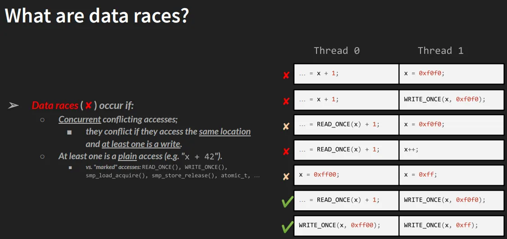

## 8.2  锁机制——关键知识点速查

之前我啰里啰唆地说了一大堆前置知识，但为了确保我们在同一个频道上，还是有几条关于「锁」的核心原则需要再强调一下。你可以把这当成一张作弊条——但记住，在并发编程里，背下来规则和真正理解规则是两码事，后者需要你付出一点调试时的痛苦作为学费。

### 什么是关键区？

首先，我们得给敌人画个像。

**关键区** 指的是代码路径中这样一段路：它可能被多个执行路径（线程、进程、甚至中断处理函数）同时执行，并且这段代码在读写**共享的可写数据**。

只要满足这两个条件——并发执行 + 访问共享可写状态——这就是关键区。

这听起来很简单，对吧？但魔鬼在细节里。

### 关键区到底在怕什么？

因为操作的是共享可写数据，关键区非常脆弱，它需要两种不同层面的保护：

1.  **防止并行**
    这意味着它必须「独善其身」。在任意时刻，只能有一个执行流进入这段代码。这就是我们常说的互斥，必须把并行强行变成串行。

2.  **原子性**
    如果你跑在原子上下文里（比如中断处理函数 `ISR`、软中断或 `tasklet` 中），你不仅不能被打断，甚至不能睡眠。这时候，关键区必须**不可分割地执行到底**。任何需要等待、睡眠的操作在这里都是违禁品。

### 守护关键区：锁的艺术

既然关键区这么危险，怎么保护它？第一步是识别，第二步是上锁。

**识别关键区是第一步，也是最关键的一步。** 你得像排雷专家一样审视你的代码：这个全局变量会被谁访问？这个中断处理函数会不会碰那个链表头？漏掉一个，就是一枚定时炸弹。

识别出来之后，保护手段通常就是**锁**（Locking）（当然，还有更高级的无锁编程，但那属于高阶技能）。

这里有两个新手最容易摔进去的坑，值得大书特书：

**❌ 坏习惯 1：只保护写操作**

「我只修改数据，你们只读，应该没事吧？」

错。这是一个非常危险的错觉。如果你只保护写，允许并发的读操作和写操作同时发生，读操作可能会读到**撕裂的脏数据**。想象一下，写操作刚写了一半（比如写了一个 64 位变量的前 32 位），读操作冲进来把这个残缺的值读走了——这就是所谓的 `torn read`。你读到的既不是旧值，也不是新值，而是一个毫无意义的垃圾值。

**❌ 坏习惯 2：锁对象不对**

「我用了锁啊，怎么还是炸了？」

回头看看你的代码。你保护同一个数据结构时，用的是**同一个锁变量**吗？

这是另一种致命错误：用错误的锁，或者在不同的代码路径用了不同的锁来保护同一个资源。这就像你用前门的钥匙去开后门的锁，不仅开不开，还可能把钥匙断在里面。只有当所有访问该数据的地方都使用**同一个锁**时，保护才成立。

### 如果保护失败：数据竞争

如果你没保护好，或者根本没保护，你就收获了**数据竞争**。

数据竞争是并发编程里的万恶之源。在这种情况下，程序的输出不再取决于代码逻辑，而是取决于——运气。也就是所谓的时序相关。这种 Bug 是典型的「海森堡 Bug**：当你试图用调试器去观察它时，它可能会消失或者改变行为，因为你的观察本身改变了执行时序。

一旦这种 Bug 进入生产环境，复现它、定位它、修复它，会让你怀念写业务代码的日子。

关于数据竞争，还有更深层的故事，我们下一小节马上会深入。

### 什么时候可以不用锁？

为了不让你产生「被迫害妄想症」，这里也有几个**不需要**加锁的例外情况。

1.  **局部变量**
    如果你操作的是局部变量，它们就在进程（或中断）的私有栈上。既然是私有的，就没有共享，天然安全。

2.  **天然串行化的代码**
    有些代码逻辑上保证了只会运行一次。比如我们内核模块的 `init` 和 `cleanup` 函数，它们在 `insmod` 和 `rmmod` 时只执行一次，完全没有并发风险。

3.  **真正的只读数据**
    如果数据是真正的常量（只读），那大家爱怎么读怎么读。不过要小心 C 语言的 `const` 关键字——它有时候只在编译期管用，运行时并不保证数据真的不可修改。

4.  **显式标记的普通访问**
    还有一种特殊情况，内核文档里有专门的说明，关于何时可以使用普通的 C 语言内存访问。文档在源码树的 `tools/memory-model/Documentation/access-marking.txt`。除此之外，都要谨慎。

---

### 理解数据竞争——深入 LKMM

如果你以为「一个写、一个读」就是数据竞争的全部，那你可能低估了这件事的复杂性。

当你继续深挖并发话题，你会发现这里有一片广阔的知识海洋：内存排序、内存屏障、无锁编程……等等。我们先从最基础的定义说起。

#### 到底什么是数据竞争？

Linux 内核有一套自己的内存一致性模型，叫 **LKMM (Linux Kernel Memory Model)**。在这个模型下，数据竞争的定义非常精确，它必须同时满足以下四个条件：

1.  **地址相同**：两个访问指向同一块内存。
2.  **并发执行**：两个访问发生在不同的线程，或者不同的 CPU 核心上（没有先后顺序）。
3.  **至少一个写**：两个操作中，至少有一个是写操作。
4.  **至少一个是「普通访问」**：这是关键！两个操作中，至少有一个是**普通的 C 语言访问**（Plain C-Language Access）。

**这最后一条是很多老手也会忽略的盲点。**

来看看下面这张图（来自 Marco Elver 在 Linux Plumbers Conference 2020 的演示），它用表格形式直观地展示了什么情况是数据竞争：

*(图 8.2 – M Elver 关于内核数据竞争检测的演示截图)*

表里的 **X** 代表红色警报（存在数据竞争），**✅** 代表安全。我们一行一行看：

*   **第 1 行（Race）**：
    *   Thread 0：**普通读**（`READ(x)`）
    *   Thread 1：**普通写**（`WRITE(x)`）
    *   **结论**：经典的教科书级数据竞争。一个线程在读，另一个线程同时在写，而且都是普通的 C 语言操作。

*   **第 2 行（Race）**：
    *   Thread 0：**标记读**（Marked Read，比如 `READ_ONCE(x)`）
    *   Thread 1：**普通写**（Plain Write）
    *   **结论**：依然是数据竞争！因为「至少有一个是普通访问」，且发生了写操作。虽然 Thread 0 很讲究地用了标记宏，但 Thread 1 的野蛮操作毁了一切。

*   **第 3、4、5 行**：
    *   原理同第 2 行。只要一方是「普通」的，且有写操作存在，竞争就不可避免。

*   **第 6、7 行（Safe）**：
    *   这两行里，Thread 0 和 Thread 1 都使用了**标记访问**。
    *   比如 `READ_ONCE()`、`WRITE_ONCE()` 或者更高级的 `atomic_t`、`refcount_t` 以及 `smp_load_acquire()` 系列宏。
    *   这些操作被设计为原子的，并且遵循 LKMM 的内存排序规则。
    *   **结论**：✅ 安全。

#### 这里的「标记」到底意味着什么？

现在我们不得不把那个类比拿回来——还记得我们说普通 C 语言访问像「不看红绿灯就过马路」吗？

这里的「标记访问」就是「看了红绿灯，并走斑马线」。

但真实世界比类比更残酷。普通的 C 语言语句（比如 `int a = x;`）在编译器看来是可以随意优化的——编译器可能会把它缓存到寄存器里，也可能会把它拆成两条指令，或者把它和别的指令重排。在单线程里这没问题，但在多核并发环境下，这就是灾难。

而 `READ_ONCE()` / `WRITE_ONCE()` 这些宏的作用就是：
1.  **告诉编译器别乱动**：禁止编译器进行危险的优化（比如合并多次访问或缓存到寄存器）。
2.  **保证原子性**：确保对齐的访问在一次总线周期内完成。
3.  **显式意图**：告诉读代码的人（和 KCSAN 工具）：这里碰到了并发边界，我处理过了。

### 知识的深水区

看到这里，你应该能感觉到，并发这潭水比你想象的要深得多。

为了真正掌握它，你需要理解并发通用概念、内存排序、内存屏障、LKMM、标记访问、无锁编程的底层机制……这每一项都值得写一本书（事实上，推荐阅读的 LKP-2 书里就有专门的章节讲这些）。

既然靠人脑硬抗这么复杂的规则已经有些吃力了，我们是不是该找点工具来帮忙？当然。下一节，我们将请出内核并发领域的「安检神器」——KCSAN。