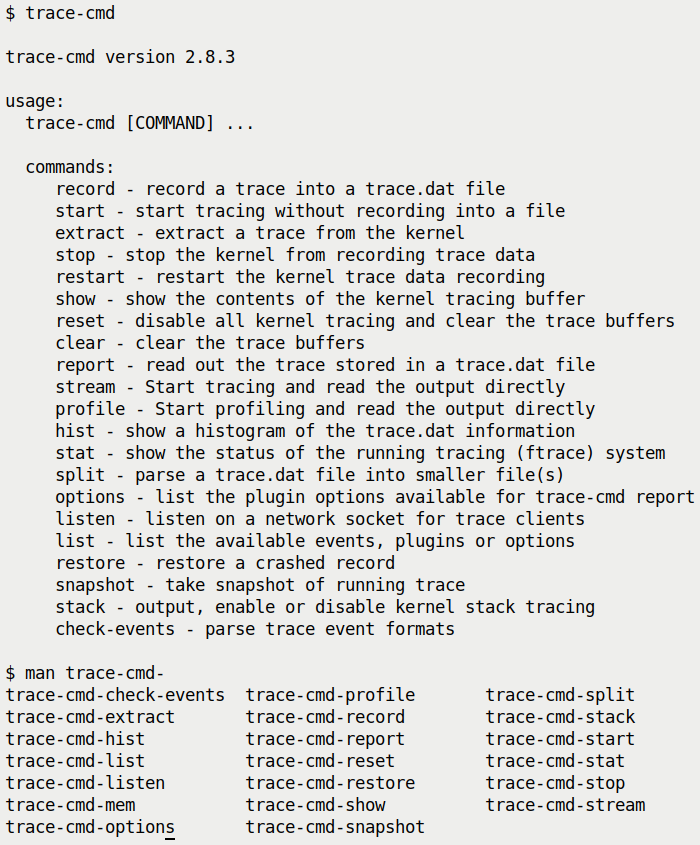
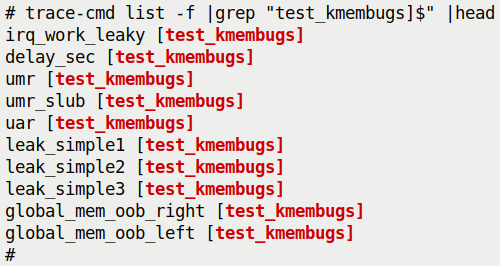
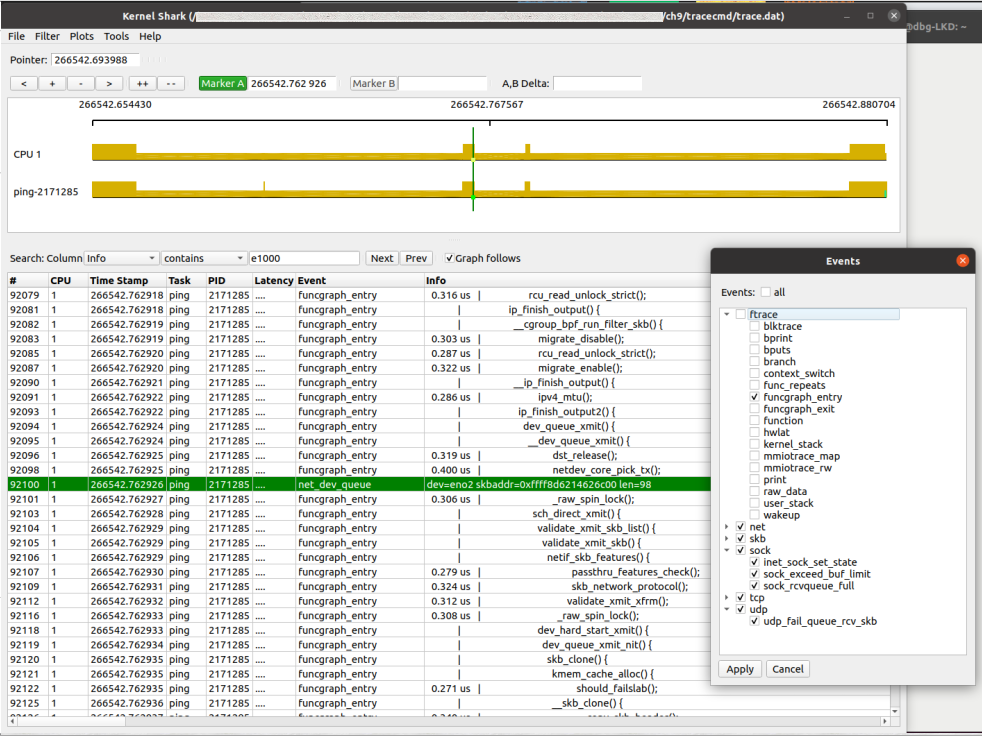
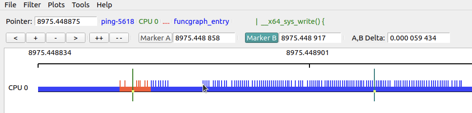
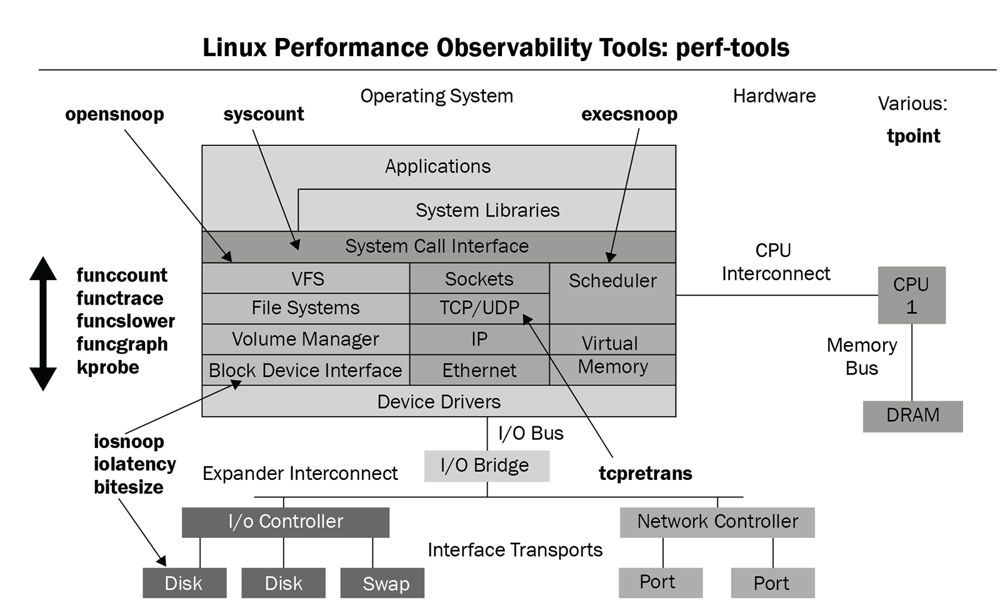
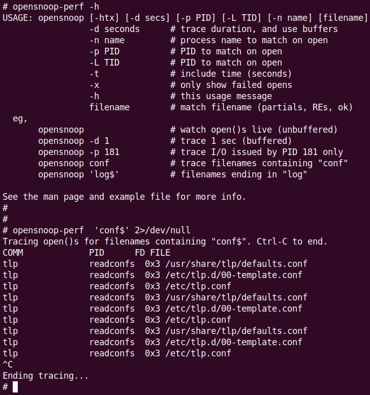
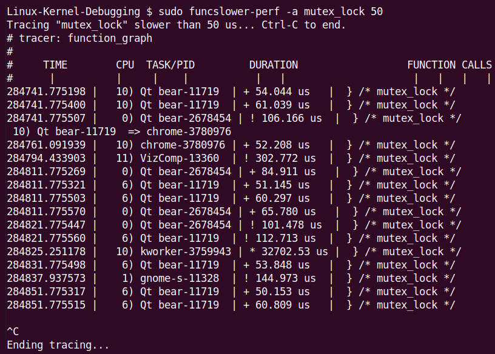

# 9.10  使用 trace-cmd、KernelShark 和 perf-tools 前端工具

在进入正题之前，先插一句题外话。当你花大量时间盯着 ftrace 报告研究时，你可能会发现一个现象——**安全相关的接口调用频率高得惊人**。

这些调用通常是通过 Linux 安全模块（LSMs）强制执行的，比如 SELinux、AppArmor、Smack、TOMOYO 等。如果你正在开发一个对性能极度敏感的应用（或者项目，比如准实时系统），这些大量的安全检查可能会成为性能瓶颈。这可能会提示你需要禁用这些安全接口（通过内核配置——如果可行的话，至少在时间关键的代码路径上禁用）。尤其是当多个 LSM 同时启用时，这种开销会叠加。

---

## 拒绝重复造轮子：我们需要前端

毫无疑问，Linux 内核的 ftrace 基础设施是极其强大的。它就像一台精密的显微镜，让你能深入内核内部，照亮那些平时看不见的黑暗角落。

但这种强大是有代价的。

代价就是陡峭的学习曲线。你需要对 sysfs 下的一大堆调优旋钮和选项了如指掌，还要学会如何在海量的噪声中过滤出有价值的信号——正如你在前面几节里体会到的那样，这并不轻松。

为了解决这个问题，Steven Rostedt（ftrace 的主要维护者）开发了一个强大而优雅的命令行前端工具：**trace-cmd**。更进一步，还有一个真正的图形化前端工具——**KernelShark**。它能解析 trace-cmd 生成的二进制跟踪文件（默认是 `trace.dat`），并以一种更易于人类消化的 GUI 形式展示出来。

与之类似，Brendan Gregg 也开发了一套基于脚本的 ftrace 前端项目——**perf-tools**。

本节的任务，就是让你从繁琐的手动配置中解脱出来，看看这些工具是如何让生活变得更美好的。

---

## 9.10.1 初识 trace-cmd：像 Git 一样的优雅

`trace-cmd` 的设计风格非常像现代 Linux 控制台软件（比如 Git）。它拥有大量的子命令，允许你轻松地记录跟踪会话——无论是全系统范围还是针对特定进程（可选，包括其子进程），并生成报告。

它能做的事情远不止于此：
*   控制 ftrace 的配置参数
*   清除和重置 ftrace
*   查看当前状态
*   列出所有可用的事件、插件和选项
*   甚至还能执行性能分析、显示直方图、生成快照、监听网络套接字……

由于 `trace-cmd` 底层操作的是 ftrace 内核子系统，所以在运行它的子命令时，通常需要 root 权限。我们这里使用的是 Ubuntu 20.04 LTS 提供的版本——2.8.3。

### 获取帮助

`trace-cmd` 的文档非常完善。有几种方式可以获取帮助：

*   **Man 手册**：每个子命令都有自己的 man 页。例如，要看 `record` 子命令的手册，敲 `man trace-cmd-record`。当然，`man trace-cmd` 会给出工具和所有子命令的概览。
*   **快速帮助**：在命令后加 `-h`，例如 `trace-cmd record -h`。
*   **在线教程**：本章末尾的「延伸阅读」部分列出了一些优秀的教程。

试着在终端里敲一下，利用 bash 的自动补全功能看看有哪些可用的 man 页：


*(图 9.20：trace-cmd 的简要帮助屏幕和可用的 man 页)*

### 第一次试手：简单的跟踪会话

让我们直接上手，完成一次非常简单的跟踪会话。篇幅有限，我们不会重复 man 页里已经详细解释的内容，那些深层次的细节留给你自己去探索。我们直接开始：

**第一步：重置 ftrace 子系统（可选）**

```bash
sudo trace-cmd reset
```

这一步相当于把桌子擦干净，确保之前的配置不会干扰这次实验。

**第二步：记录跟踪**

让我们用大名鼎鼎的 `function_graph` 插件（跟踪器），记录内核里 1 秒钟内发生的所有事情。`-p` 选项指定跟踪器。`-F <command>` 选项让 trace-cmd 只跟踪该命令（如果加上 `-c`，还会跟踪它的子进程）：

```bash
sudo trace-cmd record -p function_graph -F sleep 1
```

**第三步：生成报告**

跟踪结束后，`trace-cmd` 默认会生成一个二进制文件 `trace.dat`。要把它变成人类可读的 ASCII 文本报告，使用 `report` 子命令。

`-l` 选项非常有用，它会加上我们在「深入延迟跟踪信息」那一节里提到的延迟输出格式列。除了之前见过的四个延迟信息列外，trace-cmd 还会在前缀加上一个额外的列——**CPU 核心号**，告诉你函数是在哪个核心上跑的：

```bash
sudo trace-cmd report -l > sleep1.txt
```

除了 `report`，你也可以用 `trace-cmd show` 直接查看当前 ftrace 缓冲区的内容。

另外，在第二步里，除了用 `-F` 指定命令，你还可以用 `-P <PID>` 指定进程 ID。

**注意**：第二步会生成默认名为 `trace.dat` 的二进制跟踪文件（这就是我们等下要喂给 KernelShark 的东西）。赶紧试试这几个简单步骤吧，你会发现比直接操作 raw ftrace 简直不要太轻松！

当然，在资源受限的嵌入式系统上，安装像 trace-cmd 这样的前端可能并不现实（这真的取决于你的项目/产品）。所以，**掌握 raw ftrace 的操作依然很重要**——那是你的底牌。

> **⚠️ 踩坑预警**
> 建议不要在 tracefs（`/sys/kernel/[debug]/tracing`）目录下直接运行 `trace-cmd`。
>
> 它可能会失败，因为它会试图往里面写跟踪数据（你得用 `-o` 选项强制覆盖输出路径等操作来解决这个问题）。**别在目录里蹲着跑**，退出来再跑。

---

## 9.10.2 事件海洋：驾驭海量数据

`trace-cmd` 的强大之处才刚刚开始。`trace-cmd list` 可以列出所有可用的**事件**（Events），以及插件和选项。

这个列表是惊人的——在撰写本文时（内核 5.10 系列），它拥有超过 1,400 个事件！敲一下试试：

```bash
$ sudo trace-cmd list
events:
  drm:drm_vblank_event
  drm:drm_vblank_event_queued
  drm:drm_vblank_event_delivered
  initcall:initcall_finish
  initcall:initcall_start
  initcall:initcall_level
  vsyscall:emulate_vsyscall
  xen:xen_cpu_set_ldt
[...]
tracers:
  hwlat blk mmiotrace function_graph wakeup_dl wakeup_rt wakeup function nop
options:
  print-parent
  nosym-offset
[...]
```

这么多事件，眼花缭乱。如果你只想看**事件类别**（Event Labels，类似于事件类），而不是每一个具体的函数，可以用一点点 bash 魔法来过滤和排序：

```bash
$ sudo trace-cmd list -e | awk -F':' 'NF==2 {print $1}' | sort | uniq | tr '\n' ' '
alarmtimer asoc avc block bpf_test_run bpf_trace bridge cfg80211 cgroup clk 
compaction cpuhp cros_ec devfreq devlink dma_fence drm error_report exceptions 
ext4 fib fib6 filelock filemap fs_dax gpio gvt hda hda_controller hda_intel 
huge_memory hwmon hyperv i2c i915 initcall intel_iommu intel_ish interconnect 
iocost iomap iommu io_uring irq irq_matrix irq_vectors iwlwifi iwlwifi_data 
iwlwifi_io iwlwifi_msg iwlwifi_ucode jbd2 kmem kvm kvmmmu libata mac80211 
mac80211_msg mce mdio mei migrate mmap mmap_lock mmc module mptcp msr napi 
neigh net netlink nmi nvme oom page_isolation pagemap pagepool percpu power 
printk pwm qdisc random ras raw_syscalls rcu regmap regulator resctrl rpm rseq 
rtc sched scsi signal skb smbus sock spi swiotlb sync_trace syscalls task tcp 
thermal thermal_power_allocator timer tlb ucsi udp v4l2 vb2 vmscan vsyscall 
wbt workqueue writeback x86_fpu xdp xen xhci-hcd $
```

具体能看到哪些类别，取决于架构、内核版本和内核配置。

**最棒的事情来了**：你可以从中挑选一个或多个类别，使用 `-e` 选项让 `trace-cmd` **只记录和报告**这些类别的功能。例如：

```bash
trace-cmd record <...> -e net -e sock -e syscalls
```

你猜对了，这会让 `trace-cmd` 在记录期间只记录网络、套接字和系统调用相关的跟踪事件（函数）。

此外，`trace-cmd list` 还能干很多事。例如：
*   `trace-cmd list -t`：列出所有可用的跟踪器（完全等同于 `cat /sys/kernel/tracing/available_tracers`）。
*   `trace-cmd list -h`：查看 list 子命令的帮助菜单，里面有所有的开关说明。

如果你想跟踪特定的函数（而不是某个事件类别下的所有函数），那就用 `-l` 选项：

```bash
trace-cmd record [...] -l <func1> -l <func2> [...]
```

---

## 9.10.3 实战 Case 3.1：用 trace-cmd 跟踪一次 ping

还记得我们在「Case 2 —— 使用 raw ftrace 跟踪单个 ping」里费了多大劲才搞定这个吗？现在我们用 `trace-cmd` 来复现这个实验——包含显示函数参数。非常简单，只需要两步：

**第一步：录制数据**

这次我们用 `-q`（quiet，减少输出）并指定一系列相关的事件类别（`net`, `sock`, `skb`, `tcp`, `udp`），使用 `-F` 指定命令，`-c1` 只发一次包：

```bash
sudo trace-cmd record -q -e net -e sock -e skb -e tcp -e udp -F ping -c1 packtpub.com
```

**第二步：生成报告**

```bash
sudo trace-cmd report -l -q > reportfile.txt
```

这里有个小细节：如果在录制步骤里你加了 `-p function_graph` 参数，你会得到带有缩进调用图的报告，但**不会有**函数参数（因为 function_graph 机制不显示参数）。

这两种方式各有用途，看你想看「流程结构」还是「具体数值」。

为了方便，我把这个单 ping 跟踪封装成了一个简单的 bash 脚本——`ch9/tracecmd/trccmd_1ping.sh`。运行时，它会通过选项让你选择是要看 function_graph 风格的调用图，还是要看带参数的详细信息。动手试试吧！

---

## 9.10.4 模块也逃不掉：Kernel modules and trace-cmd

Ftrace 有个神技：它能自动识别任何内核模块里的所有函数！

这太棒了。作为 ftrace 的前端，`trace-cmd` 自然也继承了这个能力。为了验证这一点，我加载了之前写的一个模块（`ch5/kmembugs_test/test_kmembugs.ko`）。然后，我们用 `trace-cmd list -f` 配合 `grep` 来查找这个模块的函数。

看，它们确实出现了：


*(图 9.21：trace-cmd 自动识别并列出了可用于跟踪的模块函数)*

如果你想专门跟踪某个模块的函数，可以这样用：

```bash
trace-cmd record [...] --module <module-name> [...]
```

---

## 9.10.5 KernelShark：让数据可视化

`trace-cmd` 虽好，但看文本报告还是有点累。这时候就需要 **KernelShark** 登场了。它是 `trace-cmd` 输出文件的绝佳 GUI 前端。

更具体地说，它解析由 `trace-cmd record` 或 `trace-cmd extract` 生成的二进制 `trace.dat` 文件。

### 如果只有 raw ftrace 数据怎么办？

你可能会问：**如果我是直接用 raw ftrace 跟的踪，没有 `trace-cmd`，还能用 KernelShark 吗？**

没问题。你只需要用 `trace-cmd extract` 把原始 trace 缓冲区的内容提取成一个文件——它会自动转换成预期的二进制格式！照着这个例子做（需要 root 权限）：

```bash
cd /sys/kernel/tracing
trace-cmd reset ; echo > trace
echo function_graph > current_tracer 
echo 1 > tracing_on ; sleep .5 ; echo 0 > tracing_on
trace-cmd extract -o </path/to/>trc.dat
```

现在，`trc.dat` 就可以喂给 KernelShark 了。

顺便提一下，KernelShark 的最新版本（截至 2022 年 3 月是 2.1.0）已经从 GTK+ 2.0 迁移到了 Qt 5。不过，最新的 trace-cmd (3.0.-dev) 和 KernelShark 2.1.0 的组合有时候不太稳定，所以我这里依然使用 Ubuntu 20.04 LTS 发行版自带的旧版本——trace-cmd 2.8.3 和 KernelShark 0.9.8。

KernelShark 的官方文档写得很详细，强烈建议一看：https://kernelshark.org/Documentation.html。

---

## 9.10.6 实战 Case 3.2：用 KernelShark 查看 ping

回到我们最喜欢的测试——跟踪单次 ping！这次，我们要用 KernelShark 来**看**它。

首先，运行我们的脚本捕获数据：

```bash
cd <booksrc>/ch9/tracecmd
./trccmd_1ping.sh -f
```

（我们在 Case 3.1 里讲过这个脚本，`-f` 选项意味着使用 `function_graph` 跟踪器插件进行录制）。

虽然脚本生成了一个文本报告（`ping_trccmd.txt`），但 KernelShark 不吃这一套。它只吃二进制的 `trace.dat` 文件。

KernelShark 本质上是一个**跟踪阅读器**。它解析并显示 `trace.dat` 的内容。如果你在含有 `trace.dat` 文件的目录下运行 KernelShark，它会自动加载。你也可以通过 `-i` 参数指定文件，或者在 GUI 的 `File | Open` 菜单里打开。

这是 KernelShark GUI 的样子，正在可视化我们的单次 ping：


*(图 9.22：KernelShark GUI 可视化单次 ping；同时展示了事件过滤器对话框)*

**注意这里的过滤技巧**，这非常有用：

1.  **CPU 过滤**：只显示 CPU 1（或者其他你关心的核心）。通过 `Plots | CPUs` 访问。
2.  **Tasks 过滤**：只显示 `ping-[PID]` 任务。通过 `Plots | Tasks` 访问。
3.  **Events 过滤**：这是核心。我们可以设置过滤，排除所有 ftrace 事件，只保留 `funcgraph_entry`。这样在列表视图中我们就能清晰地看到进入的内核函数名。通过 `Filter | Show events` 访问。（小贴士：所有内核事件都可以在 `/sys/kernel/tracing/events/` 下找到）。

### 解读 KernelShark 的界面

KernelShark 主要有两个大的平铺区域：
*   **上方**：**图形视图**。以图形方式显示内核流，垂直刻度线代表事件。
*   **下方**：**列表视图**。本质上就是 raw ftrace/trace-cmd 的文本输出。

图形区域上方是「指针」、导航/缩放和两个**标记**控件。两个区域之间是搜索和过滤栏。

这里有一张截图，展示了 GUI 上半部分的一些关键元素（这是一个不同的会话）：


*(图 9.23：KernelShark GUI 上半部分截图)*

让我们快速过一下图 9.23 里的关键点：

*   **指针**：显示当前在时间轴上的位置。当你在事件上移动鼠标时，该事件的信息（实际上是列表视图最后一列 `Info` 的内容）会显示在指针右侧。（看图里，鼠标指针在图形上指向 `ping` 进程进入 `write()` 系统调用的位置，右侧显示了详细信息）。
*   **缩放和移动按钮**：
    *   `<`：左移图形。
    *   `+`：放大，`-`：缩小（鼠标滚轮也可以）。
    *   `>`：右移图形。
    *   `++`：放大到极致。
    *   `--`：缩小到完整时间轴宽度。
*   **双标记**：这是神器。允许你聚焦于特定的代码路径段，并查看两点之间的时间差。使用方法：先点击 Marker B 激活它，然后在图形或列表任意位置双击，它就设定好了。同理设定 Marker A。当两个都设定好时，时间差会自动显示！

### 绿杠与红杠：读懂调度延迟

读 KernelShark 文档时你会发现很多宝藏。这里有一个特别有用的：

> **"某些任务条前面的空心绿条，表示任务从被唤醒到实际运行的时间（唤醒延迟）。而事件之间的空心红条，表示任务虽然处于可运行状态，但被另一个任务抢占了。"**

既然空心绿条代表唤醒延迟，你就可以用 A, B 标记来精确测量这段时间。

此外，通过 `Filters | TEP Advance Filtering`（旧版本是 `Advanced Filtering`）菜单可以进行详细的自定义过滤。

正如 ftrace 一样，KernelShark 也被专业地用于调试性能问题和根因分析。这里有一篇 Steven Rostedt 的文章：*Using KernelShark to analyze the real-time scheduler* (Feb 2011)。

不过，KernelShark 正在从「唯一的 GUI」演变成众多前端之一，这些前端都基于一个提供底层接口访问原始跟踪数据的库框架（正如本章图 9.2 暗示的那样）。

---

## 9.10.7 perf-tools：Bash 脚本的威力

现在来看另一套工具。**perf-tools** 项目是（主要是）Bash 脚本的集合，本质上是内核 **ftrace** 和 **perf_events (perf)** 基础设施的封装。

它们帮助自动化了大量在内核（以及部分用户空间）层面进行性能分析/可观测性/调试的工作。主要作者是 Brendan Gregg。

项目地址：https://github.com/brendangregg/perf-tools

这东西对我们不陌生。我们在第 4 章《Debug via Instrumentation – Kprobes》里，深入讲过这个集合里的 `kprobe[-perf]` 工具。

安装 `perf-tools[-unstable]` 包后，脚本通常装在 `/usr/sbin`。来看看有哪些：

```bash
$ (cd /usr/sbin; ls *-perf)
bitesize-perf   execsnoop-perf   funcgraph-perf  
functrace-perf  iosnoop-perf     kprobe-perf  
perf-stat-hist-perf  
syscount-perf   tpoint-perf      cachestat-perf 
funccount-perf  funcslower-perf  iolatency-perf  
killsnoop-perf  opensnoop-perf   reset-ftrace-perf   
tcpretrans-perf uprobe-perf
$
```

这些工具覆盖了 Linux 栈的各个部分。一图胜千言，这是 perf-tools GitHub 仓库里的一张神图：


*(图 9.24：perf-tools 脚本集合图，图片来源：perf-tools GitHub 仓库)*

扫一眼这张图，你就知道这些工具能用在什么地方了。

这套工具的另一个优点是文档极好。每个都有自己的 man 页，而且命令行加 `-h` 通常会给出非常简明的摘要和一行示例用法（就像图 9.25 上半部分那样）。

由于篇幅有限，我们只挑几个最有代表性的例子（`kprobe[-perf]` 在第 4 章讲过了）。

---

## 9.10.8 实战：追踪所有 open() 调用

还记得第 4 章里，我们费尽周折想搞清楚到底哪些文件被打开（通过 `open()` 系统调用，内核里对应 `do_sys_open()`）吗？

现在让我们用 ftrace 的方式 revisit 这个问题，而且是更简单的方式——使用 **perf-tools** 的封装脚本 **opensnoop[-perf]**！

简直是小菜一碟。不用说，必须 root 跑：


*(图 9.25：opensnoop[-perf] 的帮助屏幕——居然自带示例！以及一个快速示例，跟踪全系统所有以 conf 结尾的文件打开操作)*

> **💡 深入一点：去读代码**
> 我强烈建议你去读一读这些 perf-tools 脚本的源代码。
> `funcgraph[-perf]` 就是个很好的例子：https://github.com/brendangregg/perf-tools/blob/master/kernel/funcgraph
> 它本质上就是一个 Bash 脚本封装，封装的正是我们本章前面学到的 raw ftrace function_graph 跟踪器的用法。

另外，回忆一下第 4 章《Observability with eBPF tools》那节，我们用 BCC 前端 `opensnoop-bpfcc` 也干过类似的事。

---

## 9.10.9 实战：寻找「慢」函数

再来看一个 perf-tools 的例子——使用 **funcslower[-perf]** 找出**延迟异常**的函数！

也就是哪些函数跑得太慢了。

举个例子，我在我的 x86_64 笔记本上检查 `mutex_lock()` 内核函数，看看有没有超过 50 微秒的：


*(图 9.26：funcslower[-perf] 抓住了一个离群值的截图)*

注意图里那个巨大的离群值——一个 `kworker` 线程竟然花了超过 **32 毫秒**来获取锁！这绝对是个罕见的边界情况。

这再次表明，标准 Linux 绝**不是**一个实时操作系统（RTOS）。当然，Linux 其实是可以跑成 RTOS 的——去查一下 Real-Time Linux (RTL) wiki 和补丁就知道了。

funcslower 的更多示例在这里：https://github.com/brendangregg/perf-tools/blob/master/examples/funcslower_example.txt。

---

## 9.10.10 别忘了 eBPF

最后必须提一句：许多 perf-tools 脚本的功能，现在已经被更新、更强大的 **eBPF** 技术超越了。

Brendan Gregg 对此的回答是他更新的 eBPF 前端——**\*-bpfcc 工具集！** (详见 https://www.brendangregg.com/ebpf.html)。

回忆第 4 章那个例子，当我们试图找出是谁在发 `execve()` 系统调用时，`perf-tools` 的 `execsnoop-perf` 显得力不从心，而 `execsnoop-bpfcc` BCC 前端脚本就完美搞定了。

---

## 9.10.11 Netflix 的云端实战：预告片

这种「穷追猛打」的精神不仅限于手机界。

在云端，Ftrace 也是定海神针。这里再预告一个更精彩的真实案例：使用 **perf-tools** 脚本（也就是我们前面提到的、Brendan Gregg 写的那套基于 Ftrace 的前端工具集）来调试 Netflix Linux 实例上的数据库磁盘 I/O 问题。

我们会在后面专门有一节（"Investigating a database disk I/O issue on Netflix cloud instances with perf-tools"）来讲这个。

那里的战场从手机变成了云服务器，武器从原始 Ftrace 变成了更友好的脚本，但核心逻辑是一样的：**看见不可见之物**。

---

## 9.10.12 补充：作者的 trccmd 小工具

顺便提一下，我自己也在 trace-cmd 之上写了一个叫 **trccmd** 的封装脚本。如果你感兴趣，可以在这个 GitHub 仓库看看：https://github.com/kaiwan/trccmd。

举个例子，用这个工具来跟踪单个 ping 包的流程：

```bash
./trccmd -F 'ping -c1 packtpub.com' -e 'net sock skb tcp udp'
```

既然我们在前面讲完了原始 Ftrace 的苦练，又体验了 trace-cmd 和 KernelShark 的轻松，现在是时候看看怎么把这些工具应用到 Netflix 级别的云环境实战中去了。