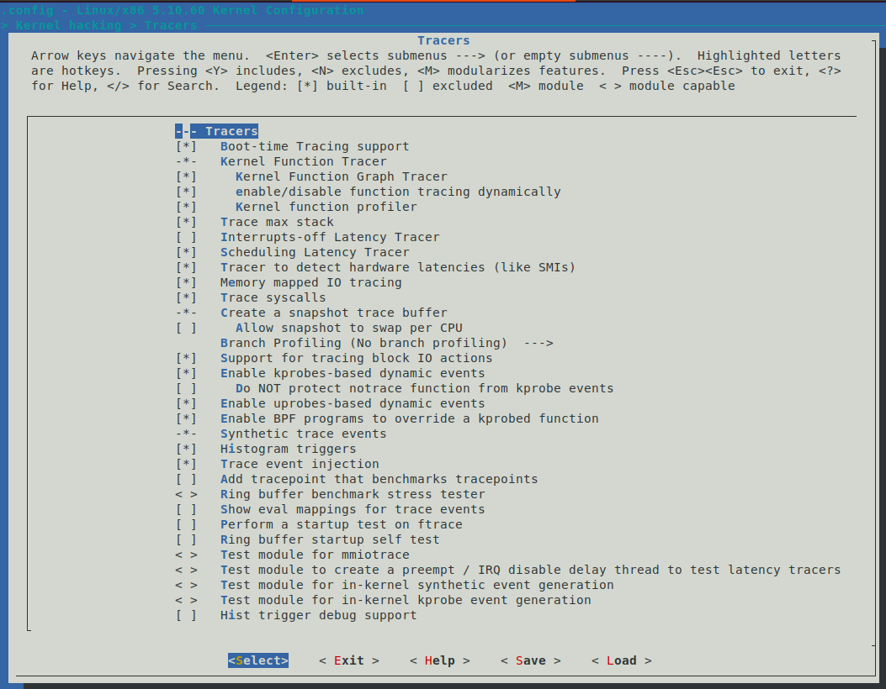

大多数现代 Linux 发行版都会预置 ftrace 支持到手。

这很合理——毕竟在出事的时候，你总希望手里有个工具能用，而不是像没头苍蝇一样乱撞。在内核配置项里，这个开关叫做 `CONFIG_FTRACE`，通常它已经被设为 `y` 了。如果你习惯用图形化的 `make menuconfig`，可以在 "Kernel hacking" 下面找到 "Tracers" 菜单。

不过，开启这个选项有一个前置依赖：`TRACING_SUPPORT`。

这跟架构（CPU 类型）有关，而且必须是 `y`。实际上，你常用的大多数架构（x86, ARM64 等）都已经满足了这个依赖。为了让你有点实感，这里放一张在 x86_64 上 5.10.60 内核的配置截图：



**图 9.3 – x86_64 (5.10.60) 上 Tracers 子菜单的截图（默认选项）*

除了主开关，还有一些特定的跟踪器有自己的依赖。比如，如果你想启用 "Interrupts-off Latency Tracer"（`CONFIG_IRQSOFF_TRACER`），就需要 `TRACE_IRQFLAGS_SUPPORT=y`（通常这也是默认开启的；我们会在后面的 FAQ 章节里细讲这些专门测延迟的跟踪器）。另外，很多选项需要能显示内核栈回溯（`CONFIG_STACKTRACE_SUPPORT=y`），好在这些在现代内核里几乎都是标配。

如果你想刨根问底，所有 ftrace 相关的子菜单和配置项都定义在源码树的 `kernel/trace/Kconfig` 文件里。你可以去那里翻阅任何你感兴趣的配置项说明。

### 你的内核到底开了没？

理论说完了，实际问题来了：你手上的系统到底有没有开 ftrace？

如果是像 Ubuntu 20.04.3 LTS 这种通用发行版，答案几乎肯定是肯定的。我们可以验证一下：

```bash
$ grep -w CONFIG_FTRACE /boot/config-5.11.0-46-generic 
CONFIG_FTRACE=y
```

看，是 `y`。

那如果你搞的是嵌入式项目呢？这就不好说了。去翻翻你的项目里的内核配置文件，或者直接 `grep` 一下。在我工作的这个定制的 5.10.60 生产内核上，它是开着的。

顺便说一句，本书的技术审稿人 Chi Thahn Hoang 在嵌入式 Linux 领域经验非常丰富。他提到一个很关键的经验：**在他经手的项目里，ftrace 总是会被编译进内核**。为什么？因为虽然你平时不用它，但当系统出问题时，它简直是救命稻草。而且，只要你不去「打开」它，它的开销就是零。

这就引出了下一个问题：开销。

### Ftrace 和系统开销

你可能会想：「即使我不打开它，只要功能在那里，总归有点性能损耗吧？」

这种直觉是对的，但也不对。如果 ftrace 只是简单的「开启/关闭」，那为了跟踪每一个函数的入口和出口，代码里确实得到处埋下这种判断逻辑：

```c
if (tracing_enabled) {
    // 做跟踪记录的事情
}
```

如果是这样，即便你不跟踪，每个函数调用都要多跑一个 `if` 判断。在内核这种每纳秒必争的地方，这种开销是不可接受的。

但内核开发者们想到了一个绝妙（甚至有点疯狂）的解决方案。

这个配置叫 **`CONFIG_DYNAMIC_FTRACE`**（动态 ftrace）。

当它开启时，内核会在运行时做一些惊人的事情——它会直接修改内存中的机器码。在跟踪关闭的时候，它把函数入口处的指令替换成 `NOP`（空操作），什么都不做，完全没有性能损耗。当你需要跟踪某个函数时，它会动态地把那段指令改成一个跳转，跳转到 ftrace 的处理代码（这通常被称为 **Trampoline**，蹦床机制）。

所以，默认情况下，这个选项是开启的。这意味着：
1. 不跟踪时，性能是原生的。
2. 跟踪少量函数时，性能接近原生。
3. 只有在全速跟踪所有函数时，才会有明显的性能下降。

---

接下来，我们要进入正题了。假设你的内核已经配置妥当，我们现在直接切入 `/sys/kernel/tracing` 目录，去拨弄那些控制开关。

> **注意**：接下来的操作都需要 root 权限。如果你不是 root 用户，很多文件会是只读的，或者无法读取。

```bash
# cd /sys/kernel/tracing
```

（第一次用我们显式写出来这个路径。注意那个 `#` 提示符，这暗示我们现在是以 root 身份运行的；你需要 `sudo -s` 或者在每个命令前加 `sudo`。）

`tracefs` 这个文件系统里有很多控制旋钮（当然都是伪文件，就像 `procfs` 和 `sysfs` 一样）。其中有一个名叫 `tracing_on` 的文件，它控制着跟踪功能的实际开关。

```bash
# ls -l tracing_on 
-rw-r--r-- 1 root root 0 Jan 19 19:00 tracing_on
```

它现在的值是多少？

```bash
# cat tracing_on 
1
```

是 `1`。这很直观——`0` 表示关闭，`1` 表示开启。

**等一下，ftrace 默认是开着的？这不会影响性能吗？**

不用担心，这里有个微妙的细节。虽然 `tracing_on` 是 `1`，但 ftrace 实际上处于「待机」状态。

你可以把 `tracing_on` 理解为总闸，但还需要确认当前的 `current_tracer`（当前跟踪器）是什么。如果它是 `nop`（即 No Operation），那就意味着虽然总闸推上去了，但并没有安装任何实际的跟踪探头，所以系统依然在以原生速度运行。

这就像你把电灯开关打开了，但灯泡里没装灯丝——电流不会流过，当然也不会发光，更不会费电。

这就是 `CONFIG_DYNAMIC_FTRACE` 带来的好处：只有当你真正指定了一个跟踪器（比如 `function_graph`），内核才会开始修改指令，把「灯丝」装上去。在那之前，这一切都是静态的、零损耗的。