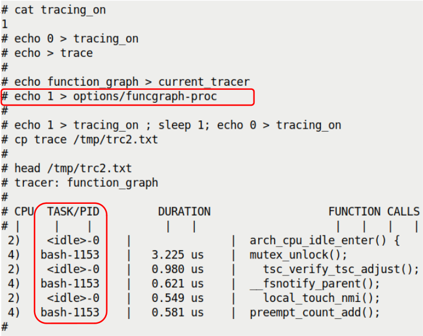
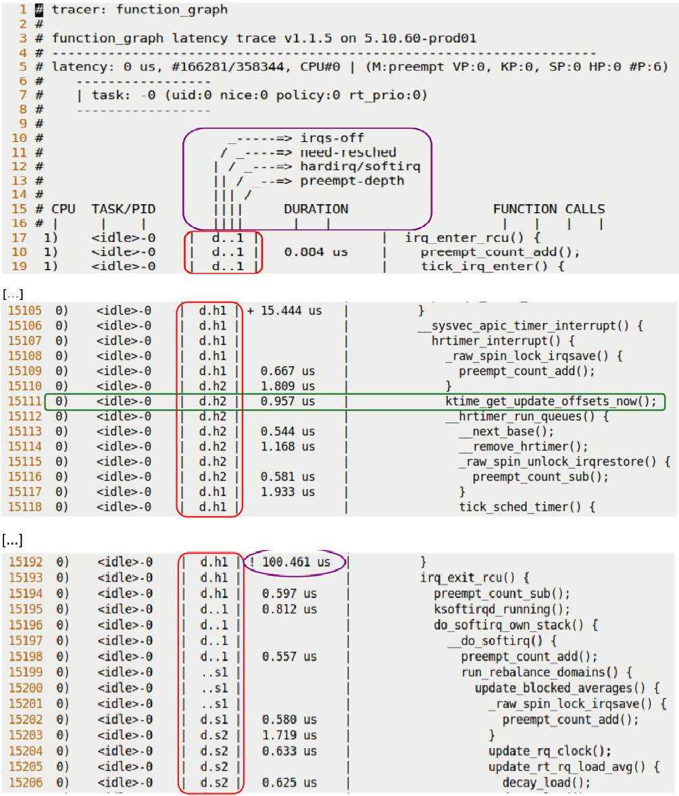

# 9.4 使用 ftrace 追踪内核流

上一节我们说到，虽然 `tracing_on` 是 `1`，但只要 `current_tracer` 还是 `nop`，系统就是零损耗的。这就像一个虽然通电但没装灯泡的灯座。

那如果我们把「灯泡」——也就是真正的跟踪器——装上去，会发生什么？

这是本节要讲的重点。你会发现，`/sys/kernel/tracing` 目录下的那些伪文件，本质上就是一排控制旋钮。我们之前只是看了看 `tracing_on` 这个总闸，现在要开始动真格的了。

---

### 9.4.1 选择合适的探头：Tracer

你可以把 `ftrace` 想象成一个万用表，它有很多不同的档位。在 ftrace 的术语里，这些档位叫 **Tracer（跟踪器）**，有时也叫插件。不同的 Tracer 决定了内核究竟在「记录什么」。

并不是所有的 Tracer 都默认编译进内核。要看你的系统里有哪些档位可用，读一下 `available_tracers` 文件：

```bash
# cat available_tracers 
hwlat blk function_graph wakeup_dl wakeup_rt wakeup function nop
```

这里列出的就是当前内核配置下可用的 Tracer。

**Tracer 的类比回收**

上一节我们把 `tracing_on` 比作「总闸」。顺着这个比喻，`current_tracer` 就是选择安装在灯座上的「灯泡型号」。

*   `nop`：就是「没装灯泡」。底座还在，开关也能动，但什么都不会发生。
*   `function`：这是一个基础型号。它能记录内核执行的每一个函数。
*   `function_graph`：这是增强型号。它不仅记录函数，还会通过缩进把调用关系画出来，看起来像一棵倒置的树。

虽然 `function` 不错，但我们强烈推荐 `function_graph`。为什么？因为它能让你看到代码的**逻辑流**，而不仅仅是一个长长的函数列表。看调用图就像看代码结构一样直观，这是理解内核执行流的关键。

现在，检查一下当前装的是什么「灯泡」：

```bash
# cat current_tracer 
nop
```

默认确实是 `nop`。

---

### 9.4.2 第一次实战：捕获一秒内的内核活动

好，理论够了，上号。

我们的目标很简单：开启 ftrace，让它记录 1 秒钟的内核活动，然后停手。

但在开始之前，必须提醒你一个操作细节：**一旦你把 `current_tracer` 改成一个有效的跟踪器（如 `function_graph`），追踪会立即开始**（只要 `tracing_on` 是 1）。内核不会等你，它非常听话且急躁。

所以，为了稳妥起见，我们的操作顺序是：
1.  先把总闸拉下来（`echo 0 > tracing_on`）。
2.  换跟踪器（`echo function_graph > current_tracer`）。
3.  合闸，睡一秒，拉闸。

动手吧：

```bash
# echo 0 > tracing_on
# echo function_graph > current_tracer
# echo 1 > tracing_on ; sleep 1; echo 0 > tracing_on
#
```

这就完了。数据在哪？在 `trace` 这个伪文件里。

```bash
# ls -l trace
-rw-r--r-- 1 root root 0 Jan 19 17:25 trace
```

注意看，文件大小是 0。千万别慌，这不是没数据。

这是一个经典的**伪文件**陷阱。`trace` 文件的大小被故意显示为 0，它是为了告诉你「这不是普通磁盘文件」。这是一个基于回调的技术——只有当你**读**它的时候，内核才会动态生成数据。

所以，你需要把它复制到一个真正的文件里：

```bash
# cp trace /tmp/trc.txt  
# ls -lh /tmp/trc.txt 
-rw-r--r-- 1 root root 4.8M Jan 19 19:39 /tmp/trc.txt
```

看到了吗？仅仅 1 秒钟，我们就抓到了 4.8MB 的数据。我用 `wc` 数了一下，差不多有 98,376 行。

**这说明了什么？**

说明内核在那一秒里非常忙。而且别忘了，这是**所有 CPU 核心**上的**所有内核活动**——包括系统调用、中断、底层任务切换。这就像把消防局的无线电调到监听模式，你会听到所有的频道都在同时说话。

数据量太大也会带来问题：噪音太多。我们后面会讲怎么过滤，但现在，先让我们看看这堆数据长什么样。

随便截取一段看看（我用 `head` 取了前 40 行）：

```bash
# head -n40 /tmp/trc.txt 
# tracer: function_graph
#
# CPU  DURATION                 FUNCTION CALLS
# |     |   |                    |   |   |   |
[...]
5)   1.156 us    |  tcp_update_skb_after_send();
5)   1.034 us    |  tcp_rate_skb_sent();
5)               |  tcp_event_new_data_sent() {
5)   1.107 us    |    tcp_rbtree_insert();
5)               |    tcp_rearm_rto() {
5)               |      sk_reset_timer() {
5)               |        mod_timer() {
5)               |          lock_timer_base() {
5)               |            _raw_spin_lock_irqsave() {
5)   0.855 us    |              preempt_count_add();
5)   2.754 us    |            }
5)   4.88 us    |          }
[...]
```

这里的信息很直观：
*   最左边的 `5)`：这是在 CPU 5 上发生的。
*   中间的数字（如 `1.156 us`）：函数执行耗时。
*   右边的函数名：实际执行的代码。
*   **缩进**：注意到了吗？`tcp_event_new_data_sent` 调用了 `tcp_rearm_rto`，后者又调用了 `sk_reset_timer`。这种缩进就是 `function_graph` 的核心价值——它给你展示了**调用栈**。

---

### 9.4.3 透视上下文：这代码到底是谁在跑？

刚才的输出虽然详细，但漏了一个关键信息。

我们看到了 `tcp_` 开头的网络函数在跑，但这是谁在跑？是用户空间的 Web 服务器进程触发的？还是内核后台线程自己在跑？或者是网卡中断触发的？

这不仅仅是好奇心。**进程上下文** 和 **中断上下文** 的处理逻辑截然不同。如果你误以为一段代码在进程上下文运行从而睡了觉，结果它其实是在中断上下文，那系统可能直接崩。

**回到那个「无线电监听」的类比**：
*   如果只有 `function_graph`，你只能听到「A 呼叫 B」。
*   加上上下文信息，你就能知道「是巡逻车在呼叫总部」，还是「总部在呼叫巡逻车」。

Linux 作为宏内核，代码只跑在两个上下文里：
1.  **进程上下文**：进程发了系统调用，代表进程干活。
2.  **中断上下文**：硬件或软中断打断了进程，处理突发事件。

ftrace 可以告诉你这个答案，但需要你手动开启一个选项。所有的控制旋钮都在 `options` 目录下。

---

### 9.4.4 重置与选项配置：funcgraph-proc

在我们继续玩弄旋钮之前，建议先养成一个好习惯：**Reset（重置）**。

当你乱试了一堆配置后，ftrace 的状态可能会变得很奇怪。与其一个个去回忆刚才改了啥，不如用脚本把它一键还原。

我们在第 1 章装过一个工具叫 `perf-tools`（不完全是 perf，是 Brendan Gregg 的脚本集），里面有个脚本叫 `reset-ftrace`：

```bash
# reset-ftrace 
Reseting ftrace state...
current_tracer, before:
     1    nop
current_tracer, after:
     1    nop
[...]
```

它会把一堆关键文件写回默认值。但注意，它可能覆盖不到所有选项。如果你想彻底一点，可以用 `trace-cmd`（我们后面会细讲这个工具）：

```bash
# trace-cmd reset
```

这会关掉所有追踪，清空缓冲区，让内核回到「出厂设置」。

**现在，让我们开启「显示进程信息」的模式。**

控制这个功能的文件是 `options/funcgraph-proc`。`proc` 代表 process。

```bash
# echo 1 > options/funcgraph-proc
```

我们再跑一次 1 秒钟的追踪，然后把结果截图对比一下（这次我们开启 `tracing_on` 后直接抓，因为设置好选项后追踪才开始）：


*(注：此处为原文引用的图示，展示了开启 funcgraph-proc 后的效果)*

看出来了吗？在 CPU 列和 TASK/PID 列里，现在不仅有 CPU 编号，还有具体的进程信息。

*   `<idle>-0`：这是 CPU 2 上的空闲进程（PID 0）。它正在摸鱼。
*   `bash-1153`：这是 CPU 4 上的 bash 进程（PID 1153）。它正在干活。

更有趣的是，你能直观地看到**并行性**：在同一时刻，CPU 2 在跑空闲进程的钩子函数，而 CPU 4 在处理 bash 的系统调用。这两个核心互不干扰，各忙各的。

---

### 9.4.5 深入：Latency-format 与中断上下文

哪怕开了 `funcgraph-proc`，还有一个陷阱。

看着 `<idle>-0` 在跑函数，你以为就是空闲进程自己在运行吗？不一定。完全有可能是一个硬件中断**打断**了空闲进程，强行在 CPU 上执行了中断处理程序。但在 `TASK/PID` 这一列，依然会显示被中断的任务（也就是 `<idle>-0`）。

这就像你正在家里睡觉（`<idle>`），突然邮递员（中断）冲进来把你摇醒塞了一封信然后跑了。日志上可能只写了「你在家」，但没提邮递员那一茬。

要看清**中断**的真面目，我们需要启用另一个大杀器：**latency-format（延迟格式）**。

这个选项会强制 ftrace 在输出里加上一列极其详细的上下文描述符。它位于 `options/latency-format`。

```bash
# echo 1 > options/latency-format
```

现在，我们的报告里会多出一列看起来像乱码的东西，比如 `d.h2`。别怕，这不是乱码，这是内核状态的密码本。

让我们跑一次，并截取一段报告：


*(注：此处为原文引用的图示，展示了 latency-format 的输出)*

请注意中间那一列 `d.h2`。它是这样解码的：

---

### 9.4.6 破解密码：`d.h2` 到底是什么意思？

这一列（Latency Info）由 4 个字符组成，每个字符代表一个维度。我们拿原文的例子 `d.h2` 来拆解：

**位置 1：硬件中断开关状态**
*   `d`：Disabled。中断被关了。
*   `.`：Enabled。中断开着。

**位置 2：需要重新调度**
*   `N`：最高优先级，需要重调度。
*   `n`：普通优先级，需要重调度。
*   `p`：抢占式重调度标记。
*   `.`：一切正常，不需要重调度。

**位置 3：当前运行上下文（重点！）**
*   `Z`：NMI（不可屏蔽中断）发生了，且它打断了硬中断。
*   `z`：NMI 正在跑。
*   `H`：硬中断发生了，且它打断了软中断。
*   `h`：**硬中断正在跑**（Hardirq）。
*   `s`：软中断正在跑。
*   `.`：**正常进程上下文**。

**位置 4：抢占深度**
*   数字：表示抢占计数器的值。
*   如果大于 0，说明内核当前处于**不可抢占**的临界区（比如拿着自旋锁）。

---

**回到我们的例子 `d.h2`：**

1.  `d`：硬件中断被禁用了。
2.  `.`：不需要重新调度。
3.  `h`：代码正在**硬中断上下文**中运行。
4.  `2`：抢占深度是 2（说明这个中断处理程序可能拿了自旋锁，或者嵌套了两层锁，这期间不能被抢占）。

结合前文，这就解释得通了：CPU 0 上的 `<idle>-0` 进程在睡懒觉时，被一个硬件中断（`h`）打断了，中断处理程序顺手关了中断（`d`）并拿了锁（`2`），然后执行了 `ktime_get_update_offsets_now()`。

这就是真相。

如果你在这一行看到了 `....`，那就是纯粹的进程上下文，一切太平。

---

### 9.4.7 延迟标记：谁在偷懒？

除了状态密码，ftrace 还有一个贴心的小功能：**视觉化的延迟标记**。

当函数执行时间过长时，ftrace 会在持续时间前面加上符号，提醒你「这里慢了」。

看这一行：

```bash
0)    <idle>-0    |  d.h1 | ! 100.461 us    |       }
```

注意到时间前面的 `!` 了吗？这就是**延迟标记**。

规则如下：
*   `$`：超过 1 秒（这简直是灾难）。
*   `*`：超过 100 毫秒（很慢）。
*   `!`：**超过 10 微秒**（注意，虽然微秒很小，但在内核里这算慢了）。
*   `+`：超过 1 微秒。
*   空格（无标记）：小于 1 微秒（正常）。

在 `function_graph` 模式下，这个功能默认开启，由 `options/funcgraph-overhead` 控制。如果你觉得眼花缭乱，可以把它关掉：

```bash
# echo 0 > options/funcgraph-overhead
```

---

### 9.4.8 其他有用的旋钮

ftrace 的旋钮多到让人头晕。这里挑几个特别实用的列出来。

**1. 检查 Buffer 大小：buffer_size_kb**

如果日志太多，缓冲区会溢出。你可以查看或设置每个 CPU 的缓冲区大小（单位：KB）。

```bash
# cat buffer_size_kb
4096
```

如果你要跑高压力测试，觉得 4MB 不够用，可以往里写数字：

```bash
# echo 8192 > buffer_size_kb
```

**2. trace_options：大杂烩**

还有一个叫 `trace_options` 的文件，它是各种开关的大集合。

```bash
# cat trace_options
print-parent
nosym-offset
nosym-addr
verbose
[...]
```

这里有个好玩的东西：`sym-offset`。

还记得我们在分析 Oops 时看到的 RIP 信息吗？`do_the_work+0x124/0x15e`？这种偏移量格式对于定位问题非常有帮助。

你可以把这个格式加到 ftrace 的输出里：

```bash
# echo sym-offset > trace_options
```

之后，函数名后面可能会带上偏移量，帮你精确定位到是函数的哪一行调用的。

**3. 实时监控：trace_pipe**

如果你不想等结束了再拷文件，想盯着屏幕看日志像水一样流出来，用 `trace_pipe`。

```bash
# cat trace_pipe
```

它是一个管道文件，读起来是流式的。适合配合 `grep` 边跑边查：

```bash
# cat trace_pipe | grep "netif_receive"
```

---

### 9.4.9 本章小结：掌握黑盒的透镜

这一节我们干了一件事：**把 ftrace 从「只有开关的手电筒」变成了「带夜视仪的高清相机」**。

通过组合 `function_graph`、`latency-format` 和 `funcgraph-proc`，我们现在不仅能看到内核跑了什么函数，还能看清是在哪个 CPU 上、哪个进程里、是不是被中断打断的、甚至是不是关了中断拿锁偷懒。

这就像给内核做了一次 MRI。

还记得那个 `d.h2` 的密码吗？如果现在再给你一行日志，你应该能一眼看出当时的内核是在发抖（中断风暴）还是在正常呼吸。

在下一节，我们会把这套手工操作通过更高级的工具（`trace-cmd` 和 `KernelShark`）自动化掉，毕竟，没人愿意每次都敲二十行命令才抓一次包。