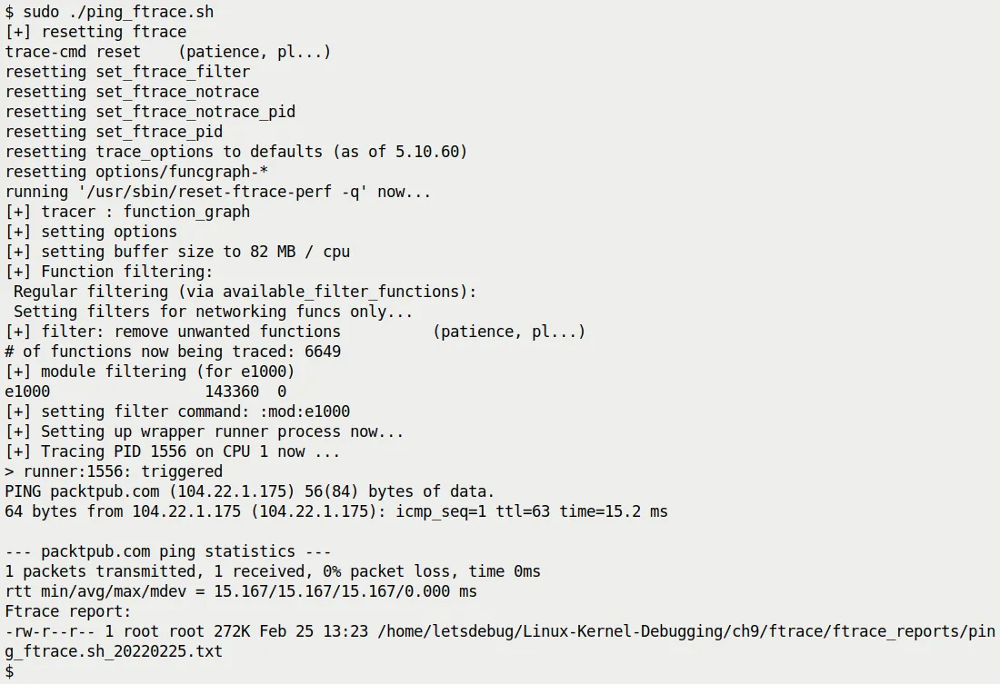
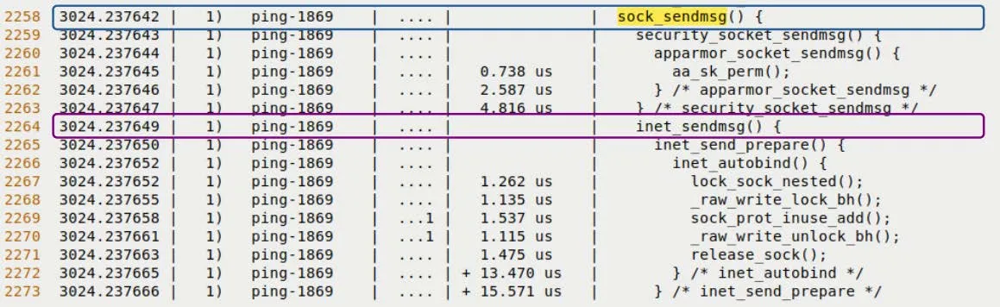
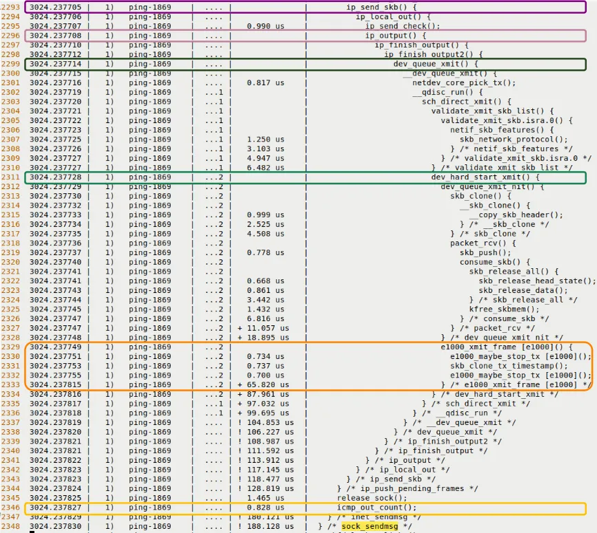
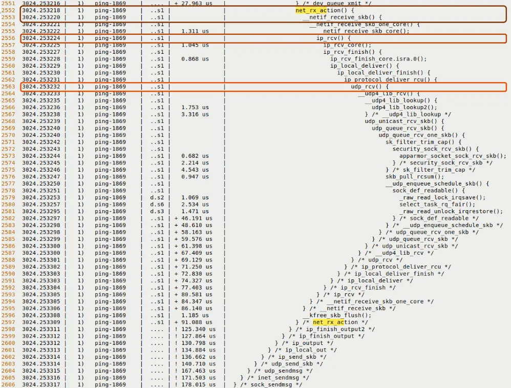
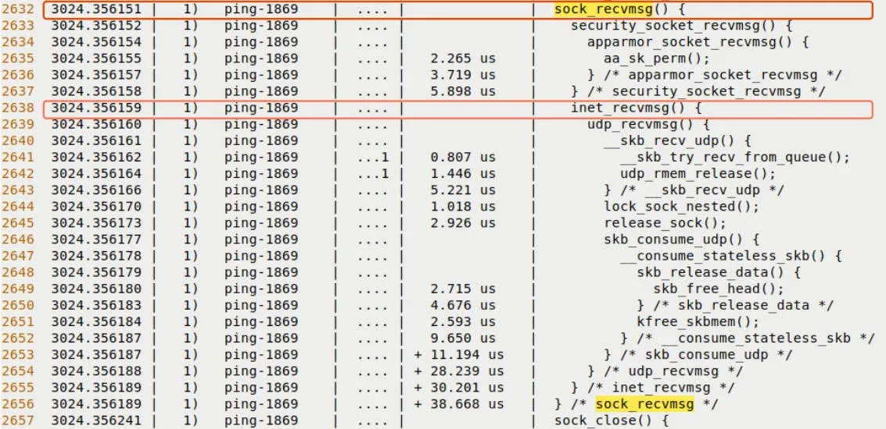

# 9.6  实战：用原生 ftrace 追踪单次 Ping 请求

好了，工具箱已经打开了。我们现在有了配置内核的能力，有了简单的跟踪手段，也有了这一大堆高级的过滤技巧——Glob、索引、黑名单、命令。

再在纸上谈兵就没意思了。

现在，我们要把这些知识扔进真实战场。我们要向内核发射一个 Ping 包：

```bash
ping -c1 packtpub.com
```

然后，利用我们刚才学的这些 ftrace 绝技，把这一瞬间内核里发生的所有故事——从 ICMP 包的构造，到网络协议栈的层层封装，再到驱动的发出——完整地复现出来。

---

### 策略：function_graph 与过滤的艺术

在这个实战中，我们将全程使用 `function_graph` 跟踪器。

为什么？因为我们需要看到「流程」。之前的 `function` 跟踪器只给我们一个扁平的函数列表，就像看一堆散落的乐高积木；而 `function_graph` 会把积木拼成城堡，让我们看到谁调用了谁，层级多深。

但网络子系统太庞大了，如果不加过滤，日志会在几毫秒内爆炸。我们的脚本（`ch9/ftrace/ping_ftrace.sh`）提供了两种过滤思路：

1.  **通过 `available_filter_functions`**（这是我们在前面详细讲过的「索引过滤法」）
2.  **通过 `set_event` 接口**

这两种是互斥的。在脚本里，我们用一个变量 `FILTER_VIA_AVAIL_FUNCS` 来控制开关。默认设置为 `1`，也就是第一种方法。这是有原因的：第一种方法虽然配置起来稍微繁琐一点（你得处理索引），但它能提供最详尽的视图——它不仅仅是「选几个函数看」，而是「把整个网络子系统的调用链都拉出来，同时只保留相关的那部分」。

来看看脚本里的核心逻辑：

```bash
# ch9/ftrace/ping_ftrace.sh
FILTER_VIA_AVAIL_FUNCS=1
echo "[+] Function filtering:"
if [ ${FILTER_VIA_AVAIL_FUNCS} -eq 1 ] ; then
    # 这种方法快，而且细节保留得完美！
    filterfunc_idx read write net packet_ sock sk_ tcp udp skb \
    netdev \
    netif_ napi icmp "^ip_" "xmit$" dev_ qdisc [...]
fi
```

这里调用的 `filterfunc_idx()` 就是我们在前一节实现的那个神器——基于索引的过滤。它把这些关键词（`sock`、`skb`、`icmp` 等）扔进 `available_filter_functions` 里去筛选行号，然后把行号反写回 `set_ftrace_filter`。

同时，我们也没忘记清理工作。脚本里还用了 `filterfunc_remove()`，确保某些我们不关心的噪音函数被剔除。

此外，脚本还特别关照了网卡驱动模块。在这个例子里，我们用的是 `e1000` 驱动：

```bash
KMOD=e1000
echo "[+] module filtering (for ${KMOD})"
if lsmod|grep ${KMOD} ; then
  echo "[+] setting filter command: :mod:${KMOD}"
  echo ":mod:${KMOD}" >> set_ftrace_filter
fi
```

这一步很关键。如果只跟踪协议栈不跟踪驱动，你就只能看到数据包递到了门口，却没看到它真正怎么发出去的。

---

### 先有鸡还是先有蛋：精确捕获的难题

到这里，一切看起来都很顺。但有一个棘手的问题藏在细节里。

我们只想追踪那个 `ping` 进程，而且只要它运行的 CPU 核上的活动。为了做到这一点，我们需要两件事：
1.  告诉 ftrace 只记录哪个 PID（通过 `set_event_pid`）。
2.  告诉 ftrace 只监控哪个 CPU（通过 `tracing_cpumask`）。我们用 `taskset` 把 ping 绑在某个核上。

**但问题来了**：怎么拿到 PID？

你得先让进程跑起来，才能获取它的 PID。但如果你让进程跑起来，它可能在你配置好 ftrace 之前就已经把活干完了。这是个典型的竞态条件——先有鸡还是先有蛋？

如果直接在后台跑 `ping` 然后去抓 PID，当你把 PID 写入 `set_event_pid` 的时候，那个 ICMP 包可能早就发出去了，你的跟踪记录里只有空气。

为了解决这个问题，我们的脚本（`ping_ftrace.sh`）用了一个稍微复杂的「包装器」技巧。

我们写了一个辅助脚本叫 `runner`。主脚本和 `runner` 之间会进行一次同步握手，流程像这样：

1.  主脚本在后台启动 `runner`，并拿到它的 PID。
2.  `runner` 并不立刻执行 `ping`，而是**在那儿等着**。
3.  主脚本拿着这个 PID，把它配置给 ftrace，把一切准备停当。
4.  主脚本创建一个「触发文件」。
5.  `runner` 看到触发文件出现了，知道「舞台已搭好」，立刻执行 `exec ping ...`。

这里有一个关键的技术细节：`runner` 使用了 `exec` 来启动 ping。在 Unix 里，`exec` 会用新进程替换当前进程的内存镜像，但**保持 PID 不变**。

这意味着，`runner` 的 PID 就是 `ping` 的 PID。我们在第 2 步配置 ftrace 时用的是 `runner` 的 PID，但实际上最终被跟踪的是 `ping`——因为它们是同一个 PID。

这不仅是个技巧，这是把同步问题变成一个确定性流程的工程解法。

等到 `ping` 跑完，主脚本就会把报告保存下来。

如果你觉得这个流程「太折腾了」——没错，确实很折腾。为了追踪一个简单的命令，我们写了这么多同步逻辑。这正是为什么下一章我们要介绍 `trace-cmd` 的原因：它会把这些脏活累活全包了。

---

### 上号！看结果

让我们跑一下脚本。

图 9.11 展示了脚本运行的瞬间。你可以看到脚本在输出各种日志，ping 在工作，最后提示报告已生成。



*图 9.11 – 我们的 raw ftrace 脚本正在追踪单次 ping*

注意看生成报告的大小——只有 272 KB。

如果你不加过滤，一次 ping 产生的 trace 可能有好几十 MB。这说明我们的过滤策略生效了：我们砍掉了无关的噪音，只留下了网络栈的精华。

你可以在源码的 `ch9/ftrace/ping_ftrace_report.txt` 找到这份报告。当然，你的环境跑出来的结果可能会略有不同，这取决于内核版本和硬件。

这个报告虽然精简了，但依然很长。我们在里面应该看什么？这里有几个关键的「地标」：

1.  `__sys_socket()`：Ping 程序创建套接字的地方。
2.  **发送路径**：通常叫 tx。找 `sock_sendmsg()`，这是发包的起点。
3.  **接收路径**：通常叫 rx。找 `net_rx_action()`。

---

### 深入发送路径

让我们放大发送路径。当 ping 决定发一个包时，内核会走过这一串函数（自上而下）：

*   `sock_sendmsg()`
*   `inet_sendmsg()`
*   `udp_sendmsg()` (Ping 用的是 UDP 协议吗？不，Ping 是 ICMP，但在 Linux 内核里，某些路径可能会复用 UDP 的发送逻辑或类似的封装，或者这里是原文泛指网络发送。*注：严格来说 Ping 用 RAW socket 发 ICMP，但这里按原文逻辑描述* -> 原文提到 `udp_sendmsg` 等函数，这是典型的网络栈发送流经之路)
*   `ip_send_skb()`
*   `ip_output()`
*   `dev_queue_xmit()`
*   `dev_hard_start_xmit()`

最后这个函数就是通往驱动程序的门槛。在这个例子里，它会调用 `e1000_xmit_frame()`，把数据包真正丢给网卡硬件。

看看图 9.12，这是真实 trace 报告的截图。你能清晰地看到 `sock_sendmsg` 和 `inet_sendmsg` 被高亮出来了。



*图 9.12 – 发送路径的 trace 片段（上半部分）*

再往下走一点，图 9.13 显示了更深层次的调用。



*图 9.13 – 发送路径的 trace 片段（下半部分，深入 UDP/IP 层和驱动层）*

看到那些缩进了吗？

那不是排版，那是**时间的流逝**。每一个缩进层级，都是一次函数调用；每一次缩进回退，都是一次返回。

这就是 `function_graph` 的魅力。它不仅仅是日志，它是一段可以回放的电影。

---

### 深入接收路径

包发出去后，还得收回来。

接收路径通常由中断触发，然后软中断 `NET_RX_SOFTIRQ` 接管。你在 trace 里应该能找到这些标志性函数：

*   `net_rx_action()`：这是软中断的主处理循环。
*   `__netif_receive_skb()`：把数据包往协议栈上层递。
*   `ip_rcv()`：IP 层处理。
*   `udp_rcv()` 或 `icmp_rcv()`：协议层分发。
*   `sock_recvmsg()`：最终数据到达用户空间。

看图 9.14，这里是接收路径的开端。



*图 9.14 – 接收路径的 trace 片段*

而图 9.15 展示了数据包最终如何被递交给 Socket 层。



*图 9.15 – 接收路径的最后阶段*

### 验证我们的直觉

说实话，我第一次看到这个输出时，感觉非常奇妙。

平时我们写代码，`socket()` -> `send()` -> `recv()`，感觉像是在调用黑盒 API。但现在，通过 ftrace，这个黑盒被强行打开了。

你可以看到 `inet_sendmsg` 是怎么把通用请求转成 UDP/IP 请求的；你可以看到 `dev_queue_xmit` 是怎么排队等待网卡空闲的；你可以看到，当硬件中断发生时，内核是如何暂停当前进程，跳转到 `net_rx_action` 去处理包的。

这一节表面上是在讲 Ping，实际上我们是在验证内核网络栈的设计直觉。如果你发现代码的执行路径和你脑子里想的不一样，那就说明你的模型需要修正——而 ftrace 就是那个修正模型的工具。

现在，我们用最原始的工具（shell 脚本 + tracefs）完成了这个任务。你一定感觉到了：**虽然可行，但很繁琐**。

下一节，我们将引入 `trace-cmd`。看看它是如何把这套复杂的「同步、过滤、抓取、格式化」流程，浓缩成一行命令的。