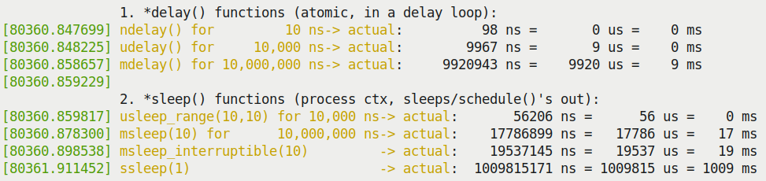
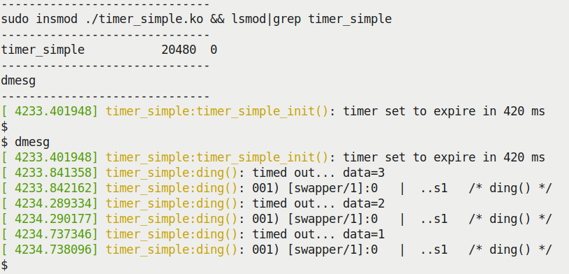
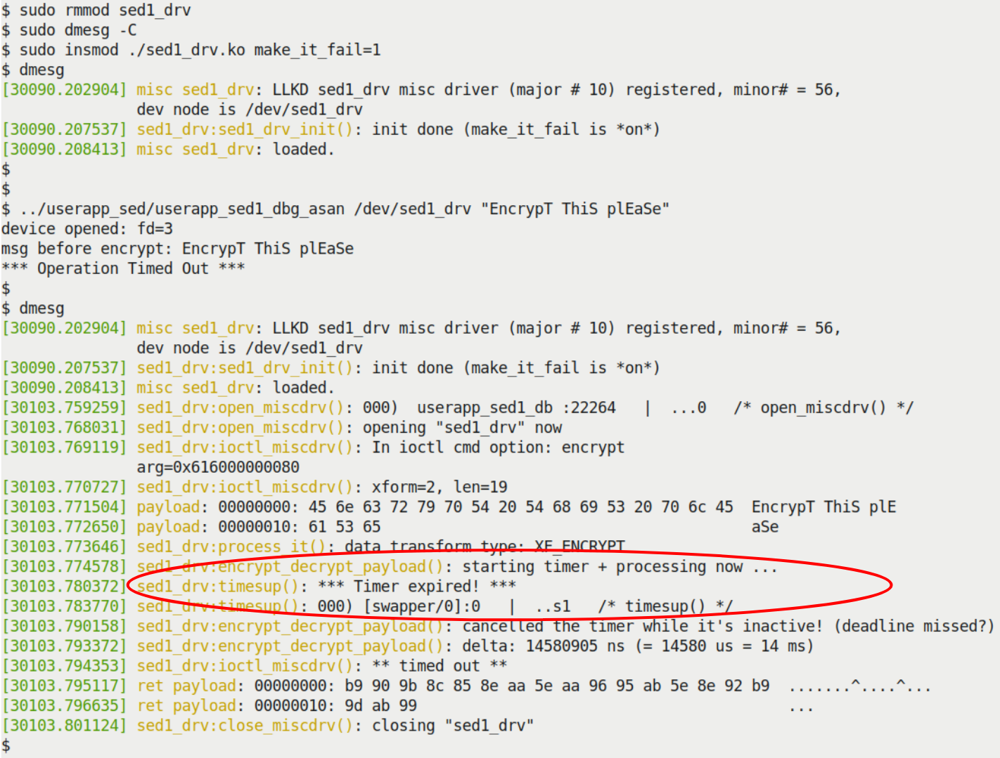
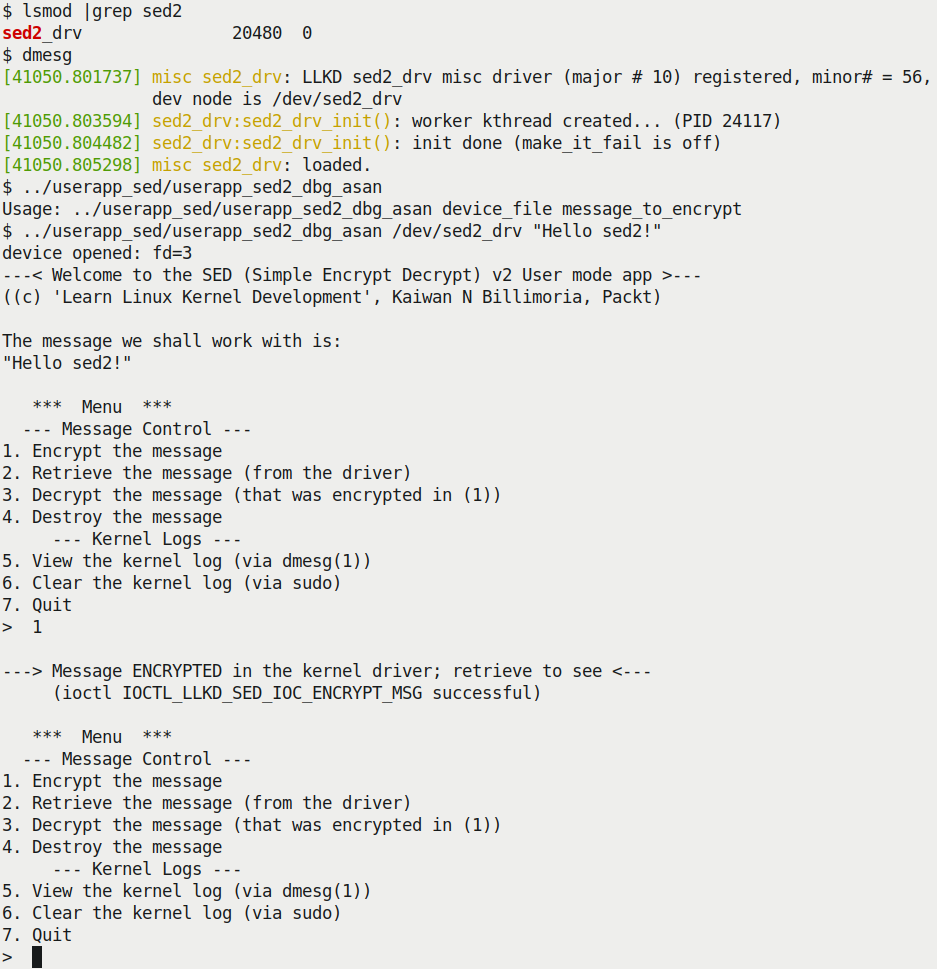
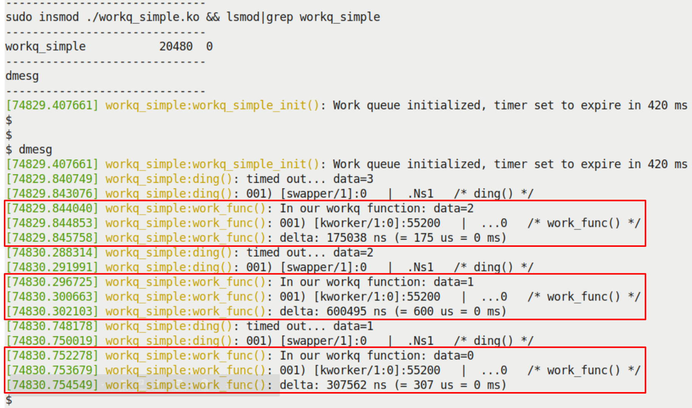
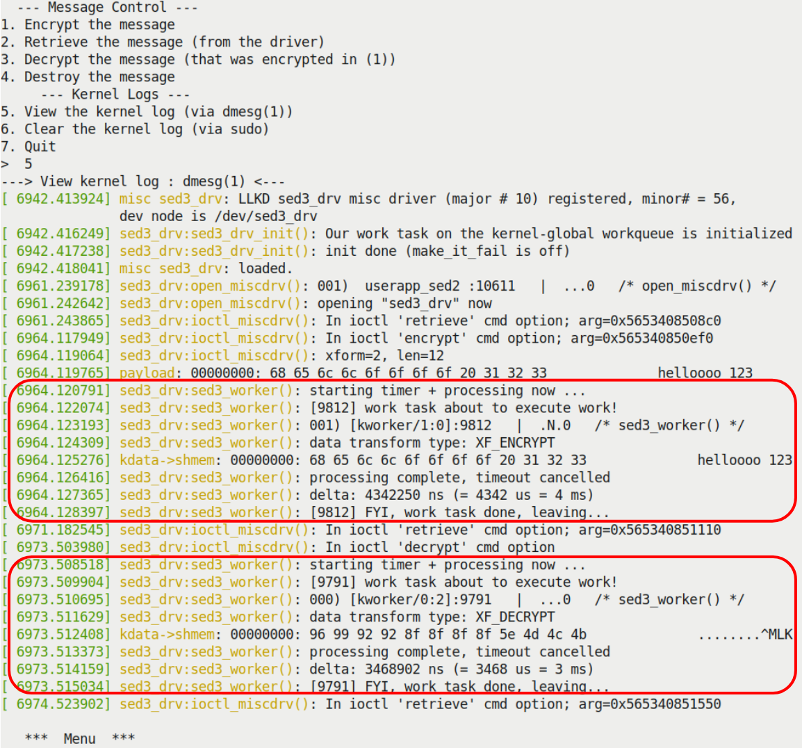

# 第 5 章  内核里的时间与异步工作

## 第 2 节  —  技术准备与环境

在开始深入代码之前，我们需要统一一下起跑线。

假设你已经读过前一本配套书《Linux Kernel Programming》的 Preface，并且准备好了一个运行 Ubuntu 18.04 LTS（或更新稳定版）的虚拟机。更重要的是，你已经把本书的 GitHub 仓库 clone 下来了。

动手是这一章的灵魂——光看不练，你永远不知道那个 timer 到底是在 softirq 里跑的，还是在进程上下文里跑的。

仓库地址在这里：[GitHub - Linux Kernel Programming Part-2](https://github.com/PacktPublishing/Linux-Kernel-Programming-Part-2)。

把环境配好，把代码拉下来，我们随时准备 `insmod`。

---

## Delaying for a given time in the kernel

想象一个场景：你正盯着你的驱动代码，突然系统毫无征兆地死机了。重启、查看日志，发现堆栈毁得一塌糊涂。经过一番痛苦的调试，你终于发现——竟然是因为你在中断处理函数里，天真地调用了一个看起来人畜无害的 `msleep(10)`。

这不仅是崩溃，更是一个哲学问题：**在内核里，当我们说“稍等一下”时，我们到底在等什么？**

你的驱动代码经常需要：“稍微等一下再往下走”。这在内核空间里是通过一套 Delay API 来实现的。但在你动手之前，必须先搞清楚一个根本性的问题：

你要等的这段时间里，**你是打算干等着（霸占 CPU），还是愿意去睡一觉（把 CPU 让给别人）？**

这不仅仅是编程风格的问题，这直接决定了你会用哪一套 API，以及你的系统会不会像刚才那个故事一样莫名其妙地卡死。

从大的方面看，内核提供的延迟机制只有两类：

1.  **非阻塞/原子延迟** (`*delay()` APIs)：这种延迟永远不会导致当前进程休眠（schedule out），也就是俗称的「忙等待」。
2.  **阻塞延迟** (`*sleep()` APIs)：这种延迟会让当前进程上下文去休眠（调用 `schedule()`），把 CPU 让出来。

**这好比在 ATM 机前办事：**
*   **忙等待**就像死死盯着屏幕，后面的人也别想动，CPU 被你霸占着。
*   **睡眠**就像拿个号坐在椅子上玩手机，把柜台让给别人，叫号了再回去。

如果你读过关于 CPU 调度的章节（比如《Linux Kernel Programming》第 10 和 11 章），你会知道 `schedule()` 意味着上下文切换。这就引出了一个**生死攸关的原则**：

> **千万不要在原子上下文或中断上下文中调用 `schedule()`。**

这里的「原子上下文」范围很广：硬中断、软中断、Tasklet，以及持有自旋锁的临界区。在这些地方，你没有任何权利睡觉。

### 上下文决定一切

写代码时，你必须时刻盯着当前运行的上下文。如果你正处在一个中断处理函数里（Top Half 或 Bottom Half），你的首要任务是**快进快出**。在这种地方赖着不走甚至还要 delay，本身就是一种设计缺陷。

**回到那个 ATM 的比喻**：如果你是中断处理程序，那你就像是在处理紧急救火，你不能说“我先坐会儿”，你必须死盯着（忙等待），虽然这很费电，但为了安全别无他法。

但如果你非要等，那就只能用第一类 API：非阻塞的 `*delay()`。

以下是两条简单的铁律：

*   **用 `*delay()`**：当你处于**原子上下文**（中断、软 IRQ 等），或者你需要极短的延迟（< 1 毫秒）。在这种上下文里，你不能休眠，只能让 CPU 空转。
*   **用 `*sleep()`**：当你处于**进程上下文**，并且允许当前进程休眠（比如没有持有自旋锁）。通常用于大于 1 毫秒的较长延迟。

**注意**：即使你身处进程上下文，如果你正处于自旋锁保护的临界区内，那它本质上也是「原子」的——这时候你敢睡，死锁就会找上门。

---

### Understanding how to use the `*delay()` atomic APIs

好，让我们先看看第一类——那些不睡觉的死硬派。

下表总结了我们在内核模块开发中常用的非阻塞延迟 API。它们的设计初衷就是在那些绝对不能调用 `schedule()` 的地方使用。

| API | Comment |
| :--- | :--- |
| `ndelay(ns);` | Delay for *ns* nanoseconds. |
| `udelay(us);` | Delay for *us* microseconds. |
| `mdelay(ms);` | Delay for *ms* milliseconds. |

**Table 5.1 – The `*delay()` non-blocking APIs**

这里有几点必须知道的细节，否则你会踩坑：

1.  **头文件**：使用这些宏/API 时，务必包含 `<linux/delay.h>`。
2.  **不要混用单位**：你需要什么级别的延迟，就用对应的函数。比如，要延迟 30 毫秒，你应该调用 `mdelay(30)`，而不是 `udelay(30*1000)`。内核源码里明确写着（`linux/delay.h`）：如果 `loops_per_jiffy` 很高（也就是 BogoMIPS 很高），用 `udelay()` 延迟几毫秒可能会导致溢出。
3.  **底层实现**：这些 API 的实现有点「分层」。
    *   高层封装在 `<linux/delay.h>`。
    *   底层架构相关实现在 `<asm-<arch>/delay.h>` 或 `<asm-generic/delay.h>`。
    *   链接器会自动帮你选好底层的实现。

本质上，`ndelay` 和 `mdelay` 最终都会调用 `udelay()`。而 `udelay()` 本质上是一个**紧凑的汇编死循环**。你可以去 `arch/x86/lib/delay.c` 里的 `__const_udelay()` 看看它的真面目。

既然是死循环，内核怎么知道要循环多少次呢？

这就是 **BogoMIPS** 的由来。

*   系统启动早期，内核会进行一次校准。
*   它计算在这个特定的硬件上，执行多少次空循环才能耗尽 1 个 timer tick（也就是 1 个 jiffy）。
*   这个值被称为 `loops_per_jiffy` (lpj)。
*   换算成的 MIPS 值就是 BogoMIPS。

你可以在 `dmesg` 里看到这个值，比如在我这台 Core-i7 上：

```text
Calibrating delay loop (skipped), value calculated using timer frequency.. 5199.98 BogoMIPS (lpj=10399968)
```

对于超过 `MAX_UDELAY_MS`（通常是 5ms）的延迟，内核内部其实是在循环调用 `udelay()`。

**⚠️ 警告**：`*delay()` API 必须用于原子上下文（如中断处理函数），因为它们保证了绝不发生 `schedule()`。内核为了帮你抓出错误，提供了一个调试宏 `might_sleep()`。如果内核在某段代码里调用了 `might_sleep()`，意味着这段代码预期是在进程上下文跑的。如果你在原子上下文里调用了它，你会得到一个刺眼的堆栈打印——这是好事，能帮你提前找到 Bug。

当然，你在进程上下文里也可以用这些 API，只是不礼貌罢了（就像明明能坐着，非要在柜台前站着）。

---

### Understanding how to use the `*sleep()` blocking APIs

现在让我们看看第二类——那些愿意睡觉的好好先生。

这些 API 只能在**进程上下文**中安全使用。它们的工作原理是：当前进程乖乖去睡觉，内核调用 `schedule()` 切换走，时间到了再叫醒它。

| API | Internally "backed by" | Comment |
| :--- | :--- | :--- |
| `usleep_range(umin, umax);` | hrtimers (high-resolution timers) | Sleep for between *umin* and *umax* microseconds. Use where the wakeup time is flexible. This is the **recommended** API to use. |
| `msleep(ms);` | jiffies/legacy_timers | Sleep for *ms* milliseconds. Typically meant for a sleep with a duration of **10 ms or more**. |
| `msleep_interruptible(ms);` | jiffies/legacy_timers | An interruptible variant of `msleep(ms);`. |
| `ssleep(s);` | jiffies/legacy_timers | Sleep for *s* seconds. This is meant for sleeps > 1 s (wrapper over `msleep()`). |

**Table 5.2 – The `*sleep*()` blocking APIs**

同样的，这里也有一些门道：

1.  **头文件**：记得包含 `<linux/delay.h>`。
2.  **进程上下文专用**：所有这些 API 内部都会触发休眠，所以绝对不能在原子上下文（比如中断里）用。
3.  **推荐 `usleep_range()`**：如果你需要一个短睡眠，这是首选。为什么？下面会讲。
4.  **可中断 vs 不可中断**：
    *   `msleep()` 是不可中断的，它会调用 `__set_current_state(TASK_UNINTERRUPTIBLE)`。
    *   `msleep_interruptible()` 是可中断的，状态设为 `TASK_INTERRUPTIBLE`。

    如果用户按了 `^C`，或者发了信号，`msleep_interruptible()` 会提前醒来。这符合 UNIX 的设计哲学：提供机制，而非策略。作为一个通用的驱动，你应该考虑尊重用户的意图，使用可中断版本。

**时间经验法则**：
*   超过 10 毫秒：用 `msleep()` 或 `msleep_interruptible()`。
*   超过 1 秒：用 `ssleep()`。

`ssleep()` 其实就是 `msleep(seconds * 1000)` 的一个简单封装。

**内核是怎么睡的？**

当你调用 `msleep(ms)` 时，内核实际上干了这件事：

```c
__set_current_state(TASK_UNINTERRUPTIBLE);
return schedule_timeout(timeout);
```

而 `schedule_timeout()` 的核心逻辑就是：
1.  设置一个内核定时器（我们下一节就讲这个），定个闹钟。
2.  调用 `schedule()`，把 CPU 交出去。
3.  闹钟响了或者信号来了，进程被唤醒。

这里有一个小技巧，如果你想实现一个类似用户空间 `sleep(3)` 的功能，可以直接用 `schedule_timeout()`。我们在 `convenient.h` 里写了这么一个 `delay_sec()` 函数：

```c
#ifdef __KERNEL__
void delay_sec(long);
/*------------ delay_sec --------------------------------------------------
 * Delays execution for @val seconds.
 * If @val is -1, we sleep forever!
 * MUST be called from process context.
 * (We deliberately do not inline this function; this way, we can see it's
 *  entry within a kernel stack call trace).
 */
void delay_sec(long val)
{
    asm (""); // force the compiler to not inline it!
    if (in_task()) {
        set_current_state(TASK_INTERRUPTIBLE);
        if (-1 == val)
            schedule_timeout(MAX_SCHEDULE_TIMEOUT);
        else
            schedule_timeout(val * HZ);
    }
}
#endif /* #ifdef __KERNEL__ */
```

---

### Taking timestamps within kernel code

既然我们学了这么多延迟的手段，怎么知道它们准不准呢？我们需要一把尺子。

在用户空间，我们习惯用 `gettimeofday(2)`。在内核里，最常用的是 `ktime_get_*()` 系列。对于我们现在的需求，这个 API 足够了：

```c
u64 ktime_get_real_ns(void);
```

它返回自 Epoch 以来的纳秒数。如果你需要更高的性能或者 NMI 安全，可以用 `ktime_get_real_fast_ns()`。

有了这个，我们就可以轻松计算代码执行时间了：

```c
#include <linux/ktime.h>
t1 = ktime_get_real_ns();
foo();
bar();
t2 = ktime_get_real_ns();
time_taken_ns = (t2 - t1);
```

为了方便，我们在 `convenient.h` 里定义了一个宏 `SHOW_DELTA(later, earlier)`，可以直接打印时间差。

---

### Let's try it – how long do delays and sleeps really take?

理论讲完了，是时候上板子验货了。

我们写了一个 `delays_sleeps` 驱动，它会依次测试这些 API，并打印出**实际**消耗的时间。

我们定义了一个宏 `DILLY_DALLY()` 来干脏活累活：

```c
// ch5/delays_sleeps/delays_sleeps.c
/*
 * DILLY_DALLY() macro:
 * Runs the code @run_this while measuring the time it takes; prints the string
 * @code_str to the kernel log along with the actual time taken (in ns, us
 * and ms).
 * Macro inspired from the book 'Linux Device Drivers Cookbook', PacktPub.
 */
#define DILLY_DALLY(code_str, run_this) do {    \
    u64 t1, t2;                                 \
    t1 = ktime_get_real_ns();                   \
    run_this;                                   \
    t2 = ktime_get_real_ns();                   \
    pr_info(code_str "-> actual: %11llu ns = %7llu us = %4llu ms\n", \
        (t2-t1), (t2-t1)/1000, (t2-t1)/1000000);\
} while(0)
```

然后在 `init` 函数里，我们一顿狂测：

```c
    /* Atomic busy-loops, no sleep! */
    pr_info("\n1. *delay() functions (atomic, in a delay loop):\n");
    DILLY_DALLY("ndelay() for         10 ns", ndelay(10));
    /* udelay() is the preferred interface */
    DILLY_DALLY("udelay() for     10,000 ns", udelay(10));
    DILLY_DALLY("mdelay() for 10,000,000 ns", mdelay(10));

    /* Non-atomic blocking APIs; causes schedule() to be invoked */
    pr_info("\n2. *sleep() functions (process ctx, sleeps/schedule()'s out):\n");
    /* usleep_range(): HRT-based, 'flexible'; for approx range [10us - 20ms] */
    DILLY_DALLY("usleep_range(10,10) for 10,000 ns", usleep_range(10, 10));
    /* msleep(): jiffies/legacy-based; for longer sleeps (> 10ms) */
    DILLY_DALLY("msleep(10) for      10,000,000 ns", msleep(10));
    DILLY_DALLY("msleep_interruptible(10)         ", msleep_interruptible(10));

    /* ssleep() is a wrapper over msleep(): = msleep(ms*1000); */
    DILLY_DALLY("ssleep(1)                        ", ssleep(1));
```

跑一下，结果可能让你意外（Figure 5.1）：

1.  **`*delay()` 的表现**：你会发现 `udelay(10)` 和 `mdelay(10)` 的**实际**耗时往往比预期的要**短**。
2.  **`*sleep()` 的表现**：你会发现 `msleep(10)` 的实际耗时往往比预期的要**长**。


**Figure 5.1 – 我们的 delays_sleeps.ko 内核模块的部分输出截图**

为什么会这样？

*   **`*delay()` 提前结束**：内核文档 `include/linux/delay.h` 里有解释。原因可能有三个：
    1.  计算的 `loops_per_jiffy` 偏低（因为处理中断本身也要花时间）。
    2.  缓存行为影响了循环执行速度。
    3.  CPU 变频了。
*   **`*sleep()` 延后结束**：因为调度器唤醒进程需要时间，醒来了还要排队等 CPU。在非实时 OS（标准 Linux）里，这是预期行为。

**结论**：内核里的延迟永远是「至少」这么多时间，而不是「精确」这么多时间。如果你有硬实时要求，标准 Linux 做不到；你需要 RTOS 补丁，或者干脆把高频逻辑放在用户空间用 POSIX timers 实现。

**关于 `usleep_range()`**：你可能会问，为什么推荐它？

因为给了范围（min, max），内核就有机会合并定时器、优化功耗，甚至配合 C-states 省电。如果你把 min 和 max 设成一样的（比如 `usleep_range(10, 10)`），内核的 `checkpatch` 脚本甚至会给你发一个 WARNING：

```text
WARNING: usleep_range should not use min == max args; see Documentation/timers/timers-howto.rst
```

它建议你应该留点余量，比如 `usleep_range(10, 15)`。

---

## The "sed" drivers – to demo kernel timers, kthreads, and workqueues

光知道怎么 Delay 还不够。如果让你在后台持续做这件事，并且还能随时被叫停，你该怎么设计？

为了演示后面几节的内容（内核定时器、内核线程、工作队列），我们设计了一个有点意思的驱动项目：**sed**。

这跟那个著名的流编辑器 `sed(1)` 没关系，它是 **Simple Encrypt Decrypt**（简单加密解密）的缩写。

这个项目的核心需求是：模拟一个带有**超时限制**的加密/解密操作。如果操作没在规定时间内完成，就算失败。

我们将演化三个版本的驱动：

1.  **sed1**：使用**内核定时器**来做超时检测。
2.  **sed2**：使用**内核线程**来干脏活累活，定时器负责超时。
3.  **sed3**：使用**工作队列**来干脏活累活。

这三个版本会帮你理解这三种机制的区别和联系。

---

## Setting up and using kernel timers

定时器是软件里的闹钟。

在用户空间，闹钟响了通常会发个信号（`SIGALRM`）。在内核空间，逻辑稍微绕一点：当定时器时间到了，内核的定时器软中断（`TIMER_SOFTIRQ`）会被触发，然后在这个软中断上下文里执行你的回调函数。

**记住这一点**：定时器的回调函数是运行在 **软中断上下文**（原子上下文）中的。这意味着你在回调里不能做任何可能阻塞的操作，不能访问用户空间内存，除了 `GFP_ATOMIC` 外也不能分配内存。

---

### Using kernel timers

要用内核定时器，通常遵循以下步骤：

1.  **定义并初始化** `struct timer_list` 结构体。
    *   使用 `timer_setup()` 宏来初始化。
    *   设置回调函数。
    *   设置过期时间（`expires`，基于 jiffies）。
2.  **编写回调函数**。
    *   签名必须是 `void (*function)(struct timer_list *timer)`。
3.  **启动定时器**。
    *   调用 `add_timer()` 或 `mod_timer()`。
4.  **处理超时**。
    *   时间一到，内核会自动调用你的回调函数。
5.  **如果是周期性任务**。
    *   在回调函数里再次调用 `mod_timer()` 重新设定时间。
6.  **删除定时器**。
    *   使用 `del_timer()` 或 `del_timer_sync()`。
    *   `del_timer_sync()` 会确保回调函数不再执行后才返回，更安全。

看看核心结构体 `struct timer_list` 的关键成员：

```c
// include/linux/timer.h
struct timer_list {
    // ...
    unsigned long expires;
    void (*function)(struct timer_list *);
    u32 flags;
    // ...
};
```

**初始化宏 `timer_setup()`**：

```c
timer_setup(timer, callback, flags);
```

*   `@timer`: 指向结构体的指针。
*   `@callback`: 回调函数。
*   `@flags`: 通常是 0。也可以是 `TIMER_DEFERRABLE`（省电，不唤醒 CPU）或 `TIMER_PINNED`（绑定特定 CPU）。

---

### Our simple kernel timer module – code view 1

先来个最简单的例子（代码路径：`ch5/timer_simple`）。

我们定义了一个上下文结构 `st_ctx`，里面放了一个 `timer_list` 和一个计数器 `data`：

```c
// ch5/timer_simple/timer_simple.c
#include <linux/timer.h>
// ...

static struct st_ctx {
    struct timer_list tmr;
    int data;
} ctx;
static unsigned long exp_ms = 420; // 延迟 420 毫秒
```

初始化代码如下：

```c
static int __init timer_simple_init(void)
{
    ctx.data = INITIAL_VALUE; // 设为 3

    /* Initialize our kernel timer */
    // 计算过期时间：当前 jiffies + 420ms 对应的 jiffies 数
    ctx.tmr.expires = jiffies + msecs_to_jiffies(exp_ms);
    ctx.tmr.flags = 0;
    // 初始化定时器，绑定回调函数 ding
    timer_setup(&ctx.tmr, ding, 0);

    pr_info("timer set to expire in %ld ms\n", exp_ms);
    add_timer(&ctx.tmr); /* Arm it; let's get going! */
    return 0;     /* success */
}
```

这里的关键是 `msecs_to_jiffies()`。它把人类能看懂的毫秒转换成内核时间基准——jiffies。`jiffies` 是内核全局变量，每个时钟中断加 1。

---

### Our simple kernel timer module – code view 2

当定时器到期时，内核会调用 `ding()` 函数：

```c
static void ding(struct timer_list *timer)
{
    struct st_ctx *priv = from_timer(priv, timer, tmr);
    /* from_timer() 是 container_of() 的封装！这招太常用了。
     * 它的作用是通过结构体成员的指针，找到整个结构体（ctx）的指针。 */
    pr_debug("timed out... data=%d\n", priv->data--);
    PRINT_CTX(); // 打印当前上下文信息

    /* until countdown done, fire it again! */
    if (priv->data)
        mod_timer(&priv.tmr, jiffies + msecs_to_jiffies(exp_ms));
}
```

`from_timer()` 这个宏一定要学会，它本质上就是 `container_of()`：

```c
#define from_timer(var, callback_timer, timer_fieldname) \
           container_of(callback_timer, typeof(*var), timer_fieldname)
```

**运行结果**：

Figure 5.2 展示了运行 `timer_simple.ko` 的 `dmesg` 输出。


**Figure 5.2 – 运行我们的 timer_simple.ko 内核模块**

仔细看时间戳，你会发现每次回调的间隔大概是 420ms 稍微多一点点（比如 448ms），这是正常的，因为有调度开销和 `printk` 本身的时间。

更重要的是 `PRINT_CTX()` 的输出，它揭示了回调函数运行在 **软中断上下文**（softirq）：

```text
[ 4234.290177] timer_simple:ding(): 001) [swapper/1]:0   |  ..s1   /* ding() */
```

注意那个 `s`，代表 softirq。

---

## sed1 – implementing timeouts with our demo sed1 driver

现在回到我们的 **sed** 项目。

**sed1** 的逻辑很简单：
1.  用户空间通过 `ioctl` 发送加密请求。
2.  驱动启动一个定时器（比如 1ms 超时）。
3.  驱动开始干活。
4.  如果干完了活，取消定时器 -> 成功。
5.  如果定时器先响了 -> 失败。

我们故意留了一个后门 `make_it_fail`，让你可以模拟超时失败的情况。

代码逻辑在 `encrypt_decrypt_payload()` 函数里：

```c
// ch5/sed1/sed1_driver/sed1_drv.c
static void encrypt_decrypt_payload(int work, struct sed_ds *kd, struct sed_ds *kdret)
{
    // ...
    /* Start - the timer; set it to expire in TIMER_EXPIRE_MS ms */
    mod_timer(&priv->timr, jiffies + msecs_to_jiffies(TIMER_EXPIRE_MS));
    t1 = ktime_get_real_ns();

    // perform the actual processing on the payload
    // ... 加密逻辑 ...

    // work done!
    if (make_it_fail == 1)
        msleep(TIMER_EXPIRE_MS + 1); // 故意超时！
    t2 = ktime_get_real_ns();

    // work done, cancel the timeout
    if (del_timer(&priv->timr) == 0)
        pr_debug("cancelled the timer while it's inactive! (deadline missed?)\n");
    else
        pr_debug("processing complete, timeout cancelled\n");
    SHOW_DELTA(t2, t1);
}
```

而定时器回调函数 `timesup()` 则是修改状态并报错：

```c
static void timesup(struct timer_list *timer)
{
    struct stMyCtx *priv = from_timer(priv, timer, timr);

    atomic_set(&priv->timed_out, 1);
    pr_notice("*** Timer expired! ***\n");
    PRINT_CTX();
}
```

如果你设置 `make_it_fail=1` 并插入模块，你会看到 Figure 5.4 的悲剧现场。


**Figure 5.4 – 我们的 sed1 项目在 make_it_fail=1 时错过了截止期限**

---

## Creating and working with kernel threads

内核线程（kthread）是运行在内核空间的线程。它们也是进程（有 `task_struct`），但它们只运行内核代码，没有用户空间的地址空间（`mm` 为 NULL）。

**为什么要用内核线程？**

当你需要在后台做一些耗时、可能阻塞的操作时，定时器这种「半路出家」的软中断机制就不合适了。你需要一个实实在在的进程上下文，可以安心地调用 `msleep()`，甚至访问用户空间（虽然通常不建议直接做）。

**快速识别内核线程**：用 `ps aux` 看，名字带方括号 `[...]` 的就是。

```text
root           2  0.0  0.0      0     0 ?          S    06:20   0:00 [kthreadd]
root           3  0.0  0.0      0     0 ?          I<   06:20   0:00 [rcu_gp]
root          10  0.0  0.0      0     0 ?          S    06:20   0:00 [ksoftirqd/0]
```

*   所有内核线程的祖宗都是 PID 为 2 的 `kthreadd`。
*   它们运行在进程上下文，可以被调度。
*   它们通常在一个死循环里：睡觉 -> 被唤醒 -> 干活 -> 再睡觉。

---

### A simple demo – creating a kernel thread

创建内核线程最方便的 API 是 `kthread_run()`。它其实是 `kthread_create()` 和 `wake_up_process()` 的组合拳。

```c
// include/linux/kthread.h
#define kthread_run(threadfn, data, namefmt, ...) \
({ \
    struct task_struct *__k \
        = kthread_create(threadfn, data, namefmt, ## __VA_ARGS__); \
    if (!IS_ERR(__k)) \
        wake_up_process(__k); \
    __k; \
})
```

我们在 `ch5/kthread_simple` 里演示了怎么创建一个线程，让它睡觉，然后等信号叫醒它。

```c
static int kthread_simple_init(void)
{
    // ...
    gkthrd_ts = kthread_run(simple_kthread, NULL, "llkd/%s", KTHREAD_NAME);
    if (IS_ERR(gkthrd_ts)) {
        // ...
    }
    get_task_struct(gkthrd_ts); // 增加引用计数，防止任务提前消失
    // ...
}
```

线程函数 `simple_kthread()` 的逻辑：

```c
static int simple_kthread(void *arg)
{
    PRINT_CTX(); // 会显示这是进程上下文
    if (!current->mm)
        pr_info("mm field NULL, we are a kernel thread!\n");

    allow_signal(SIGINT);
    allow_signal(SIGQUIT);

    while (!kthread_should_stop()) {
        pr_info("FYI, I, kernel thread PID %d, am going to sleep now...\n",
            current->pid);
        set_current_state(TASK_INTERRUPTIBLE);
        schedule(); // 睡觉去

        /* Aaaaaand we're back! Check if signal hit us */
        if (signal_pending(current))
            break;
    }

    set_current_state(TASK_RUNNING);
    pr_info("FYI, I, kernel thread PID %d, have been rudely awoken; I shall"
            " now exit... Good day Sir!\n", current->pid);
    return 0;
}
```

**注意**：`kthread_should_stop()` 是一个非常有用的机制。当你在模块卸载函数里调用 `kthread_stop()` 时，那个正在运行的线程里的 `kthread_should_stop()` 就会返回真，从而让线程有机会安全退出循环。

```c
static void kthread_simple_exit(void)
{
    kthread_stop(gkthrd_ts); // 会等待线程真正退出
    pr_info("kthread stopped, and LKM removed.\n");
}
```

---

## The sed2 driver – design and implementation

**sed2** 是 sed1 的升级版。

**核心区别**：我们把加密/解密的脏活累活，扔给了一个**专门的内核线程**去做，而不是在 ioctl 的进程上下文里做。

**这带来了一些设计上的挑战**：
1.  **数据传递**：因为内核线程有自己的上下文，不能直接用 `copy_to_user` 给用户空间回数据。
2.  **并发问题**：ioctl 进程和内核线程是并发跑的，如果用户空间连续发两个请求，可能会乱。这里我们用了一个简陋的「轮询」来避免加锁（毕竟锁还没讲到），生产环境里请务必用锁。

**流程**：
1.  `ioctl(ENCRYPT)` 拷贝数据到内核 -> 唤醒工作线程 -> 轮询等待工作完成。
2.  工作线程醒来 -> 启动定时器 -> 干活 -> 取消定时器 -> 标记完成。
3.  `ioctl` 轮询结束 -> 返回。

Figure 5.8 和 5.9 展示了 sed2 的运行效果。


**Figure 5.8 – 我们的 sed2 项目展示交互式菜单系统**

---

## Using kernel workqueues

直接创建和管理内核线程虽然灵活，但很麻烦，而且容易出错（比如死锁、管理混乱）。

内核提供了一层更高级的抽象：**工作队列**。

工作队列的本质是：**内核帮你创建和管理了一个线程池**。你把工作扔进去，内核找空闲的线程帮你跑。

这就是现代 Linux 的 **Concurrency Managed Workqueue (cmwq)** 机制。

### 特点：
*   **工作队列的回调函数运行在进程上下文**（由 worker 线程执行）。
*   可以安全地睡眠、阻塞。
*   不能直接访问用户空间（因为它是内核线程跑的）。
*   内核维护了一个默认的**全局工作队列**（`events`），通常你就用这个就够了，省得自己创建。

---

### Using the kernel-global workqueue

用全局工作队列只需要两步：

1.  **初始化** `struct work_struct`。
    ```c
    INIT_WORK(struct work_struct *_work, work_func_t _func);
    ```
2.  **调度**。
    ```c
    bool schedule_work(struct work_struct *work);
    ```

如果你想延迟一会儿再跑，用 `schedule_delayed_work()`，这时结构体要换成 `struct delayed_work`。

---

### Our simple work queue kernel module – code view

我们还是拿之前的 `timer_simple` 改造一下（`ch5/workq_simple`）。

这次，定时器回调函数 `ding()` 不干实事了，它只负责调度工作队列：

```c
static void ding(struct timer_list *timer)
{
    struct st_ctx *priv = from_timer(priv, timer, tmr);
    // ...
    /* Now 'schedule' our work queue function to run */
    if (!schedule_work(&priv->work))
        pr_notice("our work's already on the kernel-global workqueue!\n");
}
```

真正干活的是 `work_func()`：

```c
/* work_func() - our workqueue callback function! */
static void work_func(struct work_struct *work)
{
    struct st_ctx *priv = container_of(work, struct st_ctx, work);

    t2 = ktime_get_real_ns();
    pr_info("In our workq function: data=%d\n", priv->data);
    PRINT_CTX();
    SHOW_DELTA(t2, t1);
}
```

**注意**：这里用了 `container_of` 从 `work_struct` 指针拿到我们的 `st_ctx` 结构体指针。

运行结果见 Figure 5.12。你会看到 `PRINT_CTX()` 显示它是运行在进程上下文下的（`kworker/1:0`），而且是可打断的。


**Figure 5.12 – 我们的 workq_simple.ko LKM**

---

### The sed3 mini project – a very brief look

最后，**sed3** 把 sed2 里的手动线程给替换成了工作队列。

你不需要再写 `kthread_create()`，也不需要管 `wake_up_process`。你只需要：

1.  定义 `struct work_struct`。
2.  `INIT_WORK`。
3.  在需要的时候 `schedule_work`。

Figure 5.13 展示了 sed3 的日志。你可以看到工作是由 `kworker` 线程完成的。


**Figure 5.13 – 运行 sed3 驱动时的内核日志**

---

## 本章回响

这一章我们像是在拆解钟表，把「时间」、「等待」和「工作」在内核里的各种形态都过了一遍。

我们讲了 **Delay**（怎么死等，怎么睡），讲了 **Kernel Timers**（怎么设个闹钟在原子上下文里响），讲了 **Kernel Threads**（怎么招个长期工在内核里干活），最后讲了 **Workqueues**（怎么利用内核现成的线程池省心省力）。

还记得最开始那个让你系统崩溃的 `msleep` 吗？或者是那个关于“到底该空转还是睡觉”的困惑？现在你应该清楚了：这一切都取决于你所在的上下文。在中断里，你只能当“霸占者”；在进程里，你可以当“礼貌者”。Timer 是为了在**原子/中断上下文**里处理紧急但短暂的任务，而 **Thread** 和 **Workqueue** 是为了把繁重、可能阻塞的任务推迟到**进程上下文**里慢慢做。只有理解了这层区别，你才能在内核的并发世界里游刃有余。

下一章，我们将不得不面对并发带来的终极挑战：**当两个东西同时抢一个资源时怎么办？** 也就是——**内核同步**。带上你的锁，我们要进深水区了。

---

## 练习题


### 练习 1：understanding

**题目**：假设你在编写一个按键设备驱动，按键的中断处理程序（ISR）负责检测按键抖动消除。出于硬件限制，你必须在中断上下文中实现延迟。请问你应该使用 `mdelay(5)` 还是 `msleep(5)？请说明理由。

<details><summary>答案与解析</summary>


**答案**：应该使用 `mdelay(5)`。


**解析**：这个问题的核心在于区分**原子上下文**和**进程上下文**。按键的中断处理程序（ISR）运行在原子上下文（中断上下文）中。

1 **上下文限制**：在原子上下文中，不能进行进程调度，即不能让 CPU 休眠。
2 **API 特性**：
   - `mdelay()` 是忙等待，CPU 会空转指定的毫秒数，不会引发进程调度，因此可以在中断上下文安全使用。
   - `msleep()` 是阻塞睡眠，它本质上会调用 `schedule()` 让出 CPU，这只能在进程上下文中使用。
3 **结论**：在中断上下文中必须使用 `*delay()` 类 API。虽然通常不建议在 ISR 中进行长延迟，但在题目所述的必须场景下，`mdelay` 是唯一的选择。


</details>


### 练习 2：application

**题目**：内核开发者通常推荐使用 `usleep_range(min, max)` 而不是 `udelay()` 来处理微秒级的延迟，特别是当延迟时间大于几十微秒时。请结合内核的功耗与调度机制，解释为什么推荐这样做？

<details><summary>答案与解析</summary>


**答案**：因为 `udelay()` 是忙循环，持续占用 CPU，而 `usleep_range()` 允许 CPU 进入休眠状态，节省能耗。


**解析**：这是一道关于**API 应用场景**的题目。

1 **CPU 占用与功耗**：
   - `udelay()` 是基于 BogoMIPS 的忙循环，在延迟期间 CPU 一直在全速运行“空指令”，这浪费了 CPU 周期和电能。
   - `usleep_range()` 是基于高精度定时器的睡眠 API，它告诉调度器：“在 [min, max] 时间范围内不要唤醒我”。这允许内核将 CPU 置于空闲状态以节省功耗。

2 **调度器的优化**：
   - `usleep_range()` 接受一个范围而不是固定值。这给了内核调度器合并定时器中断、优化唤醒时间的灵活性，减少系统负载。

3 **上下文适用性**：
   - 如果代码在**进程上下文**（如驱动的 read 或 ioctl 调用路径），且延迟允许阻塞，应首选 `usleep_range()` 以提高系统效率。
   - `udelay()` 仅应保留给**原子上下文**（如中断处理或自旋锁保护区内）或极短（通常 < 10-20us）的延迟。


</details>


### 练习 3：thinking

**题目**：在设计驱动程序时，你可能需要延迟执行某些任务。请对比 `Kernel Timer`（内核定时器）、`Kernel Thread`（内核线程）和 `Workqueue`（工作队列）三种机制。针对“需要每隔 200ms 执行一次可能耗时 50ms 的数据计算任务”这一需求，哪种方案最合适？为什么？

<details><summary>答案与解析</summary>


**答案**：最合适的方案是使用 **Kernel Thread (内核线程)**。


**解析**：这是一道需要**综合分析上下文、执行时间和阻塞特性**的思考题。

1 **排除内核定时器**：
   - 内核定时器的回调函数运行在 `TIMER_SOFTIRQ`（软中断/原子上下文）中。
   - **原子上下文的限制**：不能休眠，不能调用可能阻塞的 API，且执行时间必须尽可能短（以避免系统延迟过高）。
   - 任务需求是“耗时 50ms”，这对于原子上下文来说是不可接受的灾难，会严重阻塞系统其他关键中断的处理。因此，内核定时器仅适合用于“短小、非阻塞”的唤醒操作，不适合执行长时间计算。

2 **工作队列 vs 内核线程**：
   - **工作队列**：工作队列确实运行在进程上下文，可以阻塞。但是，默认的系统工作队列是共享的。如果在这个队列中执行 50ms 的任务，可能会阻塞同一队列中其他等待执行的任务（甚至影响系统关键的内核线程）。除非创建一个专用的的工作队列，否则可能会影响系统响应性。
   - **内核线程**：这是一个独立的任务实体。你可以专门创建一个线程来处理这个周期性任务。
     - **精确控制**：通过 `kthread_run()` 创建线程后，可以在一个循环中配合 `msleep()` 或精确的 `hrtimer` 实现 200ms 的周期，剩下的 150ms 时间用于计算。
     - **隔离性**：这个长时间的计算不会影响其他内核工作任务的执行。
   - **结论**：虽然工作队列可以使用，但考虑到任务具有较长的、确定的执行周期和较长的耗时，**内核线程**提供了更好的独立性和可控性。如果仅仅是偶尔的一次性下半部处理，工作队列更优；但对于持续的、繁重的周期性后台任务，内核线程是更传统的选择。


</details>


---

## 要点提炼


在内核编程中，处理时间延迟的第一原则是根据当前上下文严格区分忙等待与阻塞休眠：当处于中断上下文或持有自旋锁等原子上下文时，只能使用 `udelay` 等 `*delay()` 系列函数进行忙等待，以避免系统死锁，但这会消耗 CPU 资源；而在允许调度的进程上下文中，应优先使用 `msleep` 或 `usleep_range` 等休眠函数，特别是 `usleep_range` 通过提供时间范围允许内核优化功耗与调度，尽管其实际唤醒时间通常存在延迟。

内核定时器提供了一种在软中断上下文中处理未来任务的机制，本质是设置一个“闹钟”，一旦时间到期便在原子上下文中执行回调函数。这意味着定时器回调函数内部不能执行任何可能引起阻塞的操作（如访问用户空间内存或使用 `kmalloc(GFP_KERNEL)`），且必须使用 `from_timer` 宏通过结构体成员反向获取容器结构体指针，同时必须确保在模块卸载时使用 `del_timer_sync` 安全删除定时器以防止竞争条件。

直接创建和管理内核线程（kthread）适合处理需要长期运行或可能发生阻塞的繁重后台任务，它拥有独立的 `task_struct` 且运行在进程上下文中。通过 `kthread_run` 创建并启动线程，并在其循环体内部使用 `set_current_state` 与 `schedule` 配合 `kthread_should_stop` 标志来实现线程的安全睡眠与退出，这赋予了开发者极大的灵活性，但也带来了处理并发与同步的复杂责任。

工作队列是对内核线程的一种高级抽象，它复用内核提供的工作者线程池将任务推迟到进程上下文中执行，从而避免了手动管理线程的麻烦。使用 `INIT_WORK` 初始化并在合适时机调用 `schedule_work`，即可让任务由 `kworker` 线程在进程上下文中异步执行，这既允许任务内部进行阻塞操作，又简化了代码维护，是内核中“稍后执行”繁重工作的推荐方式。

选择哪种机制取决于任务对执行上下文和阻塞特性的需求：原子上下文下的极短延迟用忙等待，精确的短时间点任务用定时器，而繁重、可能阻塞且无需精确时刻的任务则首选工作队列。开发者必须时刻警惕上下文切换的限制，理解 `schedule()` 只能在进程上下文调用，并利用 `ktime_get_*` 获取高精度时间戳来验证延迟的实际精度，以此编写出既健壮又高效的内核代码。