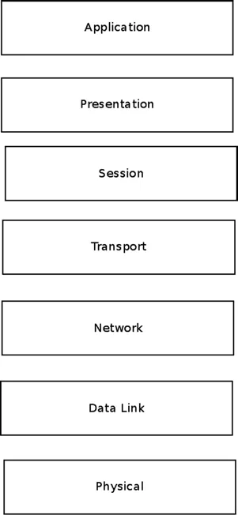
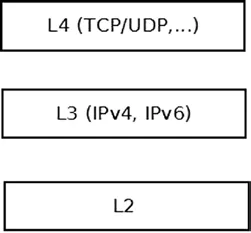

# 第 1 章  深入内核：网络协议栈的黑盒解剖

> **章节引子**

有一类问题，当你试图通过网络编程解决它时，答案总是藏在内核源码的深处。

你可能写得很完美的 TCP 客户端代码，逻辑严密，并发模型优雅，但在高吞吐场景下就是跑不满带宽；或者你明明配置了 `iptables` 规则，数据包却像长了翅膀一样飞了过去，完全没有被拦截。这时候，继续在用户态代码里打转是没用的——你需要理解这层黑盒子到底在做什么。

本章的任务，就是打开这个黑盒子。

Linux 内核网络子系统是一台精密运转的机器，它既要处理数十年的历史包袱（比如那些古老的协议），又要适应微秒级延迟的现代硬件需求。我们不会只背诵 OSI 七层模型这种教科书名词——我们要看的是数据包到底是如何在内核中穿行的，它在哪一步被修改，在哪一步被丢弃，又在哪一步被交给用户态。

在开始之前，有一点必须明确：内核并不处理所有事情。它只负责 L2 到 L4 的博弈。至于上面发生了什么，那是应用的事；下面发生了什么，那是硬件的事。我们要研究的，正是夹在中间这层「软肋」。

---

## 1.1  Linux 网络栈：从教科书到代码现实

如果你接触过任何网络课程， OSI 七层模型就像那张被贴在墙上的旧海报——虽然它总是挂在那里，但很少有人真的去盯着它看。

它把网络通信划分了七个逻辑层级。

先别急着翻过这一页——让我们快速过一遍，不是为了背诵，而是为了建立坐标系：

1.  **物理层**：这里是电流、光信号和硬件电路的领域。Linux 内核不直接碰这层，那是驱动工程师和硬件厂商的事。
2.  **数据链路层**：这是以太网网卡和驱动程序居住的地方。它处理两个直接连接的端点之间的数据传输。
3.  **网络层**：处理路由和寻址。也就是我们熟悉的 IPv4 和 IPv6。Linux 内核网络子系统的核心就在这层。
4.  **传输层**：这是 TCP 和 UDP 的地盘，负责端到端的数据传输。
5.  **会话层** & **6. 表示层**：这两层在真实的 Linux 网络栈实现中几乎被「合并」或者干脆忽略了，它们通常由应用协议自己处理。
7.  **应用层**：这里是你的浏览器、SSH 守护进程或者你亲手写的服务器程序跑的地方。

*Figure 1-1. The OSI seven-layer model*

教科书上讲的差不多就是这些。看起来很整齐，对吧？

但当你打开 Linux 内核的代码，你会发现现实并没有那么分得清清楚楚。内核真正关心的，是这三个层：**L2（链路层）、L3（网络层）和 L4（传输层）**。

这三个层构成了 Linux 内核网络栈的「铁三角」。看下面这张图，你会发现内核其实是一个夹心饼干——它只处理中间那三层，上面的交给用户态，下面的交给硬件。

*Figure 1-2. The Linux Kernel Networking layers*

### 数据包的内核漂流

数据包进入内核后的旅程，本质上就是一个不断做决策的过程。

当一个数据包从网卡进来（L2），内核要做的第一件事就是决定它的命运：是留给自己？还是转发给别人？

如果是**本地接收**，数据包会从 L2 被递交到 L3（剥去 IP 头），再往上走到 L4（剥去 TCP/UDP 头），最终被塞进 Socket 的接收队列，等待用户态程序来 `read`。

如果是**转发**，数据包在 L3 被查完路由表后，并不往上走，而是直接回头，重新塞回 L2 的发送队列，从另一个网卡发出去。

如果是**本地发送**，顺序则完全相反：用户态数据通过 Socket API 下发到 L4，加上 TCP/UDP 头；往下走到 L3，加上 IP 头；最后在 L2 加上以太网头，交给网卡驱动发出。

**但这里有个陷阱——千万别以为这是一条直线。**

在 L2 到 L4 之间穿梭的路上，数据包可能会经历各种「安检」和「整形手术」：

*   **被修改**：比如被 NAT 规则改写了 IP 地址，或者被 IPsec 加密。
*   **被丢弃**：比如防火墙规则判断这是一次非法连接。
*   **被触发反馈**：比如数据包过大导致需要发送 ICMP 「需要分片」的报文。
*   **被拆解或重组**：IP 分片和重组就在这里发生。
*   **被校验**：每一层都要算一遍 Checksum，算错了就扔，不能留情。

这就是 Linux 网络栈的本质：一个在 L2、L3、L4 之间高速流动、不断被检查和转发的数据包处理工厂。

至于物理层（L1）的细节，那是硬件驱动的事，内核只管收发数据帧；而 L5 到 L7 的那些会话管理、数据格式转换，内核一概不管——那是用户空间程序的职责。

如果这时候你觉得信息量有点大，别担心。

我们现在的任务是建立一张地图。接下来这一章，我们会深入到这张地图的每一条街道，去看那些名为 `net_device`、`sk_buff` 和 `NAPI` 的建筑到底是怎么搭建起来的。

现在，先让我们深吸一口气，准备进入代码。