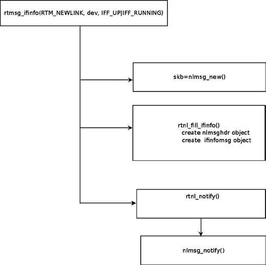

# Kernel Netlink Sockets

上一节我们聊了用户空间那边的工具——iproute2、net-tools，还有那些帮你省事的 libnl 和 libmnl。但在另一头，**内核** 是怎么看待这一切的？

当你在终端敲下 `ip link add` 时，内核里发生的事情远比“创建一个虚拟网卡”要复杂得多。这一节，我们钻进内核内部，看看这台 Netlink 引擎是如何启动、如何注册处理器，又是如何把消息扔回用户空间的。

---

### 内核 Netlink 套接字的创建

在内核的网络协议栈里，我们会创建好几种不同的 Netlink 套接字，每种套接字负责处理不同类型的消息。

比如，专门处理路由和链路消息的 `NETLINK_ROUTE`，是在 `rtnetlink_net_init()` 函数里创建的。它的代码非常典型，几乎就是内核 Netlink 初始化的标准模板：

```c
static int __net_init rtnetlink_net_init(struct net *net) {
    ...
    struct netlink_kernel_cfg cfg = {
        .groups    = RTNLGRP_MAX,
        .input     = rtnetlink_rcv,
        .cb_mutex  = &rtnl_mutex,
        .flags     = NL_CFG_F_NONROOT_RECV,
    };

    sk = netlink_kernel_create(net, NETLINK_ROUTE, &cfg);
    ...
}
```

**但这里有一个常被忽略的细节**：这个 socket 是**网络命名空间感知** 的。

注意函数参数里的 `struct net *net`，这就是网络命名空间对象。在这个对象里，有一个成员叫 `rtnl`，它就是指向这个 rtnetlink socket 的指针。在 `rtnetlink_net_init()` 调用 `netlink_kernel_create()` 创建完 socket 后，会把这个返回值赋给 `net->rtnl`。

这意味着什么？意味着你在容器 A 里配置网卡，内核只会在容器 A 对应的那个 `struct net` 里查找这个 socket；宿主机或其他容器完全不受影响。Netlink 从设计之初就是配合网络命名空间工作的，而不是后来打补丁加上去的。

---

### `netlink_kernel_create()`：工厂入口

让我们把镜头拉近，看看 `netlink_kernel_create()` 这道“工序”的参数表：

```c
struct sock *netlink_kernel_create(struct net *net, 
                                   int unit, 
                                   struct netlink_kernel_cfg *cfg);
```

这第一个参数 `net`，刚才说过了，是网络命名空间。

第二个参数 `unit`，是 **Netlink 协议号**。
- 想处理路由？填 `NETLINK_ROUTE`。
- 想处理 IPsec？填 `NETLINK_XFRM`。
- 想处理审计日志？填 `NETLINK_AUDIT`。

这里有个坑：虽然内核里定义了 20 多种协议，但它的数量被限制在 **32 个** 以内（`MAX_LINKS`）。这就是为什么后面会有 Generic Netlink 这种东西——标准协议号不够用了，得有个“万能插座”来兜底。完整的协议列表在 `include/uapi/linux/netlink.h` 里。

第三个参数 `cfg`，是一个配置结构体，它告诉内核：“我要的这个 socket，得按这个规格来”。

---

### 配置结构体 `netlink_kernel_cfg`

看看这个结构体的定义，每个字段背后都有一套规矩：

```c
struct netlink_kernel_cfg {
    unsigned int    groups;
    unsigned int    flags;
    void            (*input)(struct sk_buff *skb);
    struct mutex    *cb_mutex;
    void            (*bind)(int group);
};
```

#### 1. `groups`：多播组的掩码

这个字段用来指定多播组（或者说多播组的掩码）。在老古董年代，用户空间程序通过设置 `sockaddr_nl` 里的 `nl_groups` 来加入多播组（或者用 libnl 的 `nl_join_groups()`）。但这种方式被限制在 32 个组以内。

**转折点**：从内核 2.6.14 开始，事情变了。

你可以使用 `setsockopt` 配合 `NETLINK_ADD_MEMBERSHIP` / `NETLINK_DROP_MEMBERSHIP` 这两个选项来加入或退出多播组。这招解除了 32 组的限制。libnl 里的 `nl_socket_add_memberships()` 和 `nl_socket_drop_memberships()` 方法，底层用的就是这套新机制。

#### 2. `flags`：权限控制的开关

`flags` 可以是 `NL_CFG_F_NONROOT_RECV` 或 `NL_CFG_F_NONROOT_SEND`。

如果设置了 `NL_CFG_F_NONROOT_RECV`，普通用户（非 root）也有权 bind 到多播组。你可以看内核的 `netlink_bind()` 代码里的这段检查：

```c
static int netlink_bind(struct socket *sock, struct sockaddr *addr,
                         int addr_len)
 {
  ...
  if (nladdr->nl_groups) {
         if (!netlink_capable(sock, NL_CFG_F_NONROOT_RECV))
                         return -EPERM;
    }
  ...
}
```

如果没有设置这个 flag，当普通用户试图 bind 到一个多播组时，`netlink_capable()` 会返回 0，然后直接甩给你一个 `-EPERM`（权限拒绝）。

同理，`NL_CFG_F_NONROOT_SEND` 则是控制普通用户是否允许发送多播消息。

#### 3. `input`：灵魂回调函数

这是最关键的一个字段。如果 `netlink_kernel_cfg` 里的 `input` 回调是 `NULL`，那么这个内核 socket 将**无法接收来自用户空间的数据**（当然，它依然可以从内核发数据给用户空间）。

对于 rtnetlink socket，我们指定了 `rtnetlink_rcv` 作为回调。这意味着：所有用户空间通过 rtnetlink socket 发上来的消息，最终都会被 `rtnetlink_rcv()` 函数接手处理。

**反向案例**：对于 uevent（内核事件通知），我们只需要单向通信——从内核发向用户空间。所以在 `lib/kobject_uevent.c` 里，uevent 的 socket 配置长这样：

```c
static int uevent_net_init(struct net *net)
{
    struct uevent_sock *ue_sk;
    struct netlink_kernel_cfg cfg = {
        .groups    = 1,
        .flags    = NL_CFG_F_NONROOT_RECV,
    };

    ...
    ue_sk->sk = netlink_kernel_create(net, NETLINK_KOBJECT_UEVENT, &cfg);
    ...
}
```

注意到了吗？没有 `input` 回调。这就像一个只写不读的广播喇叭。

#### 4. `cb_mutex`：锁的玄机

`cb_mutex` 是一个可选的互斥锁。

如果你不填，内核会使用默认的全局锁 `cb_def_mutex`（定义在 `net/netlink/af_netlink.c`）。**实际上，大多数内核 Netlink socket 都不填这个字段**，直接用默认的。

比如前面提到的 uevent socket (`NETLINK_KOBJECT_UEVENT`)，还有 audit socket (`NETLINK_AUDIT`)，它们都懒得指定锁。

但 rtnetlink 是个**例外**。它用了自己的锁 `rtnl_mutex`。
为什么呢？因为 rtnetlink 操作太频繁、太关键了，它不想和其他子系统的 Netlink 操作抢锁。还有一个例外是 Generic Netlink，它也有自己的锁 `genl_mutex`。

---

### 注销与查找

当 `netlink_kernel_create()` 执行时，它会调用 `netlink_insert()` 方法，在一张名为 `nl_table` 的全局表里登记。访问这张表用的是读写锁 `nl_table_lock`。

后续如果有人要查找这个 socket，就通过 `netlink_lookup()` 方法，指定协议号和 Port ID 就能找到。

---

### 注册消息处理回调

光有 socket 还不够，你得告诉内核：“收到这种消息时，调用这个函数；收到那种消息时，调用那个函数”。

这就是 `rtnl_register()` 干的事。在网络内核代码里，到处都在注册这种回调。

比如，在 `rtnetlink_init()` 里，注册了这些消息的处理函数：
- `RTM_NEWLINK`：创建新链路
- `RTM_DELLINK`：删除链路
- `RTM_GETROUTE`：转储路由表

在 `net/core/neighbour.c` 里，又注册了邻居相关的：
- `RTM_NEWNEIGH`：创建新邻居
- `RTM_DELNEIGH`：删除邻居
- `RTM_GETNEIGHTBL`：转储邻居表

（我们会在第 5 章和第 7 章深入讨论这些动作）。此外，在 FIB 代码、多播代码、IPv6 代码里，也都在注册各自的回调。

来看一下 `rtnl_register()` 的原型：

```c
extern void rtnl_register(int protocol, 
                          int msgtype,
                          rtnl_doit_func,
                          rtnl_dumpit_func,
                          rtnl_calcit_func);
```

参数拆解如下：
1.  **protocol**：协议族。如果不针对特定协议，通常填 `PF_UNSPEC`。所有协议族列表在 `include/linux/socket.h`。
2.  **msgtype**：Netlink 消息类型。比如 `RTM_NEWLINK`、`RTM_NEWNEIGH`。这些是 rtnetlink 私有的扩展类型，全在 `include/uapi/linux/rtnetlink.h` 里。
3.  **最后三个参数**：都是回调函数指针。
    -   **doit**：用于“增删改”这类操作。
    -   **dumpit**：用于“查询/转储”信息。
    -   **calcit**：用于计算需要的缓冲区大小。

**通常你只需要指定 doit 或 dumpit 中的一个。**

在 rtnetlink 模块内部，有一个大表叫 `rtnl_msg_handlers`。这张表通过**协议号**索引。表里的每一项又是一个子表，通过**消息类型**索引。最后，子表的元素是一个 `rtnl_link` 结构体，里面装的就是这三个回调函数的指针。

所以，当你调用 `rtnl_register()` 时，实际上就是在往这个多维数组的某个格子里填函数指针。

举个例子，在 `net/core/rtnetlink.c` 里有这样一行调用：
```c
rtnl_register(PF_UNSPEC, RTM_NEWLINK, rtnl_newlink, NULL, NULL);
```
这行代码的意思是：不管协议族是什么（`PF_UNSPEC`），只要收到 `RTM_NEWLINK` 消息，就去调用 `rtnl_newlink` 函数。

---

### 内核如何发送 Netlink 消息

反过来，内核想通知用户空间怎么办？

发送 rtnetlink 消息通常使用 `rtmsg_ifinfo()` 方法。

比如，当一个设备被打开（`dev_open()`）时，内核会创建一个新链路，然后调用：
```c
rtmsg_ifinfo(RTM_NEWLINK, dev, IFF_UP|IFF_RUNNING);
```

这背后发生了什么？可以拆解为四个连续的动作（见图 2-2）：

1.  **分配空间**：调用 `nlmsg_new()`，分配一个大小合适的 `sk_buff`（这是内核里用来存放网络数据包的缓冲区）。
2.  **构建头部**：创建两个核心对象——Netlink 消息头（`nlmsghdr`）和紧接着的 `ifinfomsg` 结构体。
3.  **填充数据**：调用 `rtnl_fill_ifinfo()` 把网卡的具体信息（状态、Flags 等）填进去。
4.  **投递**：调用 `rtnl_notify()` 发包。这个函数内部最终会调用通用的 `nlmsg_notify()`（定义在 `net/netlink/af_netlink.c`），把数据包真正推出去。


*Figure 2-2. Sending of rtnelink messages with the rtmsg_ifinfo() method*

---

到目前为止，我们一直在讨论“机制”——socket 怎么建、函数怎么注册。但不管是内核发还是用户发，**数据包本身长什么样**才是通信的本质。

下一节，我们不再围着代码转，而是直接把数据包拆开，盯着里面的字节看。这就是 Netlink 消息头部的世界。