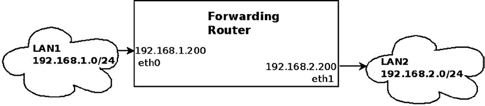
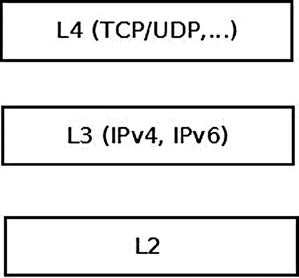

# 5.0  没有地图，就无法远行

Linux 网络栈的核心任务之一，是充当搬运工——把不属于本机的数据包，准确无误地扔给下一站。这听起来很简单，但当你面对的是互联网骨干网上的核心路由器时，这就是一个完全不同的量级的故事了。在这个世界里，网络拓扑是瞬息万变的，海量的路由信息在每一秒都在更新。

这时候，靠系统管理员手动敲 `ip route` 去维护那张被称为 **FIB（Forwarding Information Base，转发信息库）** 的表，不仅是徒劳的，简直是自杀。在真实的生产环境中，这项工作通常由用户空间的路由守护进程（routing daemons）接管，它们甚至会动用专门的硬件加速卡来处理这股洪流。这些守护进程通常维护着自己的路由镜像，并时刻准备着与内核的路由表进行同步。

我们这一章要深入探讨的，就是这个负责决策“下一站在哪”的**路由子系统**。

在跳进代码之前，我想先花点时间把一件事说清楚：**转发**到底意味着什么？这不是废话，因为理解这一点的代价，直接决定了你看待数据包路径的方式。

---

## 5.1  转发与 FIB：从一张图说起

让我们把问题简化到最原始的状态。想象你手头有两台交换机，连着两个不同的局域网：**LAN1** 和 **LAN2**。

- LAN1 是 `192.168.1.0/24`
- LAN2 是 `192.168.2.0/24`

现在，你有一台 Linux 机器夹在它们中间，充当“转发路由器”。这张机器插了两块网卡：

- `eth0` 接在 LAN1，IP 是 `192.168.1.200`
- `eth1` 接在 LAN2，IP 是 `192.168.2.200`

为了让故事纯粹一点，假设这台机器上没跑任何防火墙——也就是没有任何人为干扰。



*图 5-1：在两个 LAN 之间转发数据包*

当 LAN1 的数据包经过 `eth0` 敲门，说“我要去 LAN2”时，Linux 内核必须做一个决定：是把它留下（因为目标地址是我），还是把它送走？如果是后者，从哪扇门送出去？

这个过程就是**路由**。它不仅仅是查表，它是内核网络栈里的一套精密的决策机制。

在这个例子中，从 `eth0` 进来、 destined to LAN2 的包，会被内核判定为“过路流量”。它不会像本地流量（"Traffic to me"）那样一路向上爬到传输层（Layer 4），因为根本没有人会在 socket 那头等着接收它。把它送到 Layer 4 是纯粹的浪费 CPU，每一次协议层的解析都是成本。

这部分流量会在 Layer 3（网络层）被截停，内核查询路由表，确认出口是 `eth1`，然后直接把它扔出去。整个过程高效、冷酷，且不带一丝情感。



*图 5-2：内核网络栈处理的三层结构*

这里插播两个你肯定听过，但可能没深想过的术语：**默认网关**和**默认路由**。

当你在路由表里配置了一条默认网关，你其实是在告诉内核：“对于所有那些你在其他表项里找不到匹配项的包，别犹豫，全部扔给这个家伙。” 这就是网络世界的“最后一道防线”，通常被表示为 `0.0.0.0/0`。

这很好理解——就像你寄快递时，如果不知道具体地址，至少知道“全交给邮局处理”。但这个类比有一个陷阱：在现实世界里，邮局会把退回的信件退给你；而在网络世界里，如果默认路由配置错了，你的包就会像进入黑洞一样消失，连个响声都听不到。

你可以通过 `ip` 命令添加一条默认路由，把出口指向 `192.168.2.1`：

```bash
ip route add default via 192.168.2.1
```

或者如果你还在用老派的 `route` 命令：

```bash
route add default gateway 192.168.2.1
```

好了，现在我们搞定了基本概念：什么是转发，什么是 FIB，以及那个保命的默认路由。但在代码里，这套查找机制并不是一张简单的表格，它是一套精密的子系统。

现在，让我们去看看当数据包真正到来时，内核是如何在这张复杂的网里找到出路的。