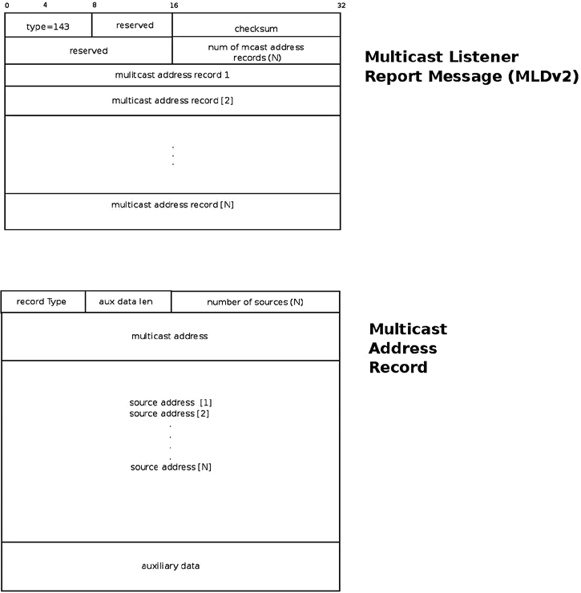

# 8.8  Multicast Listener Discovery (MLD)

上一节我们在数据包的「迷宫」里转了一圈，最终把数据包送到了正确的 Socket。那个过程像是经过了一系列安检：先查目的地，再查会员资格，最后还要查具体是谁发来的货。

但你可能会想：**路由器怎么知道谁是「会员」？**

如果我想接收 `ff02::1` 的数据包，我总不能跑到路由器跟前去喊一声吧？这里就需要一套协议，让主机和路由器坐下来好好聊聊「谁想听谁的广播」。

这就是 MLD (Multicast Listener Discovery) 干的事。它是 IPv6 版本的 IGMP，但有些不一样的地方——而且正是这些「不一样」，让我们在调试时经常掉进坑里。

### 两个世界的对话

MLD 协议本质上是一个不对称的对话：
*   **路由器**：不断发问，「这屋里有人对 `ff05::1` 感兴趣吗？」
*   **主机**：听到了就举手，「我有！」

但这只是表面。实际上，这套机制在 IPv6 里被塞进了 ICMPv6 的口袋里。你可能会问：为什么要塞进去？答案是「统一战线」。在 IPv4 时代，IGMP 是个独立的协议，有自己的一套端口号和逻辑；而在 IPv6 里，为了简化控制平面，MLD 被设计成了 ICMPv6 的一种消息类型。

这是一个很重要的认知转变：**你在抓包工具里看到的 MLD 报文，其上一层协议永远写着 ICMPv6**。

---

## 版本的战争：MLDv1 与 MLDv2

别被名字骗了，这不仅仅是「升级版」那么简单。如果你在内核配置里把 MLD 强制设为版本 1，那你就会失去一个非常强大的功能。

### MLDv1：老旧的「大锅饭」模式
MLDv1（基于 RFC 2710）是从 IGMPv2 抄来的。它支持 **ASM (Any-Source Multicast)**。
这就好比你对邮局说：「我要订阅《科技》杂志」。邮局不会问你是想要哪个记者的报道，只要是这本杂志，不管是张三写的还是李四写的，统统塞进你信箱。

这在早期网络里没问题，但随着垃圾流量和安全问题的出现，这种「照单全收」的模式就显得太粗糙了。

### MLDv2：精准的「点菜」模式
MLDv2（基于 RFC 3810）是现在的标准（从 2004 年就开始了）。它引入了 **SSM (Source-Specific Multicast)**。
现在你可以对邮局说：「我要订阅《科技》杂志，但只要张三写的，李四写的直接扔掉。」

这就是 **源过滤**。它允许主机明确指定：
*   **INCLUDE**：我只听这几个人的。
*   **EXCLUDE**：我听除了这几个人之外所有人的。

这一节的后面，我们会用真实的代码演示这两种模式在内核里是怎么运作的。

---

## 撸起袖子：加入和离开组播组

在 Linux 内核里，加入一个组播组有两种完全不同的路径：一种是内核自己加的（比如为了协议运作），一种是用户态进程通过 Socket 请求加的。

### 路径 A：内核视角的自动加入 (`ipv6_dev_mc_inc`)

当一个网卡启动时，内核并不是傻傻地等着，它必须立刻加入一些「基础」组播组，否则连邻居发现（NDP）都做不了。这在 `ipv6_add_dev()` 里完成：

```c
static struct inet6_dev *ipv6_add_dev(struct net_device *dev) {
    ...
    /* 加入接口本地所有节点组播组 (ff01::1) */
    ipv6_dev_mc_inc(dev, &in6addr_interfacelocal_allnodes);

    /* 加入链路本地所有节点组播组 (ff02::1) */
    ipv6_dev_mc_inc(dev, &in6addr_linklocal_allnodes);
    ...
}
```

这是强制性的。每个 IPv6 设备，只要一活过来，就必须在这两个「大喇叭」频道上挂着。

**路由器的特权**

如果你开启了转发功能（`/proc/sys/net/ipv6/conf/all/forwarding` 设为 1），内核会把你当路由器对待。路由器有更多的责任，它得加入更多的组播组：

1.  **ff02::2** (链路本地所有路由器)
2.  **ff01::2** (接口本地所有路由器)
3.  **ff05::2** (站点本地所有路由器)

这逻辑在 `dev_forward_change()` 里写得清清楚楚：

```c
static void dev_forward_change(struct inet6_dev *idev)
{
        struct net_device *dev;
        ...
        dev = idev->dev;
        ...
        if (dev->flags & IFF_MULTICAST) {
                if (idev->cnf.forwarding) {
                        // 变成路由器：加入这仨组
                        ipv6_dev_mc_inc(dev, &in6addr_linklocal_allrouters);
                        ipv6_dev_mc_inc(dev, &in6addr_interfacelocal_allrouters);
                        ipv6_dev_mc_inc(dev, &in6addr_sitelocal_allrouters);
                } else {
                        // 变回主机：退出这仨组
                        ipv6_dev_mc_dec(dev, &in6addr_linklocal_allrouters);
                        ipv6_dev_mc_dec(dev, &in6addr_interfacelocal_allrouters);
                        ipv6_dev_mc_dec(dev, &in6addr_sitelocal_allrouters);
                }
        }
        ...
}
```

**⚠️ 踩坑预警**
经常有人开着 VM 做实验，发现路由器公告 (RA) 怎么都收不到。一查，发现转发功能被意外开启了，结果 VM 进入了「路由器模式」，不再响应主机的 RA，甚至在某些配置下停止发送 RS。这种角色切换的错误，往往就藏在这个 `dev_forward_change` 的逻辑里。

---

### 路径 B：用户态的请求 (`ipv6_sock_mc_join`)

这是开发者最常接触的路径。你的程序想听 `ff02::113` 的视频流，你得告诉内核。

代码套路是这样的：

```c
int                sockd;
struct ipv6_mreq   mcgroup;
struct addrinfo    *results;

// 1. 填好组播地址 (假设 results 已经存好了地址)
memcpy( &(mcgroup.ipv6mr_multiaddr),
     &(((struct sockaddr_in6 *) results->ai_addr)->sin6_addr),
     sizeof(struct in6_addr));

// 2. 指定网卡 (通过 ifindex，比如 eth0 通常是 2)
mcgroup.ipv6mr_interface = 3;

// 3. 创建 Socket 并发起请求
sockd = socket(AF_INET6, SOCK_DGRAM, 0);
status = setsockopt(sockd, IPPROTO_IPV6, IPV6_JOIN_GROUP,
                    &mcgroup, sizeof(mcgroup));
```

当你调用这个 `setsockopt` 时，内核做了两件事：
1.  **本地记录**：把这个 Socket 加入到该组播组的订阅列表里。
2.  **发个「通知」**：向外发送一个 **MLDv2 Multicast Listener Report** 报文。

**那个「通知」发给了谁？**

注意，这个 Report 报文的目的地址不是你加入的那个组播地址（比如 `ff05::9`），而是 **ff02::16**。
`ff02::16` 是专门给「所有支持 MLDv2 的路由器」准备的频道。只有路由器才会监听这个频道，普通主机根本不理会。

**报文长什么样？**

这个报文带着两个重要的标记：
*   **Hop-by-Hop Options Header**：里面有个 **Router Alert** 选项。这就像是信封上盖了个红章，告诉沿途的所有路由器：「别光转发，停下来看看我！」
*   **ICMPv6 Type 143**：表示这是一个 `ICMPV6_MLD2_REPORT`。


*(Figure 8-3: MLDv2 Multicast Listener Report 报文结构)*

如果你想退出这个组，调用 `IPV6_DROP_MEMBERSHIP`（或者直接关掉 Socket），内核会发送相应的 Leave 报文（或者直接沉默，依靠超时机制，具体取决于 MLD 版本）。

---

## 深入 MLDv2 报文：`mld2_report` 结构

既然我们在发 Report，那就得看看它肚子里装的是什么。内核用 `struct mld2_report` 来描述它：

```c
struct mld2_report {
        struct icmp6_hdr         mld2r_hdr;      // ICMPv6 头部
        struct mld2_grec        mld2r_grec[0];   // 变长数组，存放具体记录
};
```

这里的关键是 `mld2_grec`（Group Record），它描述了具体是哪个组、有哪些源地址、要怎么处理：

```c
struct mld2_grec {
        __u8            grec_type;      // 记录类型 (是 INCLUDE 还是 EXCLUDE？)
        __u8            grec_auxwords;  // 辅助数据长度 (通常为 0)
        __be16          grec_nsrcs;     // 源地址的数量
        struct in6_addr grec_mca;       // 组播地址 (比如 ff05::9)
        struct in6_addr grec_src[0];   // 源地址列表 (变长)
};
```

这里有一个有趣的细节：
*   如果是普通的加入（不加过滤），`grec_nsrcs` 是 0，`grec_type` 比较简单。
*   如果是开启了源过滤（SSM），`grec_src` 数组里就会塞满具体的 IP，比如 `2000::1`, `2000::2`。路由器看到这个列表，就知道：「哦，这个主机只想听这两个人的发言。」

---

## 进阶：源过滤

既然提到了源过滤，我们就得聊聊怎么玩转它。这才是 MLDv2 相比 v1 的杀手锏。

### 单源过滤：`MCAST_JOIN_SOURCE_GROUP`

假设你只想听 `2000::1` 发过来的 `ff05::9` 组播流。

你需要用 `struct group_source_req` 结构，这比刚才的 `ipv6_mreq` 多了一个 `gsr_source` 字段：

```c
int                       sockd;
struct group_source_req   mreq;
struct addrinfo           *results1; // 目标组播地址
struct addrinfo           *results2; // 允许的源地址

// 1. 设置组播地址
memcpy(&(mreq.gsr_group), results1->ai_addr, sizeof(struct sockaddr_in6));

// 2. 设置允许的源地址 (关键！)
memcpy(&(mreq.gsr_source), results2->ai_addr, sizeof(struct sockaddr_in6));

// 3. 设置网卡
mreq.gsr_interface = 3;

sockd = socket(AF_INET6, SOCK_DGRAM, 0);
setsockopt(sockd, IPPROTO_IPV6, MCAST_JOIN_SOURCE_GROUP, &mreq, sizeof(mreq));
```

这行代码一敲下去，内核就会发一个 Report，里面的 `grec_type` 会告诉路由器：「我要加入这个组，但我只接受这一个源的数据。」

### 多源过滤：`MCAST_MSFILTER`

如果你有一份黑名单或者白名单，里面有好几个 IP，一个一个 `JOIN_SOURCE` 实在太慢了。这时候可以用 `MCAST_MSFILTER` 一次性设置。

用户态定义是这样：

```c
struct group_filter {
    uint32_t                 gf_interface; // 网卡索引
    struct sockaddr_storage gf_group;     // 组播地址
    uint32_t                 gf_fmode;    // 过滤模式：INCLUDE 或 EXCLUDE
    uint32_t                 gf_numsrc;   // 源地址数量
    struct sockaddr_storage gf_slist[1]; // 源地址列表（变长）
};
```

#### 场景一：白名单 (INCLUDE)

我要听 `ff05::9`，但只允许 `2000::1`, `2000::2`, `2000::3` 发。

```c
struct group_filter filter;
struct sockaddr_in6 *psin6;

filter.gf_interface = 2; // eth0
filter.gf_fmode = MCAST_INCLUDE; // 模式设为 INCLUDE
filter.gf_numsrc = 3; // 三个源

// 设置组地址
psin6 = (struct sockaddr_in6 *)&filter.gf_group;
psin6->sin6_family = AF_INET6;
inet_pton(PF_INET6, "ffff::9", &psin6->sin6_addr);

// 填充源列表
psin6 = (struct sockaddr_in6 *)&filter.gf_slist[0];
psin6->sin6_family = AF_INET6;
inet_pton(PF_INET6, "2000::1", &psin6->sin6_addr);
// ... (依次设置 2000::2, 2000::3)

// 发送给内核
sockd[0] = socket(AF_INET6, SOCK_DGRAM, 0);
setsockopt(sockd[0], IPPROTO_IPV6, MCAST_MSFILTER, &filter, GROUP_FILTER_SIZE(filter.gf_numsrc));
```

这会触发一个 Report，`grec_type` 是 `MLD2_CHANGE_TO_INCLUDE` (3)，里面带着 3 个源地址。

#### 场景二：黑名单 (EXCLUDE)

我要听 `ff05::9`，但拒绝 `2001::1`, `2001::2`。

代码逻辑一样，只是把 `gf_fmode` 改成 `MCAST_EXCLUDE`，源列表换成那两个黑名单 IP。

这会触发 `MLD2_CHANGE_TO_EXCLUDE` (4)。

### 验证一下：`/proc/net/mcfilter6`

这是调试时最好用的工具。别光相信代码，看看内核账本上是怎么记的：

```bash
cat /proc/net/mcfilter6
Idx Device      Multicast Address      Source Address     INC    EXC
  2   eth0      ffff::9                2000::1            1      0
  2   eth0      ffff::9                2000::2            1      0
  2   eth0      ffff::9                2000::3            1      0
  2   eth0      ffff::9                2001::1            0      1
  2   eth0      ffff::9                2001::2            0      1
```

这里清清楚楚地写着：前三行是 **INCLUDE (INC=1)**，后两行是 **EXCLUDE (EXC=1)**。
如果你的视频流怎么都收不到，先查查这个表。看看是不是你本来想加进白名单的 IP，结果被内核记成了 EXCLUDE，或者干脆没记上去。

---

## 路由器这边在做什么？

我们刚才都是站在「听众」的角度。那「主持人」（路由器）呢？

当一个路由器（比如 XORP 项目里的 `mld6igmp` 守护进程）启动时：
1.  它加入 `ff02::16`（监听所有的 Report）。
2.  它周期性地往 `ff02::1` 发送 **Multicast Listener Query** (ICMPv6 Type 130)。
3.  收到 Report 后，它更新自己的状态表，知道「eth0 上有人想听 `ff05::9`」。
4.  当有组播数据包经过时，它查看状态表，决定是否往这个接口转发。

**Qeury 的细节**
主机收到 Query 后，内核的处理函数是 `igmp6_event_query()`。
这里有个小细节：这个函数怎么区分是 MLDv1 还是 v2 的查询？
答案是：**看长度**。
*   MLDv1 Query：长度固定 24 字节。
*   MLDv2 Query：长度至少 28 字节。

别小看这个判断，如果版本对不上，主机可能回复 v1 的 Report，导致 v2 特有的源过滤信息丢失，整个组播树的建立就会出问题。

### 强制降级：`force_mld_version`

如果你在一个老旧的网络里，或者在做兼容性测试，可以强行让内核说 v1 的方言：

```bash
echo 1 > /proc/sys/net/ipv6/conf/all/force_mld_version
```

一旦这么做了，你的 `setsockopt(..., MCAST_JOIN_SOURCE_GROUP, ...)` 就会失效。因为 v1 根本听不懂你在说什么源地址。内核会忽略源过滤参数，把你当作普通的 ASM 客户端处理。

---

### 本章回响

回到我们在本节开始时提出的那个问题：**路由器怎么知道谁是「会员」？**

现在的答案很清楚了：路由器维护着一份动态的名单。这份名单不是靠管理员手动填写的，而是靠主机自己通过 MLD 协议不断「喊话」建立的。
在 IPv4 时代，IGMP 是个独立协议；而在 IPv6 里，MLD 成为了 ICMPv6 的一部分，利用 Hop-by-Hop 扩展头中的 Router Alert 确保每台路由器都必须停下来处理这份报告。

这体现了 IPv6 设计中的一个哲学：**控制平面的统一与简化**。这种统一在减少协议复杂度的同时，也要求我们在调试时必须打开「眼光」，不能只看组播包，还得看嵌套在里面的 ICMPv6 消息类型。

下一章，我们将走出 IP 层，去往那个著名的「网络大过滤器」—— Netfilter。在那里，我们会看到这些组播报文是如何被防火墙规则拦截、修改或者放行的。那是内核网络栈里最险峻的一段路。