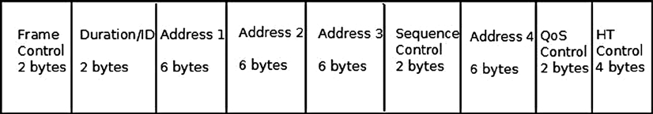
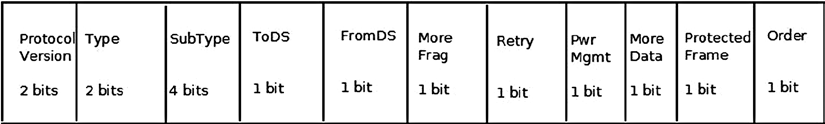

The 802.11 MAC Header

---
Each MAC frame consists of a MAC header, a frame body of variable length, and an FCS (Frame Check Sequence) of 
32 bit CRC. Figure 12-1 shows the 802.11 header.



Figure 12-1. IEEE 802.11 header. Note that all members are not always used, as this section will shortly explain

346

Chapter 12 ■ Wireless in Linux

The 802.11 header is represented in mac80211 by the ieee80211_hdr structure: 
 struct ieee80211_hdr {
        __le16 frame_control;
        __le16 duration_id;
        u8 addr1[6];
        u8 addr2[6];
        u8 addr3[6];
        __le16 seq_ctrl;
        u8 addr4[6];
} __packed;
 (include/linux/ieee80211.h)
In contrast to an Ethernet header (struct ethhdr), which contains only three fields (source MAC address, 
destination MAC address, and Ethertype), the 802.11 header contains up to six addresses and some other fields. For 
a typical data frame, though, only three addresses are used (for example, Access Point or AP/client communication). 
With an ACK frame, only the receiver address is used. Note that Figure 12-1 shows only four addresses, but when 
working with Mesh networking, a Mesh extension header with two additional addresses is used.
I now turn to a description of the 802.11 header fields, starting with the first field in the 802.11 header, called the 
frame control. This is an important field, and in many cases its contents determine the meaning of other fields of  
the 802.11 MAC header (especially addresses).

The Frame Control

The frame control length is 16 bits. Figure 12-2 shows its fields and the size of each field.



Figure 12-2. Frame control fields

The following is a description of the frame control members:

• 
Protocol version: The version of the MAC 802.11 we use. Currently there is only one version 
of MAC, so this field is always 0.

• 
Type: There are three types of packets in 802.11—management, control, and data:

Management packets (IEEE80211_FTYPE_MGMT) are for management actions like 
• 
association, authentication, scanning, and more.

Control packets (IEEE80211_FTYPE_CTL) usually have some relevance to data packets; 
• 
for example, a PS-Poll packet is for retrieving packets from an AP buffer. Another example: 
a station that wants to transmit first sends a control packet named RTS (request to send); 
if the medium is free, the destination station will send back a control packet named CTS 
(clear to send).

Data packets (IEEE80211_FTYPE_DATA) are the raw data packets. Null packets are a special 
• 
case of raw packets, carrying no data and used mostly for power management control 
purposes. I discuss null packets in the “Power Save Mode” section later in this chapter.

347

Chapter 12 ■ Wireless in Linux

• 
Subtype: For all the aforementioned three types of packets (management, control, and data), 
there is a sub-type field which identifies the character of the packet used. For example:

A value of 0100 for the sub-type field in a management frame denotes that the packet is a 
• 
Probe Request (IEEE80211_STYPE_PROBE_REQ) management packet, which is used in a 
scan operation.

A value of 1011 for the sub-type field in a control packet denotes that this is a request to 
• 
send (IEEE80211_STYPE_RTS) control packet. A value of 0100 for the sub-type field of 
a data packet denotes that this is a null data (IEEE80211_STYPE_NULLFUNC) packet, 
which is used for power management control.

A value of 1000 (IEEE80211_STYPE_QOS_DATA) for the sub-type of a data packet means 
• 
that this is a QoS data packet; this sub-type was added by the IEEE80211e amendment, 
which dealt with QoS enhancements.

• 
ToDS: When this bit is set, it means the packet is for the distribution system.

• 
FromDS: When this bit is set, it means the from the distribution system.

• 
More Frag: When you use fragmentation, this bit is set to 1.

• 
Retry: When a packet is retransmitted, this bit is set to 1. A typical case of retransmission 
is when a packet that was sent did not receive an acknowledgment in time. The 
acknowledgments are usually sent by the firmware of the wireless driver.

• 
Pwr Mgmt: When the power management bit is set, it means that the station will enter power 
save mode. I discuss power save mode in the “Power Save Mode” section later in this chapter.

• 
More Data: When an AP sends packets that it buffered for a sleeping station, it sets the More 
Data bit to 1 when the buffer is not empty. Thus the station knows that there are more packets 
it should retrieve. When the buffer has been emptied, this bit is set to 0.

• 
Protected Frame: This bit is set to 1 when the frame body is encrypted; only data frames and 
authentication frames can be encrypted.

• 
Order: With the MAC service called strict ordering, the order of frames is important. When this 
service is in use, the order bit is set to 1. It is rarely used.

Note
■
■
  The action frame (IEEE80211_STYPE_ACTION) was introduced with the 802.11h amendment, which dealt with 
spectrum and transmit power management. However, because of a lack of space for management packets sub-types,  
action frames are used also in various newer amendments to the standard—for example, HT action frames in 802.11n.

The Other 802.11 MAC Header Members

The following describes the other members of the mac802.11 header, after the frame control:

• 
Duration/ID: The duration holds values for the Network Allocation Vector (NAV) in 
microseconds, and it consists of 15 bits of the Duration/ID field. The sixteenth field is 0. 
When working in power save mode, it is the AID (association id) of a station for PS-Poll frames 
(see 8.2.4.2 (a) in IEEE 802.11-2012). The Network Allocation Vector (NAV) is a virtual carrier 
sensing mechanism. I do not delve into NAV internals because that is beyond the scope of  
this chapter.

348

Chapter 12 ■ Wireless in Linux

• 
Sequence Control: This is a 2-byte field specifying the sequence control. In 802.11, it is possible 
that a packet will be received more than once, most commonly when an acknowledgment is not 
received for some reason. The sequence control field consists of a fragment number (4 bits) and 
a sequence number (12 bits). The sequence number is generated by the transmitting station, in 
the ieee80211_tx_h_sequence() method. In the case of a duplicate frame in a retransmission, 
it is dropped, and a counter of the dropped duplicate frames (dot11FrameDuplicateCount) is 
incremented by 1; this is done in the ieee80211_rx_h_check() method. The Sequence Control 
field is not present in control packets.

• 
Address1 – Address4: There are four addresses, but you don’t always use all of them. Address 
1 is the Receive Address (RA), and is used in all packets. Address 2 is the Transmit Address (TA), 
and it exists in all packets except ACK and CTS packets. Address 3 is used only for 
management and data packets. Address 4 is used when ToDS and FromDS bits of the frame 
control are set; this happens when operating in a Wireless Distribution System.

• 
QoS Control: The QoS control field was added by the 802.11e amendment and is only 
present in QoS data packets. Because it is not part of the original 802.11 spec, it is not part 
of the original mac80211 implementation, so it is not a member of the IEEE802.11 header 
(ieee80211_hdr struct). In fact, it was added at the end of the IEEE802.11 header and 
can be accessed by the ieee80211_get_qos_ctl() method. The QoS control field includes 
the tid (Traffic Identification), the ACK Policy, and a field called A-MSDU present, which 
tells whether an A-MSDU is present. I discuss A-MSDU later in this chapter, in the “High 
Throughput (ieee80211n)” section.

HT Control Field: HT (high throughput) control field was added by the 802.11n amendment 
• 
(see 7.1.3.5(a) of the 802.11n-2009 spec).

This section covered the 802.11 MAC header, with a description of its members and their use. Becoming familiar 
with the 802.11 MAC header is essential for understanding the mac802.11 stack.
```

## 12.2  The 802.11 MAC Header (802.11 MAC 头部)

In the previous section, I discussed the mac80211 subsystem, its history, and the difference between FullMAC and SoftMAC drivers. Now, let's look at the actual data structures.

每一个 802.11 MAC 帧都由三部分组成：MAC 头部、可变长度的帧体以及一个 32 位的 CRC 校验序列。图 12-1 展示了 802.11 头部的结构。注意，并不是所有成员都会在每一帧中出现——这在接下来的内容里会详细解释。


**Figure 12-1.** IEEE 802.11 header. (注意：所有成员并不总是被使用，正如本节即将解释的那样)

在内核的 mac80211 实现中，这个头部被定义为 `ieee80211_hdr` 结构体：

```c
struct ieee80211_hdr {
        __le16 frame_control;
        __le16 duration_id;
        u8 addr1[6];
        u8 addr2[6];
        u8 addr3[6];
        __le16 seq_ctrl;
        u8 addr4[6];
} __packed;
```
*(include/linux/ieee80211.h)*

如果你习惯了以太网（`struct ethhdr`），看到这个结构可能会觉得有点「重」——以太网头只有三个字段：源 MAC、目的 MAC 和 EtherType。而 802.11 头部最多可能包含 4 个甚至 6 个地址（加上 Mesh 扩展头的两个），还有一堆控制位。

别被这个「豪华阵容」吓到。在典型的数据帧里（比如手机和路由器通信），其实只用到了 3 个地址。如果是简单的 ACK 帧，甚至只用到一个地址。图 12-1 里只画了 4 个地址，因为 Mesh 网络（网状网络）会用到一个特殊的扩展头来塞另外两个地址。

让我们来拆解一下这个头部。先从第一个字段——帧控制——开始。这 16 位非常重要，在很多时候，它决定了后续字段（尤其是那些地址）到底该怎么解读。

### The Frame Control (帧控制字段)

帧控制字段长度为 16 位，结构如图 12-2 所示。


**Figure 12-2.** Frame control fields (帧控制字段)

它就像一个总开关面板，每一位都有特定的含义。我们来看看各个成员：

*   **Protocol Version (协议版本)**:
    标识 802.11 MAC 的版本。目前只有一个版本，所以这个字段永远是 0。你可以把它理解为「历史遗留的占位符」，或者说是为了将来可能的协议大改而预留的。

*   **Type (类型)**:
    802.11 把包分为三大类：管理、控制、数据。

    *   **Management packets (`IEEE80211_FTYPE_MGMT`)**：这些是「管理信令」。比如你想连上 WiFi，得先认证再关联，或者你想扫描一下周围有哪些 AP，这些都属于管理帧。没有它们，网络连都连不上，更别提传数据了。
    *   **Control packets (`IEEE80211_FTYPE_CTL`)**：这些通常是辅助数据传输的。最典型的就是 PS-Poll，用来让休眠的站点找 AP 要数据。还有一个经典组合是 RTS/CTS：你想发数据前先发一个 RTS（请求发送），如果信道空闲，对方回一个 CTS（允许发送），然后再发数据。这是为了解决「隐藏节点」问题，通过提前占坑来避免碰撞。
    *   **Data packets (`IEEE80211_FTYPE_DATA`)**：这就是我们要传的实际数据了。这里有一个特例叫 **Null packets（空数据包）**。它虽然是数据帧的类型，但不携带任何有效载荷。它主要用来通知 AP：「我要去睡了」或者「我醒了」。我们会在后面的「Power Save Mode」一节专门讲这个。

*   **Subtype (子类型)**:
    上面那三类每一类下面都有更细的划分，这就是 Subtype 干的事。它是帧的「具体身份」。

    *   对于管理帧，如果 Subtype 是 `0100`，那就是一个 **Probe Request** (`IEEE80211_STYPE_PROBE_REQ`)，也就是你在扫描网络时手机发出的「谁在这里？」的喊话。
    *   对于控制帧，Subtype `1011` 代表 **RTS** (`IEEE80211_STYPE_RTS`)。
    *   对于数据帧，Subtype `0100` 代表 **Null Data** (`IEEE80211_STYPE_NULLFUNC`)。
    *   还有一个关键值 `1000` (`IEEE80211_STYPE_QOS_DATA`)，代表这是 **QoS 数据帧**。这是 802.11e 补丁加进来的，主要是为了支持语音、视频这些对延迟敏感的应用，也就是我们常说的「高优先级队列」。

*   **ToDS / FromDS (To Distribution System / From DS)**:
    这两个位用来指示数据的流向，特别是在有 AP（接入点）的基础架构模式里。
    *   **ToDS = 1**：表示这个包是发给分发系统（DS）的。简单说，就是客户端发给 AP，让 AP 帮你转发到局域网里去。
    *   **FromDS = 1**：表示这个包是从分发系统来的。简单说，是 AP 发给客户端的。

    这里有个有意思的组合：如果这两个位都是 1，代表这是在无线分布式系统（WDS）里传输的帧，也就是两个 AP 之间通过无线在回传数据。这种情况下，你会用到 4 个地址（后面会细讲）。

*   **More Frag (更多分片)**:
    开启分片传输时，这个位设为 1。如果一个包太大，被切成了几片，除了最后一片，前面的都要把这个位设为 1，告诉接收方「还没完，别急」。

*   **Retry (重传)**:
    如果这个包是重传的，这个位就是 1。802.11 是不可靠的无线链路，丢包是常态。如果发出去的包没收到 ACK，发送方就得重传。这个位就是告诉接收方：「别嫌我烦，刚才那个可能是丢了，这是再发一次」。

*   **Pwr Mgmt (电源管理)**:
    这一位设为 1，表示站点马上要进入省电模式了。AP 看到 this bit，就会明白：发给这个人的数据先别丢，帮我缓存起来，等他醒来再要。我们后面会专门讲这一套复杂的「醒来-睡觉」机制。

*   **More Data (更多数据)**:
    这是 AP 对休眠站点的回复。当 AP 给休眠的站点发包时，如果自己的缓冲区里还有货没发完，就把这个位设为 1。站点看到这个位，就知道：虽然我现在收了一个包，但我还得继续醒着，或者是赶紧发 PS-Poll 再要一批，因为还没完。当缓冲区空了，这个位就变回 0。

*   **Protected Frame (加密帧)**:
    如果这个位是 1，说明帧体是加密的。只有数据帧和认证帧才会被加密。

*   **Order (严格顺序)**:
    如果使用了「严格顺序服务」，这个位就是 1。这是一种保证帧按顺序到达的机制，但现在很少用了。

> **⚠️ 注意**
> **Action Frame (`IEEE80211_STYPE_ACTION`)** 最初是 802.11h 引入的，主要是为了频谱管理和发射功率控制。但后来因为管理帧的子类型空间不够用了，很多新标准（比如 802.11n 的 HT 操作）都复用 Action Frame 来携带信息。它就像一个万能信封，里面装什么得看具体的协议 amendment。

### The Other 802.11 MAC Header Members (其他头部成员)

除了帧控制，802.11 头部还有几个关键角色：

*   **Duration/ID (持续时间/ID)**:
    这个字段通常用来设置 **NAV (Network Allocation Vector)**，这是一个虚拟载波侦听机制。简单说，就是告诉周围的人：「我要占信道多久，你们先别说话，算一下时间」。它由 15 位组成，最高位（第 16 位）为 0。
    
    但在节电模式下，这个字段有个特殊用途：对于 PS-Poll 帧，它携带的是站点的 **AID (Association ID，关联 ID)**。AID 是 AP 分配给每个连接上的设备的编号，在休眠唤醒机制里非常重要。

*   **Sequence Control (序列控制)**:
    这是一个 2 字节的字段，包含两部分：
    *   **Fragment Number (4 位)**：分片编号。
    *   **Sequence Number (12 位)**：序列号。
    
    无线环境里乱序和丢包是常事。发送方在 `ieee80211_tx_h_sequence()` 方法里生成序列号。如果接收方收到了一个序列号和之前一模一样的包（通常是 ACK 丢了导致发送方重传），mac80211 的 `ieee80211_rx_h_check()` 方法就会把它当成重复帧丢掉，并增加计数器 `dot11FrameDuplicateCount`。
    
    **注意**：控制帧通常没有这个字段。

*   **Address 1 – Address 4 (地址字段)**:
    这是最让人头晕的地方。为什么一个包需要 4 个地址？
    *   **Address 1 (RA, Receiver Address)**：接收方地址。所有包都有这个，告诉网卡「这是给谁的」。
    *   **Address 2 (TA, Transmitter Address)**：发送方地址。除了 ACK 和 CTS 这种极短的控制帧，大部分包都有这个，告诉网卡「这是谁发的」。
    *   **Address 3**：主要用于管理和数据帧。在基础架构模式（有 AP）下，它通常是源地址或目的地址（取决于 ToDS/FromDS 的设置）。比如，你的手机发给电脑的数据包，虽然是通过 AP 转发的，但 Address 3 仍然是电脑的 MAC 地址。
    *   **Address 4**：这个只在特殊情况下出现——当 ToDS 和 FromDS **同时为 1** 时。这通常发生在 WDS（无线分布式系统）或者 Mesh 网络中，代表数据包经过了多个无线跳数的最终源或目的。

*   **QoS Control (QoS 控制字段)**:
    这是 802.11e 补丁加进来的，只存在于 QoS 数据帧中。因为它不在最初的 802.11 规范里，所以它不属于标准的 `ieee80211_hdr` 结构体成员。如果你在代码里找它，它其实是挂在头部后面的。mac80211 提供了 `ieee80211_get_qos_ctl()` 方法来访问它。
    
    这个字段包含了 **TID (Traffic Identifier，流量标识符)**、**ACK 策略**（比如要不要 Block Ack）以及 **A-MSDU present** 标志（告诉你这是个聚合帧）。我们会在后面的「High Throughput (802.11n)」一节深入探讨 A-MSDU。

*   **HT Control Field**:
    这是 802.11n 补丁加进来的，用于 High Throughput 操作。参见 802.11n-2009 规范的 7.1.3.5(a) 节。

这一节我们拆解了 802.11 MAC 头部，看完了它的每一个成员。熟悉这个结构是理解 mac80211 栈的基础，因为你驱动里处理的每一个字节，几乎都在这里定义了逻辑。

现在我们已经知道了「帧长什么样」，接下来我们需要思考：这些帧是如何在不同的设备之间流动的？这就涉及到了网络拓扑和 MAC 层管理实体（MLME）。