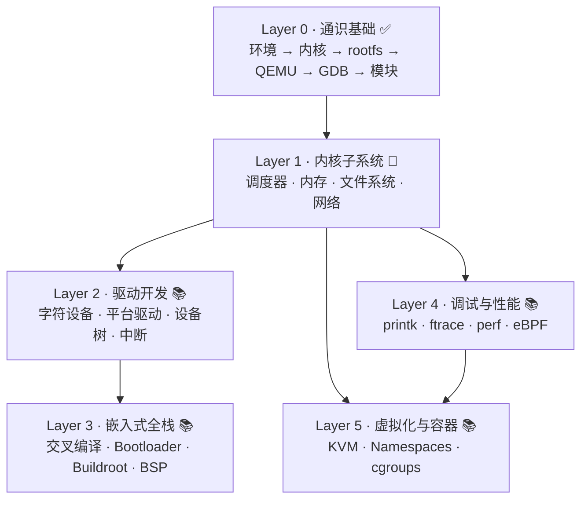

# 学习路线图

> 这页告诉你：PenguinLab 怎么学——从哪开始、各板块什么关系、现在写到哪了。教程按六个层级组织，每层有明确的前置和成熟度标记。

## 整体路线

六层从下往上垒，**通识基础是所有东西的地基**，绕不开：

## 按背景选起点

- **完全新手**：从 Layer 0 通识基础开始，一条线打通「环境 → 内核 → 模块」，建立工具链。
- **会点 C、想懂内核**：Layer 0 快速过，重点放 Layer 1 内核子系统。
- **做嵌入式、想补内核底子**：Layer 0 + Layer 1 选读，然后 Layer 2 驱动 / Layer 3 嵌入式。
- **搞性能调优 / 内核应用**：Layer 0 + Layer 1，重点 Layer 4 调试与性能。

## 逐层详情

### Layer 0 · 通识基础 ✅ 已锤炼

- **定位**：内核开发的入门工具链。从零搭起一套「编译内核 + rootfs + QEMU + GDB + 模块」的环境。
- **关键主题**：WSL2 环境、Mini Config、ARM64 内核编译、BusyBox rootfs、QEMU 启动、GDB 远程调试、内核模块、9p 迭代。
- **难度 · 前置**：入门，会基本 Linux 命令和 C 即可。
- **建议节奏**：8 篇循序，约 1–2 周打通。
- → [进入通识基础](/tutorials/foundations/)

### Layer 1 · 内核子系统 🔨 整理中

- **定位**：内核核心原理——调度器怎么挑任务、内存怎么管、文件怎么存、包怎么转。
- **关键主题**：调度器（CFS / EEVDF / sched_ext）、内存（Buddy / Slab / 回收）、文件系统（VFS / Ext4）、网络栈。
- **难度 · 前置**：中级，需要 Layer 0。
- **建议节奏**：四大子系统各成一线，调度器先行。
- → [进入内核子系统](/tutorials/kernel/)

### Layer 2 · 驱动开发 📚 规划中

- **定位**：主线内核驱动开发全链条。
- **关键主题**：字符设备、平台驱动、设备树、中断。
- **难度 · 前置**：中级，需要 Layer 0 + Layer 1。
- → [进入驱动开发](/tutorials/drivers/)

### Layer 3 · 嵌入式全栈 📚 规划中

- **定位**：完整嵌入式 Linux 流程，从 QEMU 虚拟平台迁移到真板。
- **关键主题**：交叉编译、Bootloader（U-Boot）、Buildroot / Yocto、BSP。
- **难度 · 前置**：中高级，需要 Layer 0 + Layer 2。
- → [进入嵌入式全栈](/tutorials/embedded/)

### Layer 4 · 调试与性能 📚 规划中

- **定位**：内核调试和性能分析全栈。
- **关键主题**：printk、ftrace、perf、eBPF。
- **难度 · 前置**：中高级，需要 Layer 0 + Layer 1。
- → [进入调试与性能](/tutorials/debugging/)

### Layer 5 · 虚拟化与容器 📚 规划中

- **定位**：虚拟化和容器背后的内核机制。
- **关键主题**：KVM、Namespaces、cgroups。
- **难度 · 前置**：高级，需要 Layer 1 + Layer 4。
- → [进入虚拟化与容器](/tutorials/virtualization/)

---

## 成熟度怎么看

每个板块、每篇内容都标了三档火候：

- ✅ **已锤炼** — 读过、跑过、亲手验证过
- 🔨 **整理中** — 笔记已经收集来，还在整理和验证
- 📚 **规划中 / 持续补充** — 框架立住了或还在规划，慢慢加

具体每个版本锤炼了什么、修了什么，见[更新日志](/changelogs/)。
